# WireSharkLab-DHCP

## 实验材料
[Wireshark_DHCP_v6.0](Wireshark_DHCP_v6.0.pdf)

## 概述
  
  本实验很简短，因为我们只会检查主机捕获的DHCP数据包。
  如果您还具有对DHCP服务器的管理访问权限，则可能需要在进行一些配置更改（例如租用时间）后重复此实验。
  如果您家中有路由器，则很可能可以配置DHCP服务器。
  因为许多Linux / Unix机器（特别是为许多用户提供服务的机器）具有静态IP地址，并且因为在这些机器上操作DHCP通常需要超级用户权限，所以我们将仅在下面提供此实验的 Windows版本。

## DHCP实验

  为了观察DHCP的运行情况，我们将执行几个与DHCP相关的命令，并捕获由于执行这些命令而交换的DHCP消息。
  
  请执行下列操作。

1. 首先打开Windows命令提示符应用程序（点击windows图标，输入cmd后按回车键）。
   将路径改为C:/Windows/System32(cd C:/Windows/System32)，输入“ipconfig / release”。
   ipconfig的可执行文件位于C:\windows\system32中。这个命令将会把你的ip地址释放，使得你的ip地址变为0.0.0.0。

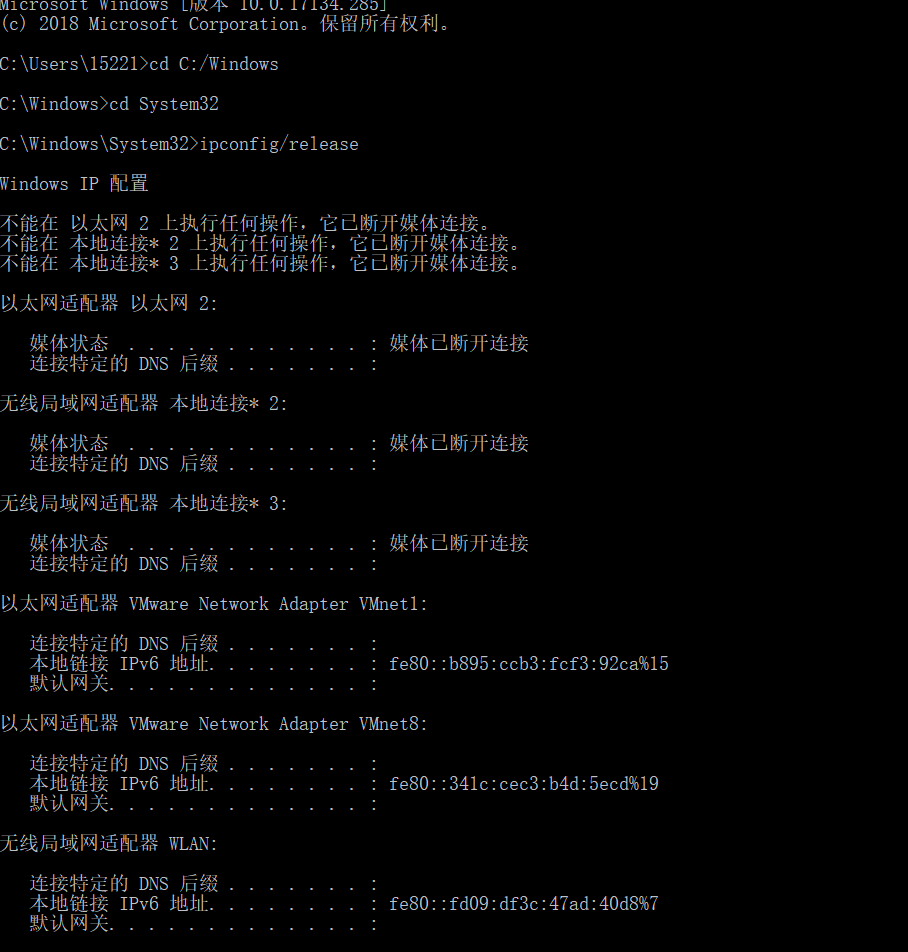

2. 启动Wireshark数据包嗅探器，如介绍Wireshark实验室中所述，并开始Wireshark数据包捕获.
3. 现在返回Windows命令提示符并输入“ipconfig / renew”。这会指示您的主机获取网络配置，包括新的IP地址。在图2中，主机获得IP地址192.168.31.100.

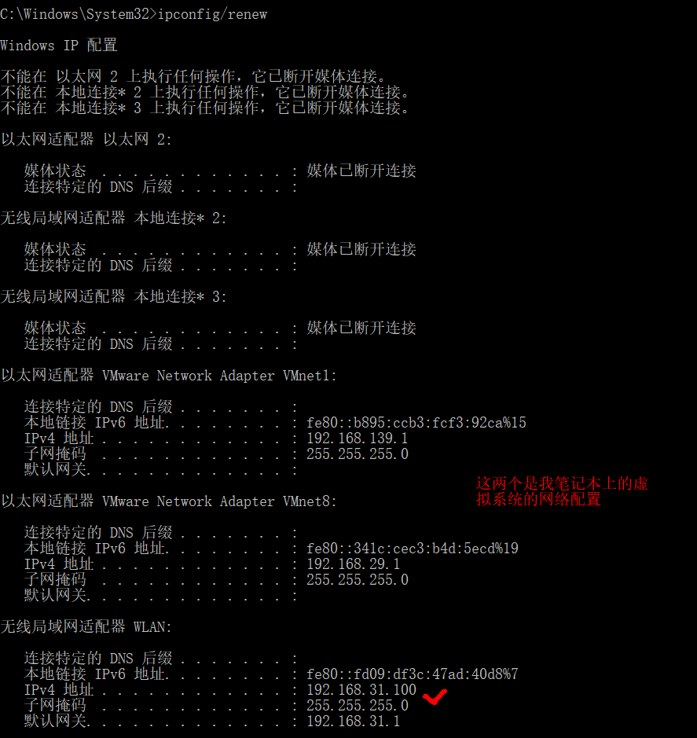

4. 等到“ipconfig / renew”终止。然后再次输入相同的命令“ipconfig/renew”。
5. 当第二个“ipconfig / renew”终止时，输入命令“ipconfig/release”.
6. 最后，输入“ipconfig / renew”再次为您的计算机分配一个IP地址。
7. 停止WireShark的捕获。

---

  现在让我们来看看生成的Wireshark窗口。要仅查看DHCP数据包，请进入过滤器字段“bootp”。（DHCP来自一个名为BOOTP的旧协议.BOOTP和DHCP都使用相同的端口号67和68.要查看当前版本的Wireshark中的DHCP数据包，您需要在过滤器中输入“bootp”而不是“dhcp”。）我们从图3中看到，第一个ipconfig renew命令导致生成四个DHCP数据包：DHCP Discover数据包，DHCP Offer数据包，DHCP Request数据包和DHCP ACK数据包。
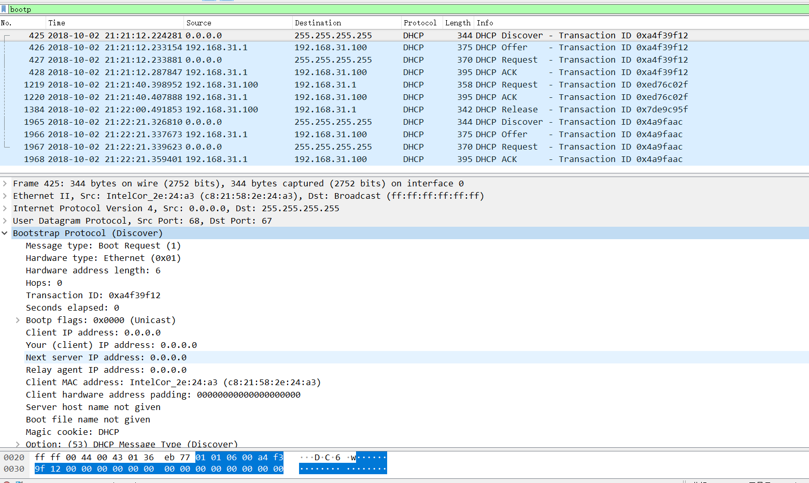

## 问题

1. DHCP消息是通过UDP还是TCP发送的？

答：UDP。
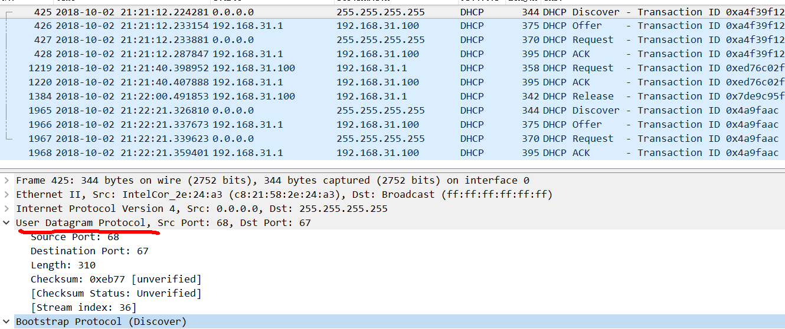

2. 绘制一个定时数据报，说明客户端和服务器之间的第一个四包发送/提供/请求/ ACK DHCP交换的顺序。对于每个数据包，指示源和目标端口号。端口号是否与本实验分配中给出的示例相同？

答：如图，端口号与本实验分配中给出的示例相同。(点击统计->流量图，然后把显示过滤器限制勾上就能得到下图)
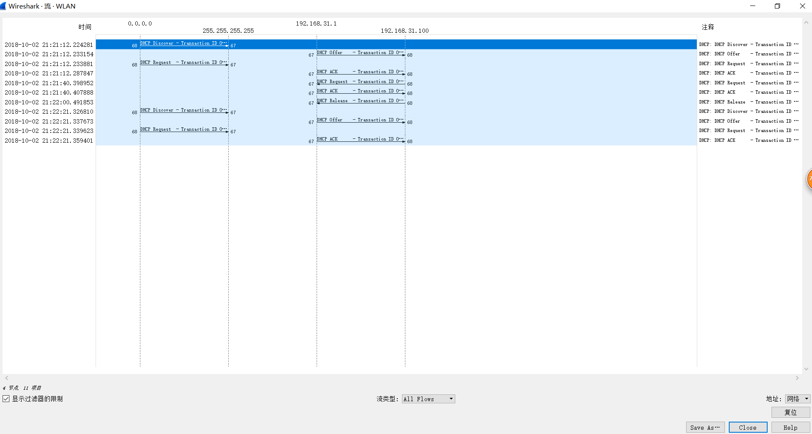

3. 主机的链路层（例如以太网）地址是什么？

答：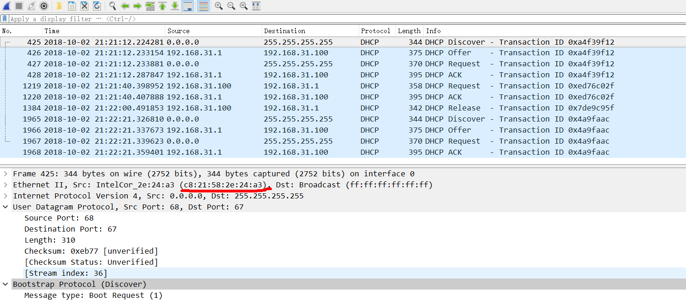

4. DHCP发现报文中的哪些值将此消息与DHCP请求报文区分开来？

答：在Option(53) Message Type中。

5. 前四个（发现/提供/请求/ ACK）DHCP消息中的每一个中的Transaction-ID值是多少？
第二组（请求/ ACK）DHCP消息集中的Transaction-ID值是多少？
Transaction-ID字段的目的是什么？

答：使用事务ID，以便DHCP服务器可以在请求过程中区分客户端请求。
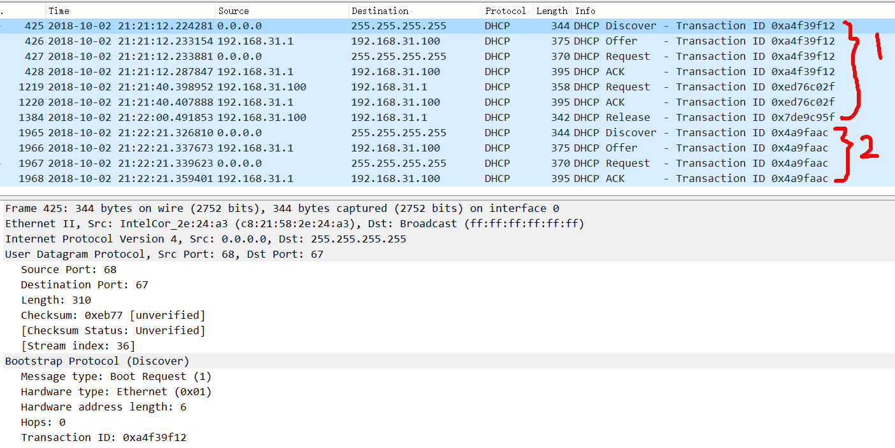

6. 主机使用DHCP来获取IP地址等。但是直到四消息交换结束才确认主机的IP地址！
如果在四消息交换结束之前未设置IP地址，那么在四消息交换中的IP数据报中使用了哪些值？
对于四个DHCP消息（发现/提供/请求/ ACK DHCP）中的每一个，指示封装IP数据报中携带的源和目标IP地址。

答： DHCP客户端使用255.255.255.255作为目标地址。
客户端使用源IP地址0.0.0.0，而服务器使用其实际IP地址作为源。
关于DHCP服务器的提供报文的目标地址，有的是以255.255.255.255作为目标地址(多播),
也有的(像我的这次实验，见第五问的图)是单播的，尽管此时服务器分配的地址客户端还没有使用（甚至客户端都还没有收到这个OFFER报文），但是服务器已经将这个IP填充到了三层包头中。这样做的好处是，即使二层设备，由于各种原因，广播了数据帧，但是三层包头中的目标地址也不会和在线的任何一个主机一样，其它在线主机根本不会处理这个不属于自己目标IP的报文的。对于大型网络来说，这对网络性能和主机性能都是一种优化。

7. DHCP服务器的IP地址是多少？
答：192.168.31.1.

8. 在DHCP Offer报文中DHCP服务器为主机提供的是什么IP地址？
指示哪条DHCP报文包含提供的ip地址。

答：192.168.31.100，提供(Offer)报文提供了ip地址。
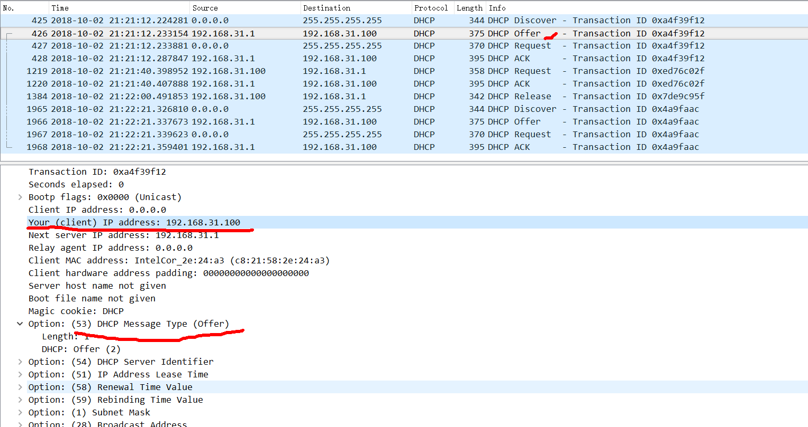

9. 在示例屏幕截图中，主机和DHCP服务器之间没有中继代理。
跟踪中的哪些值表明没有中继代理？
您的实验中是否有中继代理？
如果是这样，代理的IP地址是什么？

答： 如下图，中继代理的ip地址为0.0.0.0，这意味着没有使用中继代理。
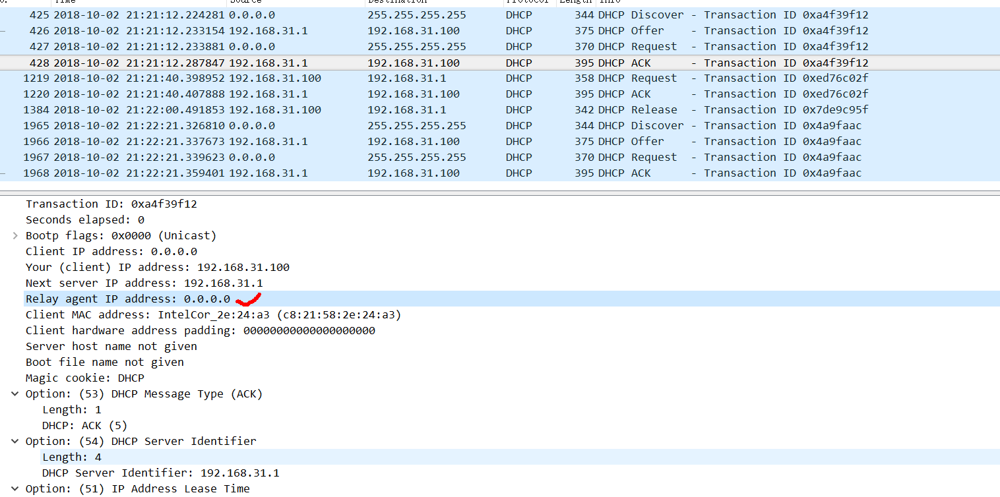

10. 解释DHCP offer报文中路由和子网掩码行的用途。

答：路由行向客户端指示其默认网关应该是什么。
子网掩码行告诉客户端它应该使用哪个子网掩码。
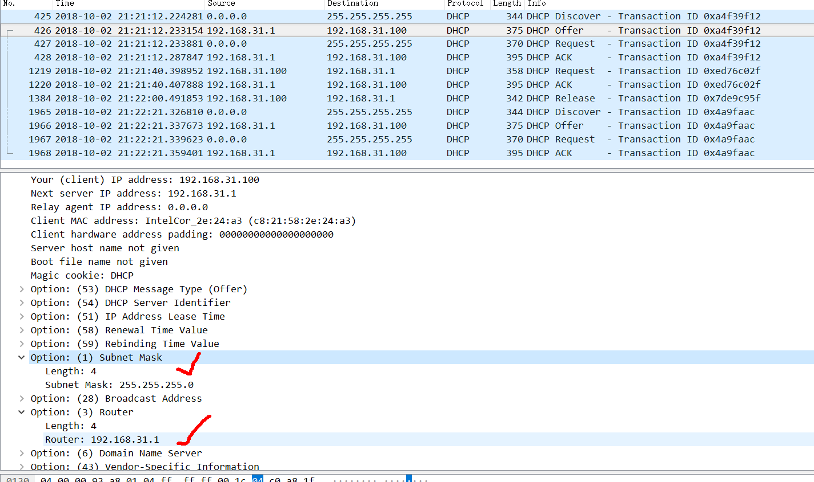

11. 在脚注2中注明的DHCP跟踪文件中，DHCP服务器向客户端提供特定的IP地址（另请参见上面的问题8）。在客户端对第一个服务器OFFER报文的响应中，客户端是否接受此IP地址？
客户的响应中在哪里指示了客户要求的地址？

答：在wireshark中打开dhcp-ethereal-trace-1文件；可知客户端接收此ip地址，客户在request报文中指明了要求的ip地址。
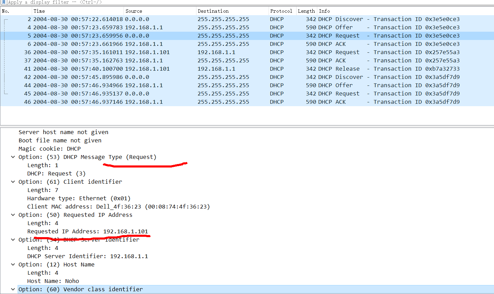

12. 解释租赁时间的目的。你的实验中的租约时间有多长？

答：租用时间是DHCP服务器为客户端分配IP地址的时间。
在租用期间，DHCP服务器不会将给予客户端的IP分配给另一个客户端，除非客户端发布它。
一旦租约时间到期，DHCP服务器就可以重用IP地址以提供给另一个客户端。
在我的实验中，租约时间是12小时。

13. DHCP释放报文的目的是什么？
DHCP服务器是否发出收到客户端DHCP请求的确认？
如果客户端的DHCP释放报文丢失会发生什么？

答：客户端发送DHCP释放报文以取消其对DHCP服务器为其提供的IP地址的租用。
DHCP服务器不会向客户端发送报文以确认DHCP释放报文。
如果来自客户端的DHCP Release报文丢失，则DHCP服务器必须等到该IP地址的租用期结束，直到它可以将其重新用于另一个客户端。

14. 从Wireshark窗口清除bootp过滤器。
在DHCP数据包交换期间是否有发送或接收的ARP数据包？
如果是，请说明这些ARP数据包的用途。

答： 是的，DHCP服务器发出ARP请求。 在向客户端提供IP地址之前，DHCP服务器会为提供的IP发出ARP请求，以确保其他工作站尚未使用该IP地址。