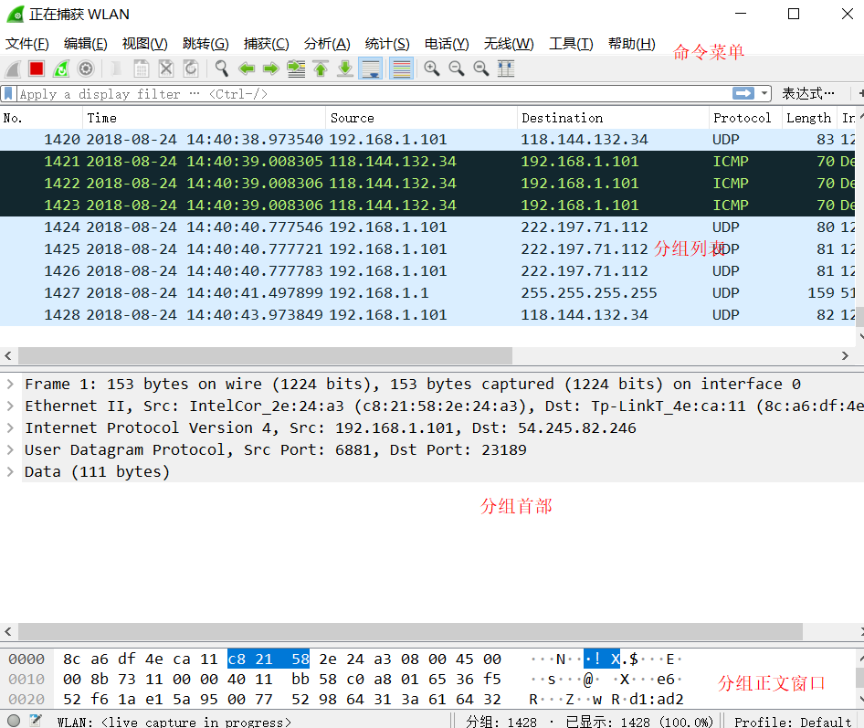
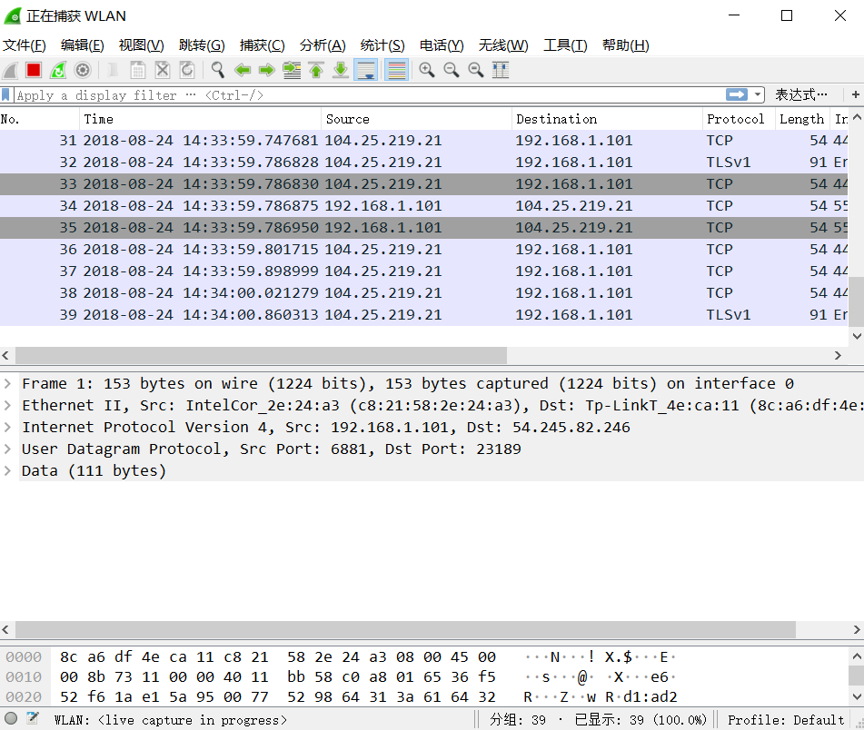
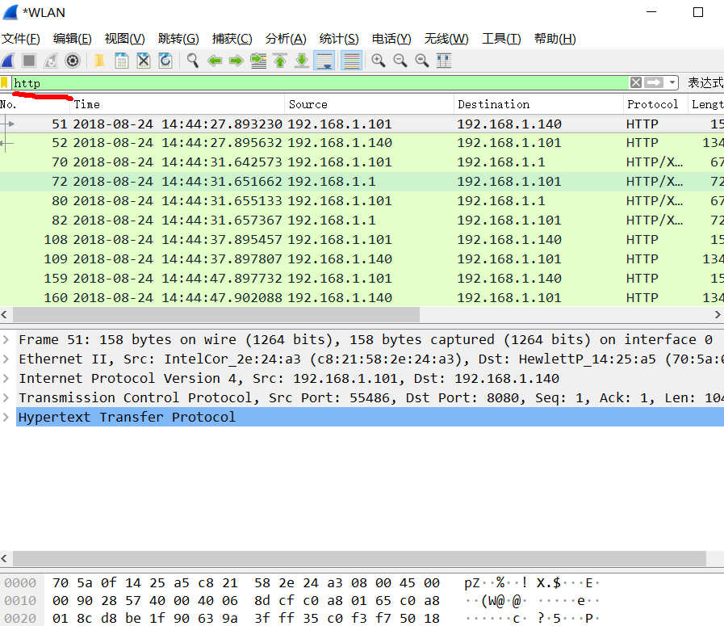
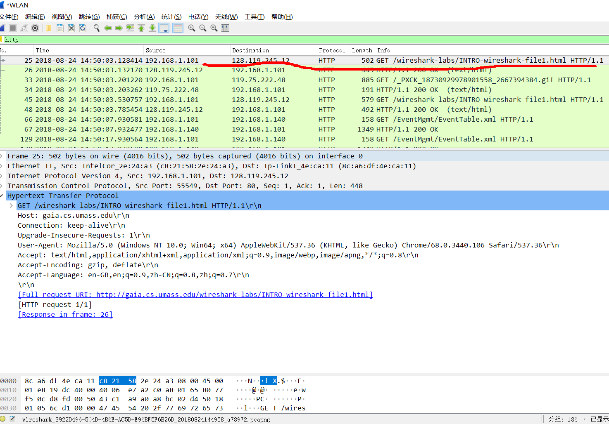

# WireShark实验-GetStarted

## 实验材料
[WireShark Lab Getting Started](Wireshark_Intro_v6.0.pdf)

## 分组嗅探器

分组嗅探器捕获（“嗅探”）从计算机发送/接收消息; 它还将存储并显示这些捕获的消息中各种协议字段的内容。
分组嗅探器本身是被动的。它只是观察有计算机上运行的应用程序和协议发送和接收的消息，但本身不会发送分组。
类似地，接收的分组也不会直接到达分组嗅探器。相反，分组嗅探器接收一份从您的机器中的应用程序和协议发送/接收的分组的副本。

## 结构

## 下载安装
[http://www.wireshark.org/download.html](http://www.wireshark.org/download.html)

## 运行WireShark

  **初始界面**(演示环境为Windows10)
  

  显示了接口列表，接口有有线的和虚拟的，本图隐藏了两个虚拟的接口（本人笔记本上装了虚拟机，所以有两个虚拟接口）。
  
  一旦你选择了一个接口并双击它，将捕获这个接口上的所有数据包。
  
  点击WLAN接口启动分组捕获（即，Wireshark开始捕获从该接口发送的所有分组），将显示如下所示的界面，
  包含有关正在捕获的分组的信息。启动分组捕获后，可以使用“捕获”下拉菜单并选择“停止”来停止分组捕获。

Wireshark界面有五个主要组件：

**命令菜单(command menus)** 是位于窗口顶部的菜单。我们现在感兴趣的是文件和捕获菜单。
文件菜单允许您保存捕获的分组数据或打开先前捕获的分组数据的文件，并退出Wireshark应用程序。捕获菜单允许您开始分组捕获。

**分组列表窗口(packet-listing window)** 为每个捕获的分组显示一行摘要，包括分组编号（由Wireshark分配；任何协议首部并不包含该编号），
分组的时间，源地址和目的地址，协议类型以及分组中包含的协议特定信息。可以通过单击列名称或者其他类似栏目对分组列表进行排序。
协议类型字段列出了发送或接收该分组的最高级协议，即作为该分组的源或最终接收的协议。

**分组首部详细信息窗口(packet-header details window)** 提供分组列表窗口中被选中（高亮显示）分组的详细信息。 
（要在分组列表窗口中选择分组，请将光标放在分组列表窗口中的单行摘要中，然后单击鼠标左键。）
这些细节包括有关以太网帧的信息（假定分组通过以太网接口发送/接收）和包含该分组的IP数据报。
通过在分组详细信息窗口中单击以太网帧左侧的加减号框或IP数据报行，可以扩展或最小化显示的以太网和IP层详细信息。
如果分组通过TCP或UDP传输，TCP或UDP的详细信息也将被显示，同样可以扩展或最小化。最后还提供了有关发送或接收此分组的最高级别协议的详细信息。

**分组正文窗口(packet-contents window)** 以ASCII和十六进制格式显示捕获帧的全部内容。
Wireshark界面的顶部是分组显示过滤器(packet display filter field)，可以向其中输入协议名称或其他信息，
以过滤分组列表窗口中显示的信息（分组首部窗口和分组内容窗口同理）。
在下面的示例中，我们将使用分组显示过滤器字段来使Wireshark隐藏（不显示）除了与HTTP消息相关的分组。

## 一次运行测试

1.打开浏览器，显示一个主页

2. 启动Wireshark软件。启动捕获。

3. 当Wireshark正在运行时，输入URL：http://gaia.cs.umass.edu/wireshark-labs/INTRO-wireshark-file1.html ，
并在浏览器中显示该页面。为了显示此页面，您的浏览器将通过gaia.cs.umass.edu与HTTP服务器链接，
并与服务器交换HTTP消息，以便下载此页面，如书中第2.2节所述。包含这些HTTP消息（以及通过以太网的所有其他帧）的以太网帧将被Wireshark捕获。

4. 在浏览器显示INTRO-wireshark-file1.html页面后（这是一行简单的祝贺消息），
在Wireshark捕获窗口中点击停止按钮来停止Wireshark分组捕获。现在Wireshark主窗口看起来与图3相似。
您现在有了计算机和其他网络实体之间交换的所有协议的实时分组数据！与gaia.cs.umass.edu 的Web服务器交换的HTTP消息应该出现在捕获分组的列表中。
但是，这里还会显示许多其他类型的分组（例如，图3中的协议列中显示了许多不同的协议类型）。即使你唯一的动作仅仅是下载了一个网页，
但显然还有许多其他协议在您的计算机上运行，这些是用户所看不见的。通过书中内容，我们将更多地了解这些协议！现在，你会亲眼看到许多事情即将发生！

5. 在主Wireshark窗口顶部的分组显示过滤器窗口中，键入“http”（不含引号，且小写 - Wireshark中的所有协议名称均为小写）。
然后回车。这样就可以只让HTTP消息显示在分组列表窗口中。

6. 找到从您的计算机发送到gaia.cs.umass.edu HTTP服务器的HTTP GET消息。 
（在Wireshark分组列表窗口中查找HTTP GET消息（见图3），
其后的gaia.cs.umass.edu URL中显示“GET”）当您选择该HTTP GET消息，那么它的以太网帧，IP数据报，
TCP段和HTTP消息首部将显示在分组首部窗口中，通过点击左侧的“>”和“ˇ”或向右和向下箭头的分组详细信息窗口，
将帧，以太网，IP协议和TCP协议的信息最小化，同时将HTTP协议的信息最大化，您的Wireshark显示屏现在应该如图5所示。
注意，特别是除了HTTP之外的所有协议的协议信息的最小量以及在分组报头窗口中用于HTTP的协议信息的最大量）。

7. 退出实验。
