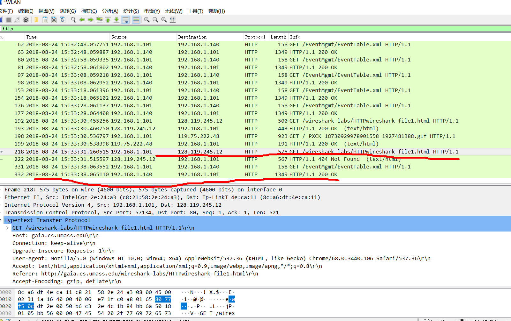
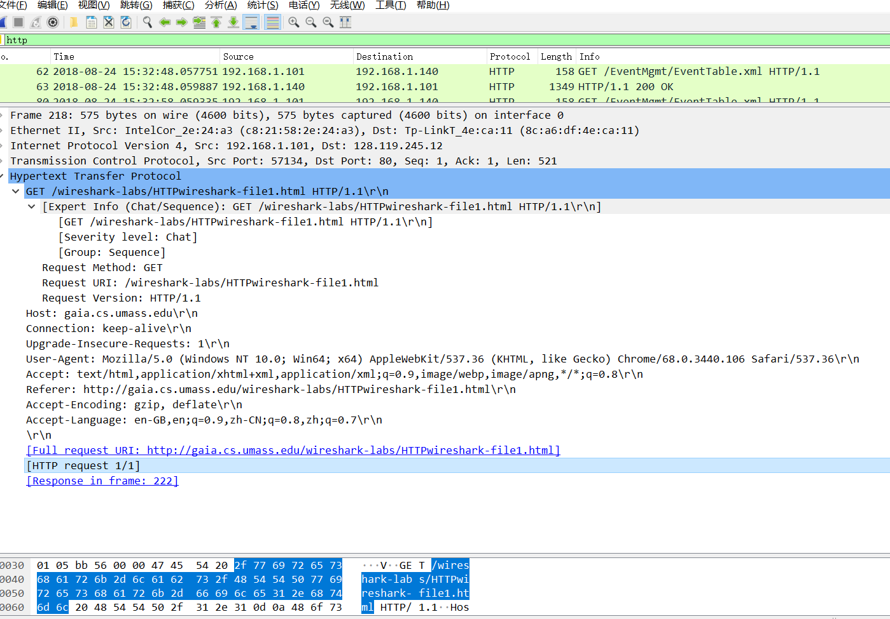
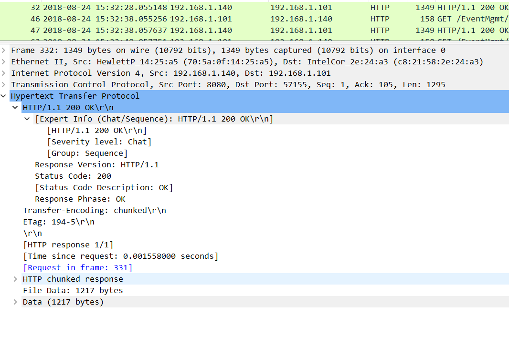
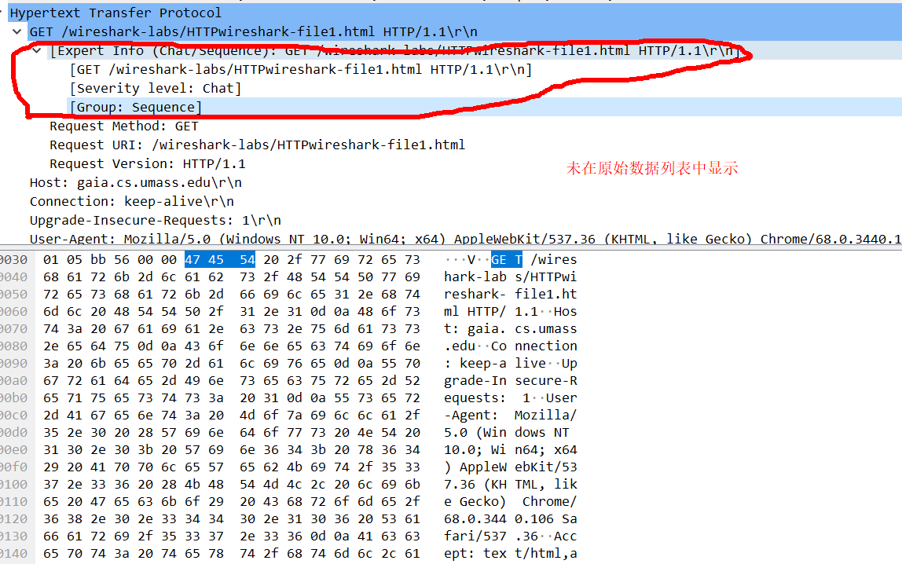
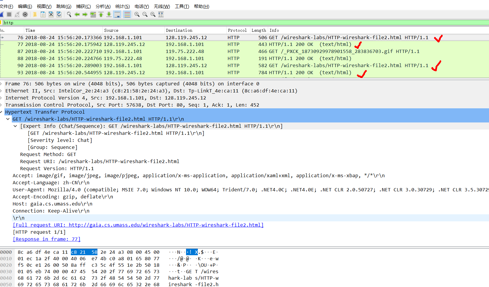
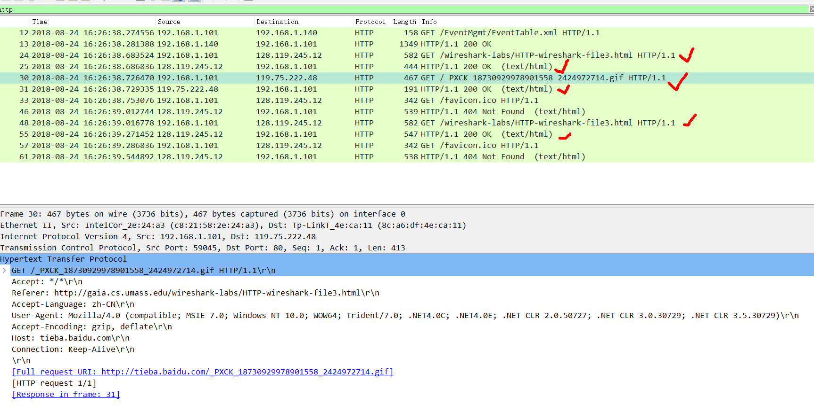
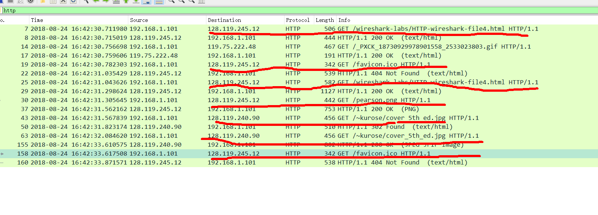
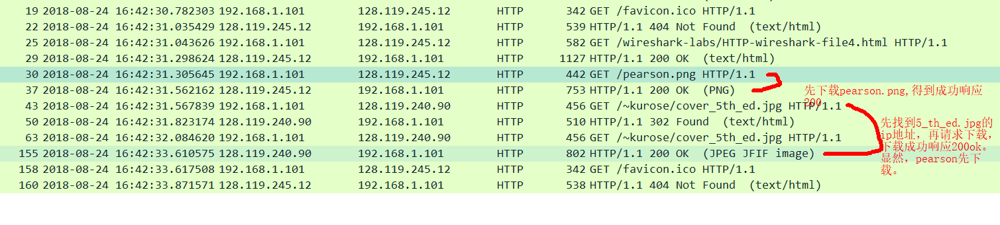
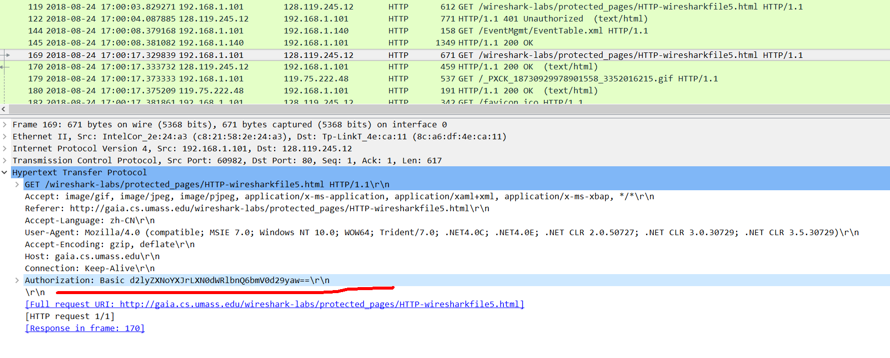

# WireSharkLab-HTTP

## 实验材料

[Wireshark_HTTP_v6.1.pdf](Wireshark_HTTP_v6.1.pdf)

## 1.基本的 HTTP GET/response交互
   目标：下载一个简单地HTML文件。
1.1 打开浏览器。
1.2 打开WireShark，先不要启动捕获，在过滤器中输入http，以便只捕获HTTP信息。
1.3 等待一分钟然后开始捕获。
1.4 在浏览器中输入以下内容 http://gaia.cs.umass.edu/wireshark-labs/HTTP-wireshark-file1.html 
您的浏览器应显示非常简单的单行HTML文件。
1.5 停止捕获。

  可看到分组列表中的两个分组信息：GET消息（从您的浏览器发送到gaia.cs.umass.edu 的web服务器）
和从服务器到浏览器的响应消息。

关注HTTP报文信息，其他帧、以太网、ip和tcp报文具体信息最小化。

通过上图，我们可以回答以下问题：

您的浏览器是否运行HTTP版本1.0或1.1？服务器运行什么版本的HTTP？

浏览器HTTP版本1.1，服务器1.1.

您的浏览器会从接服务器接受哪种语言（如果有的话）？

英文、中文

您的计算机的IP地址是什么？ gaia.cs.umass.edu服务器地址呢？

192.168.1.101    128.119.245.12

服务器返回到浏览器的状态代码是什么？

200

服务器上HTML文件的最近一次修改是什么时候？

0.001558秒前

服务器返回多少字节的内容到您的浏览器？

1217字节

通过检查数据包内容窗口中的原始数据，你是否看到有协议头在数据包列表窗口中未显示？ 如果是，请举一个例子。

## HTTP条件GET/response交互

1. 启动浏览器，清空缓存
2. 启动WireShark，捕获开始
3. 输入http://gaia.cs.umass.edu/wireshark-labs/HTTP-wireshark-file2.html ，
浏览器应显示一个非常简单的五行HTML文件。
4. 再次快速地将相同的URL输入到浏览器中（或者只需在浏览器中点击刷新按钮）。
5. 停止Wireshark数据包捕获，并在display-filter-specification窗口中输入“http”，
以便只捕获HTTP消息，并在数据包列表窗口中显示。

** 问题解答 **

检查第一个从您浏览器到服务器的HTTP GET请求的内容。您在HTTP GET中看到了“IF-MODIFIED-SINCE”行吗？

答：没有

检查服务器响应的内容。服务器是否显式返回文件的内容？ 你是怎么知道的？

 答：是的，有个line-based text data首部。

现在，检查第二个HTTP GET请求的内容。 您在HTTP GET中看到了“IF-MODIFIED-SINCE:”行吗？ 如果是，“IF-MODIFIED-SINCE:”头后面包含哪些信息？

答：是，包含了浏览器缓存的文件的修改时间。如果服务器文件的修改时间比浏览器缓存文件的修改时间要晚，
则浏览器会向服务器再发出get请求，否则，直接从浏览器缓存中读取数据给用户。（相当于代理服务器）

针对第二个HTTP GET，从服务器响应的HTTP状态码和短语是什么？服务器是否明确地返回文件的内容？请解释。

304 NOT Modified，服务器没有返回文件内容，因为没有line-based text data行。

# 检索长文件

1. 启动您的浏览器，并确保您的浏览器缓存被清除，如上所述。
2. 启动Wireshark数据包嗅探器
3. 在您的浏览器中输入以下URL http://gaia.cs.umass.edu/wireshark-labs/HTTP-wireshark-file3.html 您的浏览器应显示相当冗长的美国权利法案。
4. 停止Wireshark数据包捕获，并在display-filter-specification窗口中输入“http”，以便只显示捕获的HTTP消息。

在分组列表窗口中，您应该看到您的HTTP GET消息，然后是HTTP GET请求的多个分组的TCP响应。（由于请求的html文件过大
被分为几个数据包）

** 问题解答 **
  您的浏览器发送多少HTTP GET请求消息？哪个数据包包含了美国权利法案的消息？
  
  
  
  哪个数据包包含响应HTTP GET请求的状态码和短语？
  
  答：25和55
  
  响应中的状态码和短语是什么？
  
  答：200 OK
  
  需要多少包含数据的TCP段来执行单个HTTP响应和权利法案文本？
  
  ## 具有嵌入对象的HTML文档
  
1. 启动您的浏览器。
2. 启动Wireshark数据包嗅探器。
3. 在浏览器中输入以下URL http://gaia.cs.umass.edu/wireshark-labs/HTTP-wireshark-file4.html 浏览器应显示包含两个图像的短HTML文件。这两个图像在基本HTML文件中被引用。也就是说，图像本身不包含在HTML文件中；相反，图像的URL包含在已下载的HTML文件中。如书中所述，您的浏览器将不得不从指定的网站中检索这些图标。出版社的图标是从 www.aw-bc.com 网站检索的。第5版的封面图像存储在manic.cs.umass.edu服务器。
4. 停止Wireshark数据包捕获，并在display-filter-specification窗口中输入“http”，以便只显示捕获的HTTP消息。

** 问题解答 **

您的浏览器发送了几个HTTP GET请求消息？ 这些GET请求发送到哪个IP地址？

答：  

浏览器从两个网站串行还是并行下载了两张图片？请说明。

答：串行。
  

## HTTP认证

1. 请确保浏览器的缓存被清除，如上所述，然后关闭你的浏览器，再然后启动浏览器
2. 启动Wireshark数据包嗅探器。
3. 在浏览器中输入以下URL http://gaia.cs.umass.edu/wireshark-labs/protected_pages/HTTP-wiresharkfile5.html 在弹出框中键入所请求的用户名和密码。
4. 停止Wireshark数据包捕获，并在display-filter-specification窗口中输入“http”，以便只显示捕获的HTTP消息。

** 问题解答 **

  对于您的浏览器的初始HTTP GET消息，服务器响应（状态码和短语）是什么响应？

答：401 Unauthorized.

  当您的浏览器第二次发送HTTP GET消息时，HTTP GET消息中包含哪些新字段？

答：  

使用python中的

    base64.b64decode('d2lyZXNoYXJrLXN0dWRlbnRzOm5ldHdvcms')
    
就可以得出当前的用户名和密码，也就是说任何一台装有Wireshark的机器都可以得到用户发给服务器的密码（在使用Basic Access Authentication的方法时）。

输入的用户名（wireshark-students）和密码（network）按照客户端HTTP GET消息中请求头的“Authorization: Basic ”的字符串（d2lyZXNoYXJrLXN0dWRlbnRzOm5ldHdvcms=）编码。虽然您的用户名和密码可能加密，但它们只是以一种称为Base64格式的格式进行编码。用户名和密码并没有加密！要确认这些，请访问 http://www.motobit.com/util/base64-decoder-encoder.asp 并输入base64编码的字符串d2lyZXNoYXJrLXN0dWRlbnRz 并进行解码。瞧！您已从Base64编码转换为ASCII编码，因此应该看到您的用户名！要查看密码，请输入字符串Om5ldHdvcms=的剩余部分，然后按解码。因为任何人都可以下载像Wireshark这样的工具，而且可以通过网络适配器嗅探数据包（不仅仅是自己的），任何人都可以从Base64转换为ASCII（你刚刚就这么做了！），所以你应该很清楚，WWW网站上的简单密码并不安全，除非采取其他措施。
