# WireSharkLab-ICMP

## 实验材料

[Wireshark_ICMP_v6.0](Wireshark_ICMP_v6.0.pdf)

## 概述

  在本实验中，我们将探讨ICMP协议的几个方面：
1. Ping程序生成的ICMP报文;
2. Traceroute程序生成的ICMP报文;
3. ICMP报文的格式和内容。

## ICMP和Ping

  让我们通过捕获Ping程序生成的分组开始我们的ICMP冒险。Ping程序是一个简单的工具，
  允许任何人（例如，网络管理员）验证主机是否存在。源主机中的Ping程序将分组发送到目标IP地址;
  如果目标是在运行的，则目标主机中的Ping程序通过将分组发送回源主机来响应。
  这两个Ping分组都是ICMP分组。

  按以下步骤操作：
  
+ 打开windows命令提示符(点击windows图标，输入cmd）；
+ 打开wireshark，并开始捕获分组；
+ 在命令行输入“ping -n 10 hostname",-n 10表示发送10次ping报文，默认是发送四次。
 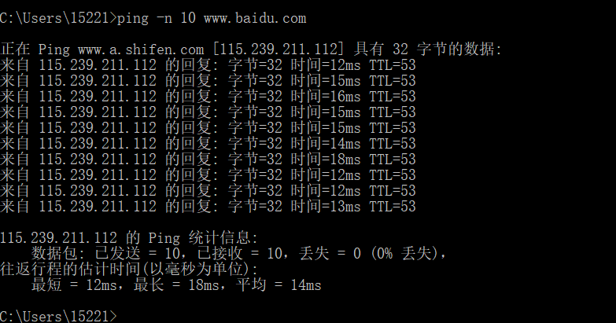
+ 当ping程序停止，停止wireshark的分组捕获。

  从命令行窗口我们可以看到，源ping程序发送了10个查询包并收到了10个响应。
  另请注意，对于每个响应，也计算了往返时间（RTT），对于10个分组平均为14.2毫秒。
  
  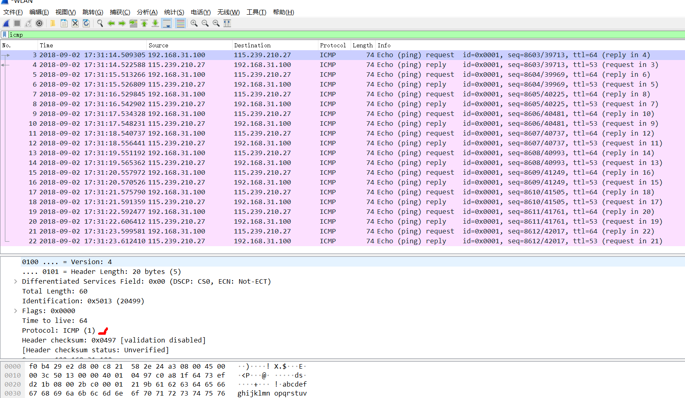

  上图提供了在将“icmp”输入过滤器显示窗口后Wireshark输出的屏幕截图。
  请注意，分组列表显示20个分组：源发送的10个Ping查询和源接收的10个Ping响应。
  另请注意，源IP地址是192.168/12格式的私有地址（在NAT后面）;
  目的地的IP地址是百度Web服务器的IP地址。现在看一下第一个分组的详细信息。分组内容区域
  提供有关此分组的信息。我们看到该分组中的IP数据报具有协议号01，这是ICMP的协议号。
  这意味着IP数据报的有效载荷是ICMP分组。
  
  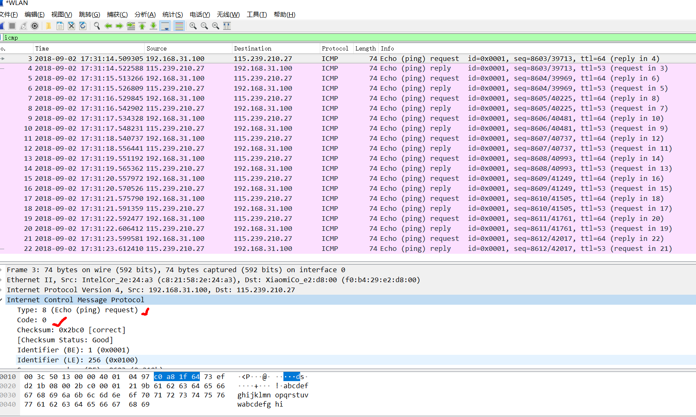
  上图关注相同的ICMP，但侧重观察分组内容窗口中ICMP协议信息。
  观察到该ICMP分组是类型8和代码0 - 所谓的ICMP“回应请求”分组。
（请参见课本的图4.23。）另请注意，此ICMP分组包含校验和，标识符和序列号。

### 问题解答

1. 您的主机的IP地址是多少？目标主机的IP地址是多少？

答：192.168.31.100和115.239.210.27。

2. 为什么ICMP分组没有源和目标端口号？

答： ICMP分组没有源和目标端口号，因为它旨在在主机和路由器之间传递网络层信息，而不是在应用层进程之间传递。
每个ICMP分组都有一个“类型”和一个“代码”。类型/代码组合标识正在接收的特定消息。
由于网络层本身解释所有ICMP消息，因此不需要端口号来将ICMP消息定向到应用层进程。

3. 检查主机发送的ping请求分组之一。ICMP的类型和代码是多少？
   该ICMP分组还有哪些其他字段？校验和，序列号和标识符字段有多少字节？
   
 答：类型为8，代码字段为0.还有校验和（checksum）、标识（id）、序号（seq number）字段。
 
     校验和两个字节、id两个字节、序列号两个字节。
     
     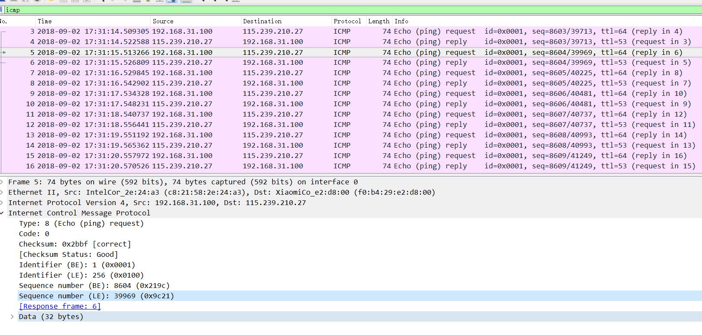
     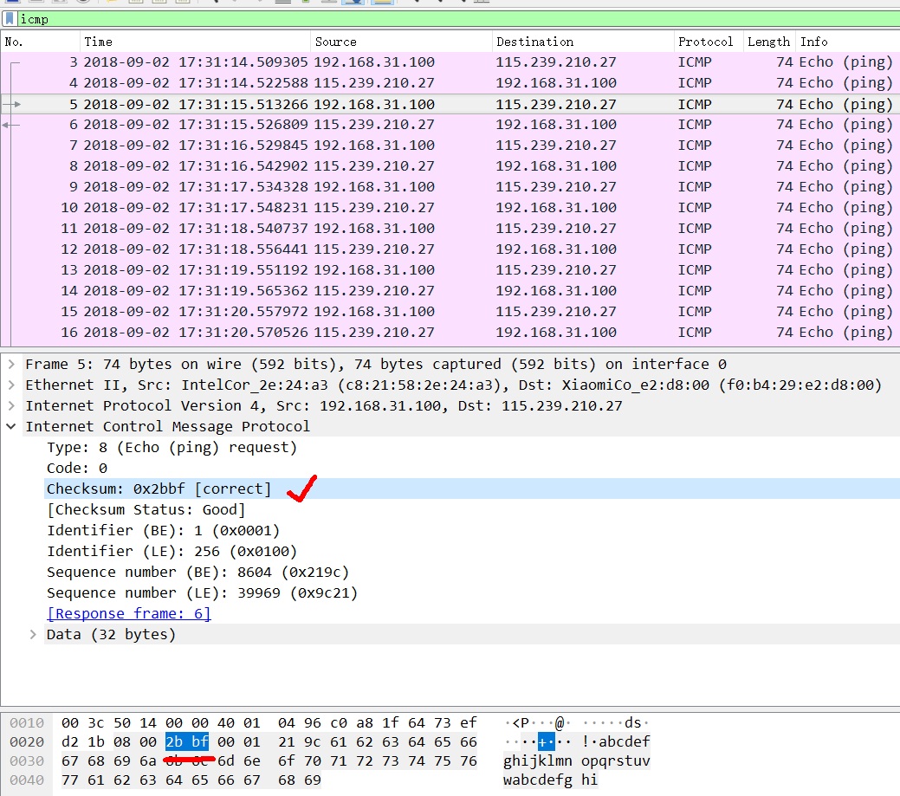
     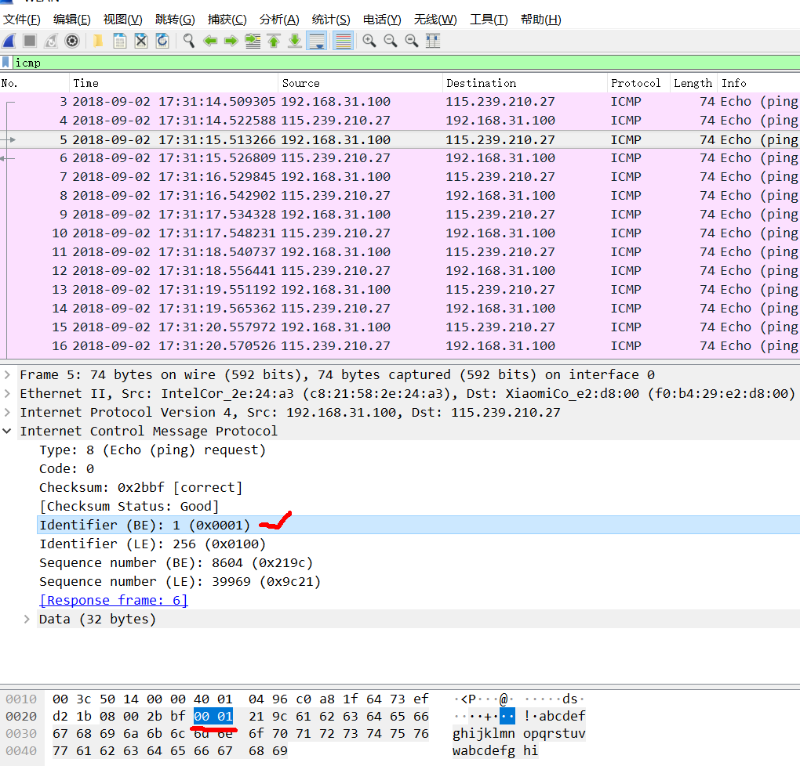
     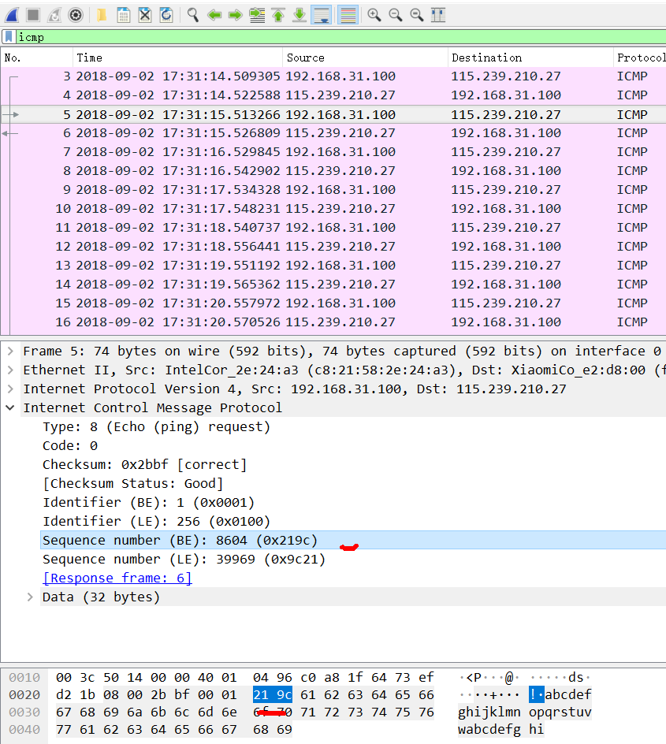

4. 检查相应的ping回复分组。ICMP类型和代码字段是多少？
   该ICMP分组还有哪些其他字段？校验和，序列号和标识符字段有多少字节？
   
 答：ICMP类型和代码字段分别是0和0.
     还包含校验和，序列号和标识符字段，都是2字节。
     

## ICMP和Traceroute

  现在让我们通过捕获Traceroute程序生成的分组继续我们的ICMP冒险。
  您可能还记得Traceroute程序可用于确定分组从源到目的地的路径。
  Traceroute将在课本的1.4节和4.4节中讨论。

  Traceroute在Unix / Linux / MacOS和Windows中以不同的方式实现。
  在Windows中，源将一系列ICMP分组发送到目标。
  对于两种操作系统，程序发送TTL = 1的第一个分组，TTL = 2的第二个分组，依此类推。
  回想一下，当分组通过路由器时，路由器将减少分组的TTL值。
  当TTL=1的分组到达路由器时，路由器会将ICMP错误分组发送回源地址。
  在下文中，我们将使用本机Windows tracert程序。
  一个非常好的Windows Traceroute程序的软件是pingplotter（www.pingplotter.com）。
  
  按以下步骤操作：
+ 打开命令行窗口。
+ 启动Wireshark分组嗅探器，并开始Wireshark分组捕获。
+ 在命令行窗口输入" tracert hostname"。比如：“tracert www.inria.fr。
   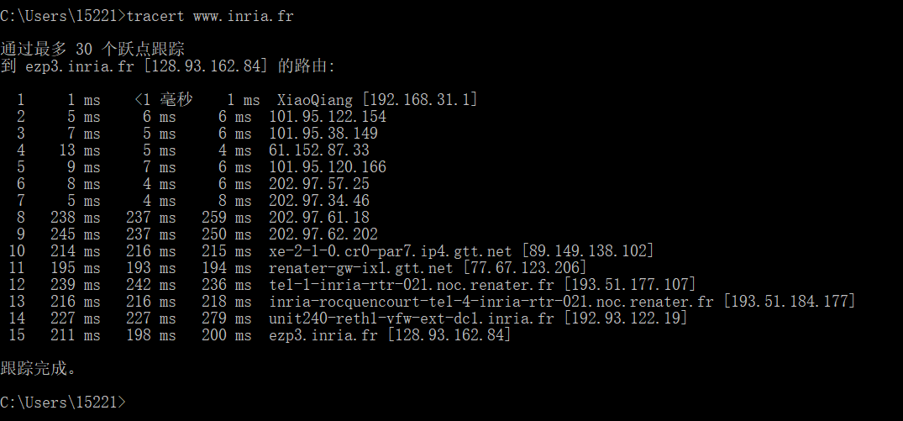
+ 当traceroute程序停止时，停止wireshark的嗅探。

  从上图中我们看到，对于每个TTL值，源程序发送三个探测包。
Traceroute显示每个探测包的RTT，以及返回ICMP TTL超出消息的路由器的IP地址（可能还有名称）。

   上图显示了路由器返回的ICMP分组的Wireshark窗口。
请注意，此ICMP差错报告报文分组包含的字段比Ping ICMP消息多得多。
  
### 问题解答
5. 您的主机的IP地址是多少？
目标目标主机的IP地址是多少？

答：192.168.31.100
    
   128.93.162.84。
6. 如果ICMP发送UDP分组（如在Unix / Linux中），那么探测分组的IP协议号仍然是01吗？
如果没有，它会是什么？

答： 不会。如果ICMP发送UDP分组，则IP协议号应为0x11（即十进制的17）。

7. 检查屏幕截图中的ICMP echo分组。这与本实验的前半部分中的ICMP ping查询分组不同吗？
如果是，怎么回事？

答：ICMP echo分组与ping查询分组具有相同的字段。
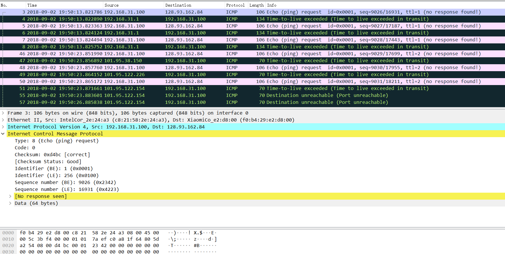

8. 检查屏幕截图中的ICMP差错报告报文。它具有比ICMP echo数据报更多的字段。
这些字段包含哪些内容？

答：ICMP差错报告报文与ping查询包不同。它包含IP数据报首部和原ICMP差错报告数据报的前8个字节。
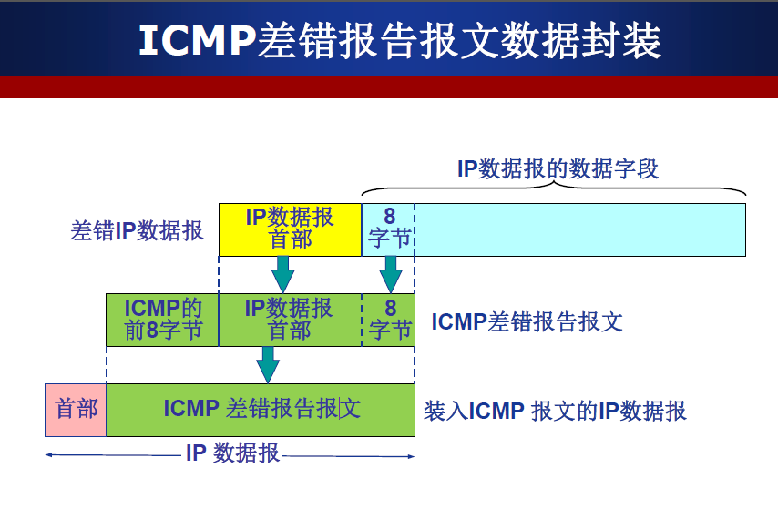
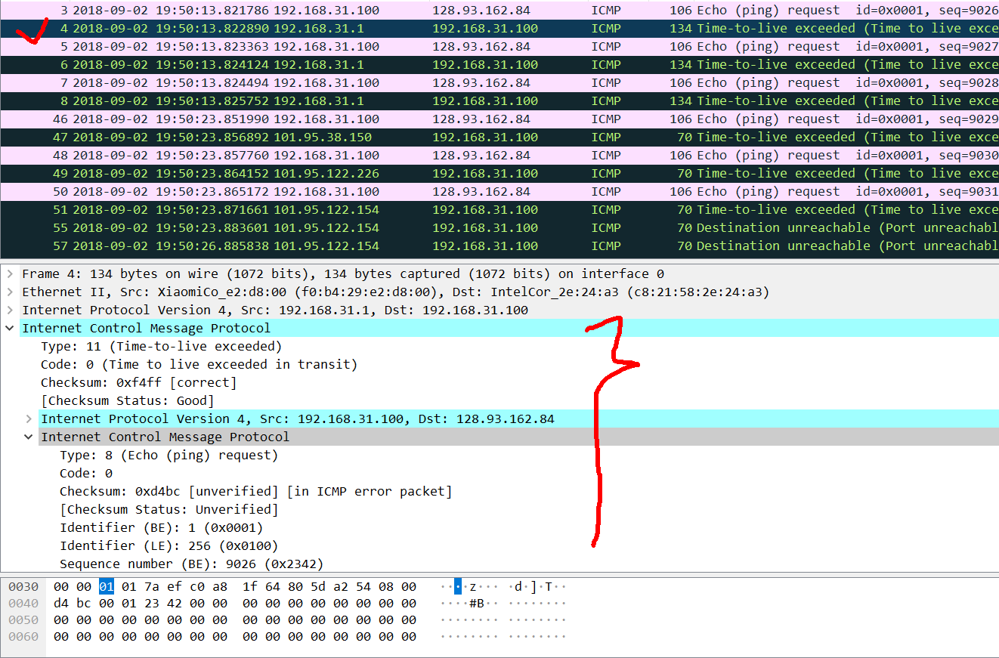

9. 检查源主机收到的最后三个ICMP分组。
这些分组与ICMP差错报告报文有何不同？
他们为什么不同？

答：最后三个ICMP分组是消息类型0（响应应答）而不是11（TTL已过期）。
它们是不同的，因为分组在TTL过期之前已经到达目的地主机。
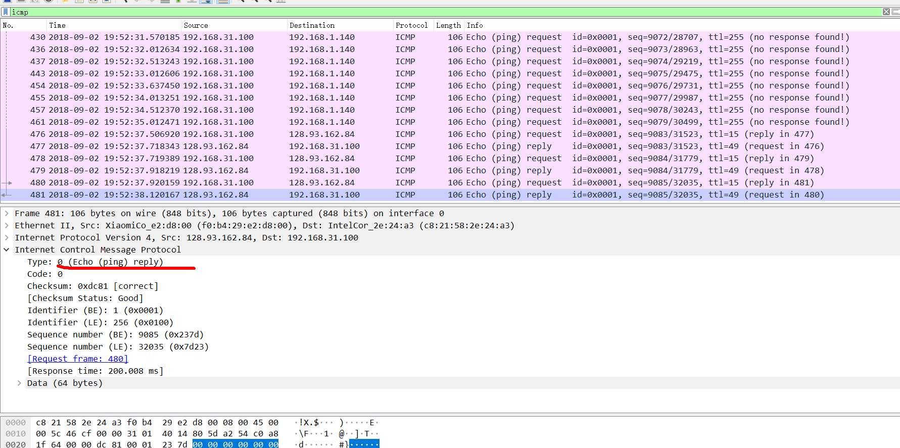

10. 在tracert测量中，是否有一个链接的延迟比其他链接长得多？
根据路由器名称，您能猜出这个链路末端的两个路由器的位置吗？

答：在我的这一次测试中，并没有一个连接的延迟比其他连接长得多。
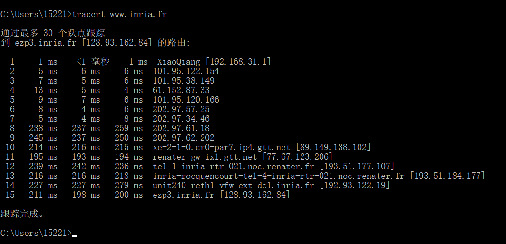
