# WireSharkLab-IP

## 实验材料
[Wireshark_IP_v6.0](Wireshark_IP_v6.0.pdf)

## 概述
  在本实验中，我们将研究IP协议，重点关注IP数据报。我们将通过分析执行traceroute程序发送和接收的一系列IP数据报来
  实现（traceroute程序本身在Wireshark ICMP实验室中进行了更详细的探讨）。我们将研究IP数据报中的各个字段，并详细研究IP分片。
  
## 执行traceroute捕获数据包

  为了生成本实验的一系列IP数据报，我们将使用traceroute程序向不同的目的地X发送不同大小的数据报。
  
  traceroute通过首先发送一个或多个带有生存时间的数据报来运行。
  
  IP报头中的（TTL）字段设置为1;然后它将一系列一个或多个数据报发送到同一目的地，TTL值为2;然后它将一系列数据报发送到同一目的地，TTL值为3;等等。
  路由器必须将每个接收到的数据报中的TTL减1（实际上，RFC 791表示路由器必须将TTL减少至少一个）。如果TTL达到0，路由器会向发送主机返回ICMP消息
  （类型11 - 超出TTL）。由于这种行为，TTL为1的数据报（由执行traceroute的主机发送）将导致路由器距发送方一跳，将ICMP TTL超出的消息发送回发送方;
  TTL为2的数据报（由执行traceroute的主机发送）将导致路由器距发送方2跳，将ICMP TTL超出的消息发送回发送方;以TTL为3发送的数据报将使路由器跳三跳，
  将ICMP消息发送回发送方;等等。通过这种方式，执行traceroute的主机可以通过查看包含ICMP TTL超出消息的数据报中的源IP地址
  来了解自身与目标X之间的路由器的身份。
  
  **运行traceroute并让它发送各种长度的数据报**
  
  为Windows提供的tracert程序（用于我们的ICMP Wireshark实验）不允许更改tracert程序发送的ICMP echo请求（ping）消息的大小。
  
  一个更好的Windows traceroute程序是pingplotter，可在http://www.pingplotter.com上以免费版和共享软件版本获得。
  
  下载并安装pingplotter，并通过对您喜欢的站点执行一些traceroute来测试它。
  
  通过选择菜单项Edit-> Options-> Packet Options然后填写Packet Size字段，可以在pingplotter中显式设置ICMP echo请求消息的大小。
默认数据包大小为56个字节。

  一旦pingplotter发送了一系列具有增加的TTL值的数据包，它会在等待Trace Interval时间后再次以TTL为1重新启动发送进程。
可以在pingplotter中明确设置Trace Interval的值和间隔数

### 步骤：

+ 启动Wireshark并开始数据包捕获（Capture-> Start），然后在Wireshark数据包捕获选项屏幕上按OK（不需要在此处选择任何选项）。
+ 使用的是Windows平台，启动pingplotter并在“要跟踪的地址窗口”中输入目标目标的名称。在“要跟踪的次数”字段中输入3，这样您就不会聚集太多
数据。选择edit - > option - >engine，然后在数据包大小字段中输入值56，然后按确定。
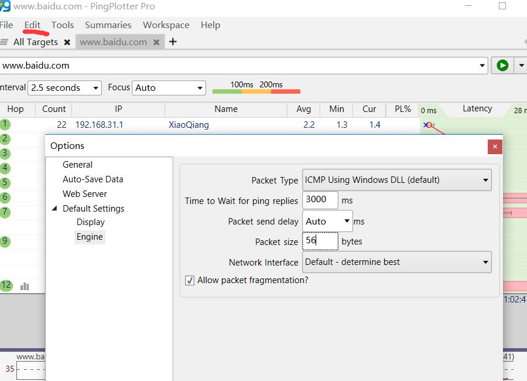
然后开始。
你应该看到一个看起来像这样的pingplotter窗口：
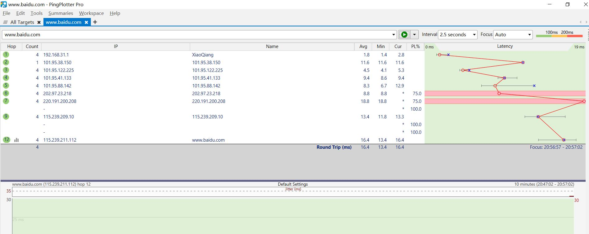

+ 然后，暂停，数据包大小改为2000，继续。
+ 然后，暂停，数据包大小改为3500，继续。
+ 停止WireShark的捕获。

## 看看捕获的跟踪信息

  在跟踪中，应该能够看到计算机发送的ICMP Echo请求系列（在Windows计算机的情况下）或UDP段（在Unix的情况下）
  以及由中间路由器返回到计算机的ICMP TTL超出的消息。
  在下面的问题中，假设使用的是Windows机器。

### 问题解答

1. 选择计算机发送的第一个ICMP Echo Request消息，然后在数据包详细信息窗口中展开数据包的Internet协议部分。你的ip地址是多少？

答：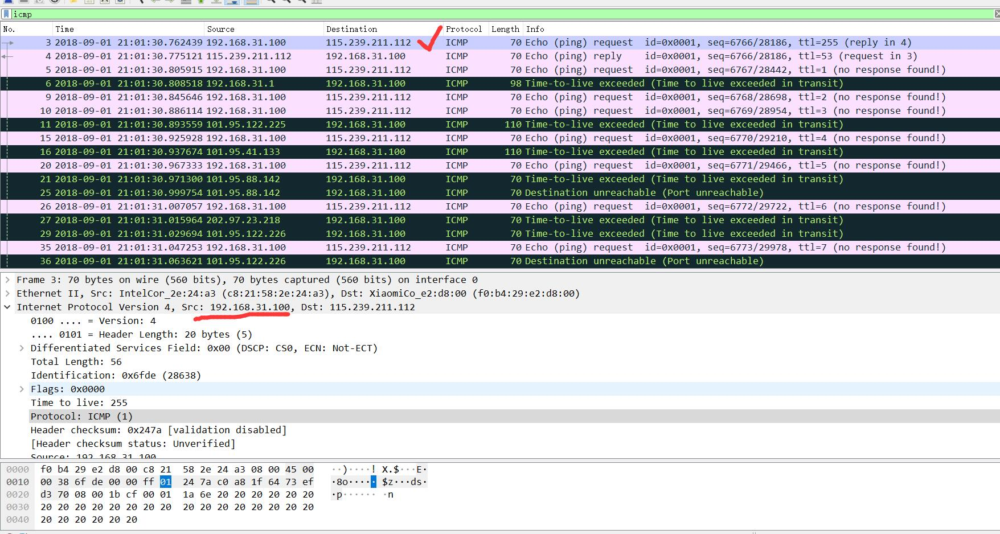

2. 在IP头部中，上层协议字段中的值是多少？

答：ICMP(1)

3. IP头中有多少字节？IP数据报的有效负载中有多少字节？说明如何确定有效负载字节数。

答：ip头部有20个字节，有效载荷为36个字节。
    

4. 这个IP数据报是否分片？解释您如何确定数据报是否已分片。

答：未分片。因为MF=0并且offset=0。
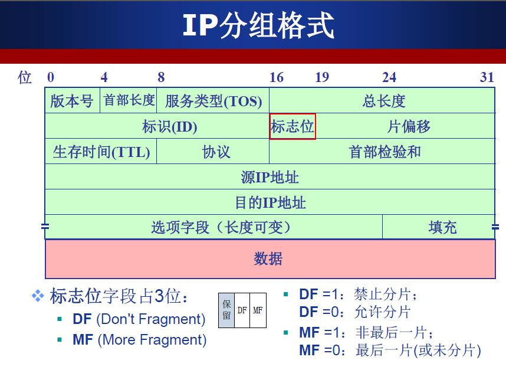
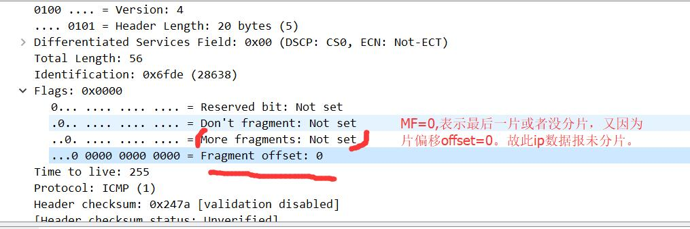

---

  接下来，通过单击Source列标题，根据IP源地址对跟踪的数据包进行排序;一个小的向下箭头应出现在单词Source旁边。
  如果箭头指向上方，请再次单击“源”列标题。选择计算机发送的第一个ICMP Echo Request消息，
  然后展开“所选数据包标题的详细信息”窗口中的Internet协议部分。在“捕获数据包列表”窗口中，
  您应该在第一个ICMP下面看到所有后续ICMP消息（可能还有计算机上运行的其他协议发送的其他散布数据包）。
  使用向下箭头浏览计算机发送的ICMP消息。
  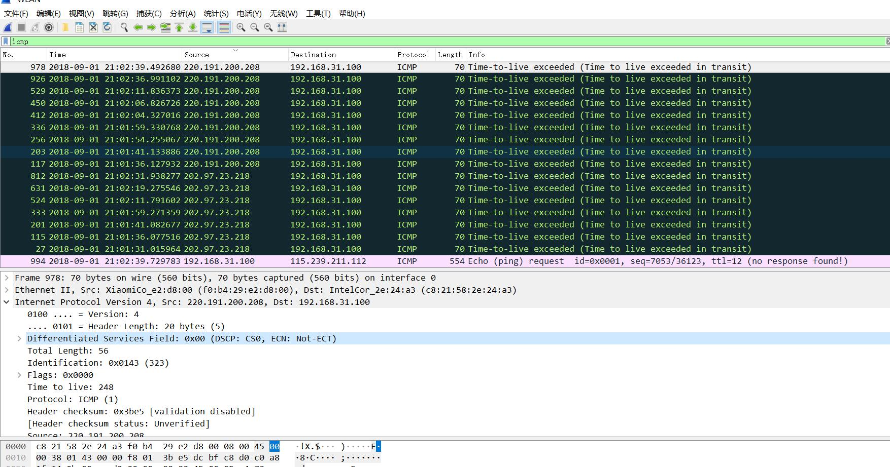
  
5. 在您的计算机发送的这一系列ICMP报文中，IP数据报中的哪些字段总是会变？

答： 标识(ID)，生存时间(TTL)和标头校验和总是会改变。
    ID是一种唯一的标识符。不同的IP数据包必须具有不同的ID才能识别自身。
	TTL始终更改，因为traceroute会增加每个后续数据包。
	标头校验和更改，因为标头更改后，校验和也必须更改。

6. 哪个字段必须保持不变？哪些字段必须更改？为什么？

答：在IP数据报中保持不变的字段是：
+ 版本号（IPv4）
+ 头部长度(header length)（因为这些都是icmp分组)
+ 源ip地址
+ 目的ip地址
+ 差异化服务（Differentiated Services),ICMP报文都使用相同的服务类型（TOS)
+ 上层协议，都是ICMP

  必须更改的字段是：
+ 标识Identification，每个ip分组（除分片）都有唯一的id
+ 存活时间Time to live，traceroute会对每下一个分组加1
+ 头部校验和（头部变了，校验和自然也会变）

7. 描述您在IP数据报的标识字段中的值中看到的模式。

答：TTL和ID每次都会增加1.

 ---
 下一步（数据包仍然按源地址排序）查找最近（第一跳）路由器发送到您的计算机的一系列ICMP TTL超过的回复。
 
 **通过pingplotter，得知第一跳的路由器ip地址为101.95.38.150。**
 
 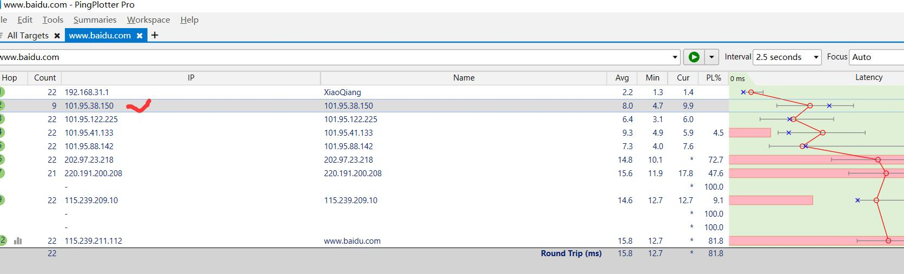
 故：
 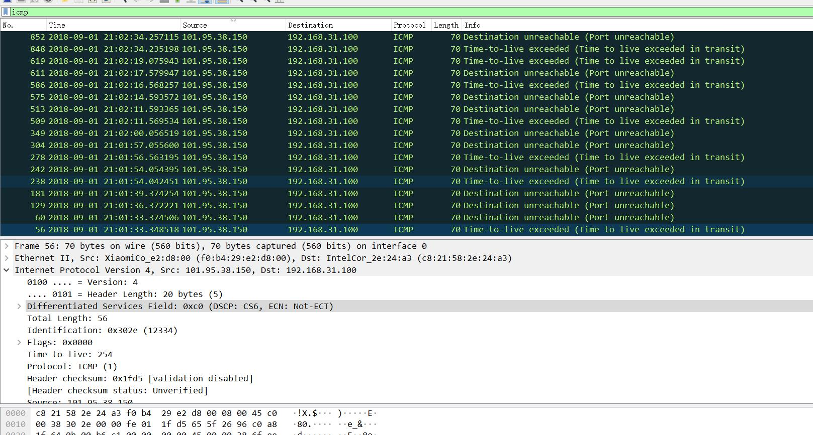
 
 8. 标识字段和TTL字段中的值是多少？
 
 答：0x3746和254.
  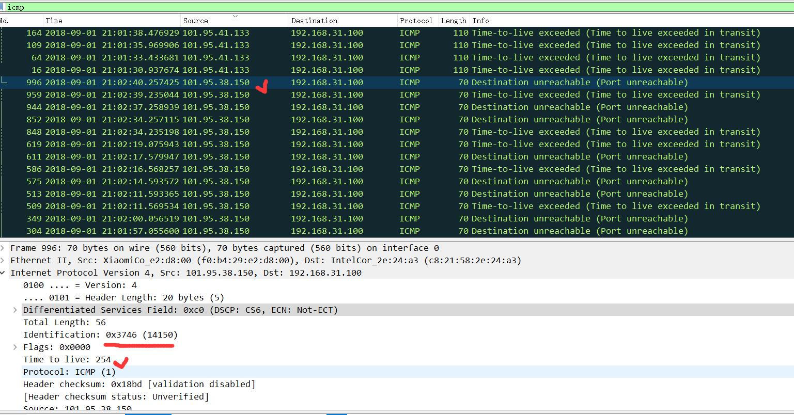
  
9. 对于最近的（第一跳）路由器发送到您的计算机的所有ICMP TTL超出的回复，这些值是否保持不变？
为什么？

答： 由于标识字段是唯一值，因此标识字段会更改所有ICMP TTL超出的回复。
当两个或多个IP数据报具有相同的标识值时，则意味着这些IP数据报是单个大型IP数据报的片段。
TTL字段保持不变，因为第一跳路由器的TTL始终相同。

 --- 
 **分片：
单击“时间”列，再次按时间对数据包列表进行排序**

10. 在将pingplotter中的数据包大小更改为2000之后，查找计算机发送的第一个ICMP Echo Request消息。该消息是否已分片为多个IP数据报？

答：是的，已经分片。
   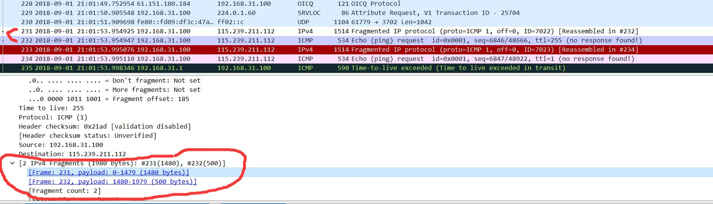
   
11. 打印出分片IP数据报的第一个片段。IP头中的哪些信息表明数据报已碎片化？
    IP头中的哪些信息表明这是第一个片段还是后一个片段？
    这个IP数据报有多长？ 

答：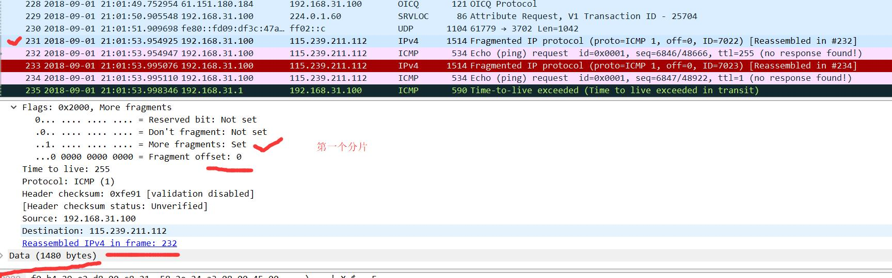
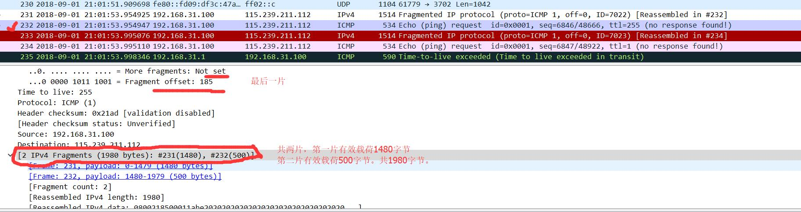

12. 打印出分片IP数据报的第二个片段。IP头中的哪些信息表明这不是第一个数据报片段？还有更多的分片吗？你怎么知道的？

答： 见上一问第二张截图。

13. 第一个和第二个片段之间的IP标头中哪些字段发生了变化？

答： 总长度total length,flags字段, fragment offset字段, 校验和checksum.

 ---
 **现在，在将pingplotter中的数据包大小更改为3500后，找到计算机发送的第一个ICMP Echo Request消息。**

14. 从原始数据报创建了多少个分片？

答：三个。
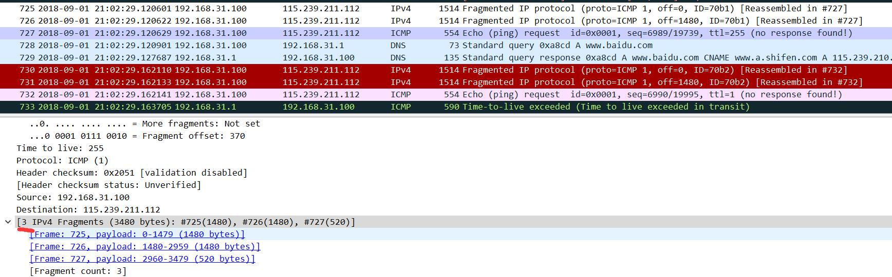

15. 分片中的IP标头中哪些字段发生了变化？

答：在所有数据包之间更改的IP标头字段是：片段偏移量和校验和。
    在前两个数据包和最后一个数据包之间，我们看到总长度和标志flag中的变化。
    前两个数据包的总长度为1500，其中更多的分片位（MF)设置为1，最后一个数据包的总长度为540，更多分片位（MF)设置为0。

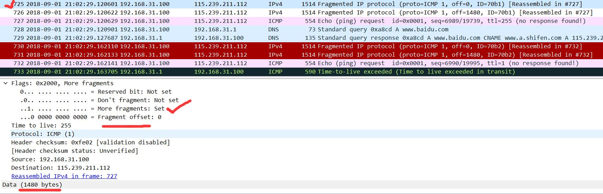
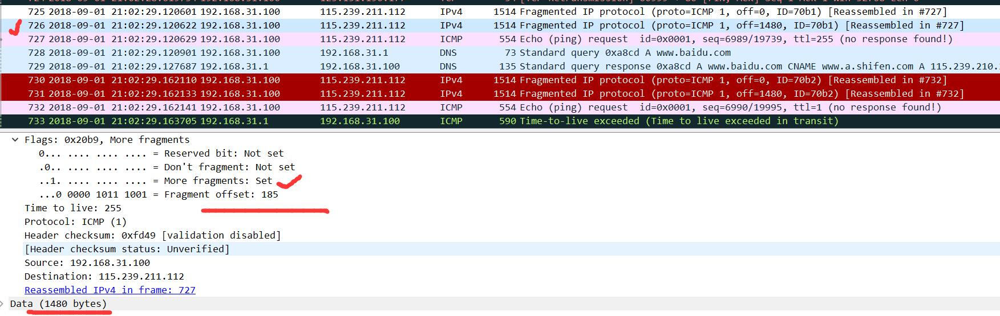
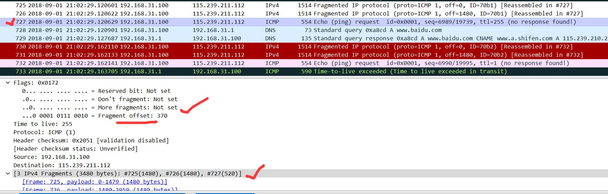
