## WireShark-NAT

## 实验材料
[Wireshark_NAT_v6.0](Wireshark_NAT_v6.0.pdf)

## 概述

  在本实验中，我们将研究NAT协议的行为。本实验将与我们的其他在一个Wireshark测量点捕获了跟踪文件的Wireshark实验不同。因为我们有兴趣在NAT设备的输入和输出端捕获数据包，所以我们需要在两个位置捕获数据包。
  
  此外，由于许多学生无法轻松访问NAT设备或两台可以进行Wireshark测量的计算机，此这不是一个可以由学生“实时”轻松完成的实验室。因此，在本实验中，您将使用我们为您捕获的Wireshark跟踪文件。在开始本实验之前，您可能希望查看text1中NAT第4.4节的内容

## 1.NAT测量场景

  在本实验中，我们将从家庭网络中的客户端PC向www.google.com服务器捕获来自简单Web请求的数据包。在家庭网络中，家庭网络路由器提供NAT服务，如第4章所述。图1显示了我们的Wireshark跟踪收集方案。与我们的其他Wireshark实验室一样，我们在家庭网络中的客户端PC上收集Wireshark跟踪。该文件名为NAT_home_side。因为我们也对NAT路由器发送到ISP的数据包感兴趣，我们将在PC（未示出）上收集第二个跟踪文件，从家庭路由器到ISP网络的链路中，如图1.（路由器ISP侧显示的集线器设备用于接入NAT路由器和ISP中的第一跳路由器之间的链路）。Wireshark此时捕获的客户端到服务器数据包将经历NAT转换。在家用路由器的ISP端捕获的Wireshark跟踪文件称为NAT_ISP_side。

  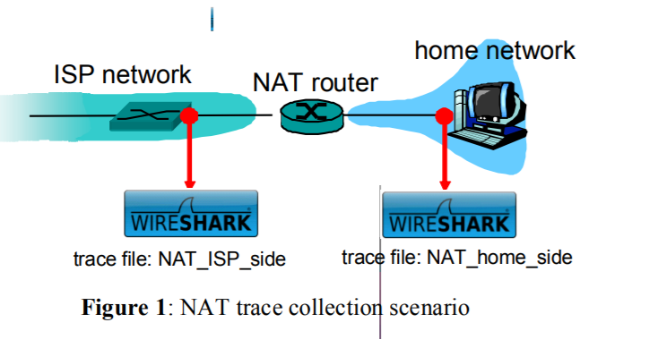

  打开NAT_home_side文件并回答以下问题。您可能会发现使用Wireshark过滤器非常有用，从而只跟踪文件中显示包含HTTP消息的帧。

  ### 问题

1. 客户端的IP地址是什么？
  答： 192.168.1.100.

2. 客户实际上与几个不同的Google服务器进行通信，以实现“安全浏览”。（请参阅本实验结束时的额外信用部分）。提供主要Google网页的主要Google服务器的IP地址为64.233.169.104。为了仅显示包含发送到此服务器/服务器的HTTP消息的帧，请在Wireshark的Filter：字段中输入表达式“http && ip.addr == 64.233.169.104”（不带引号）.

  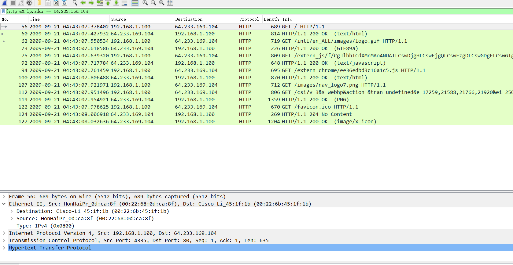

3. 现在考虑在7.109267时从客户端发送到Google服务器（其IP地址为IP地址64.233.169.104）的HTTP GET。承载此HTTP GET的IP数据报上的源IP地址和目标IP地址以及TCP源和目标端口是什么？

答：源IP地址：192.168.1.100，目标IP地址：64.233.169.104.

    TCP源端口号4335，目的端口80。

  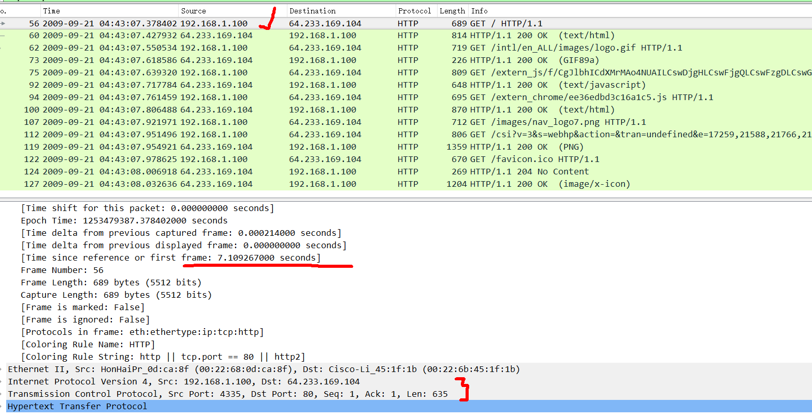

4. 什么时候从Google服务器收到相应的200 OK HTTP消息？携带此HTTP 200 OK消息的IP数据报上的源ip和目标IP地址以及TCP源和目标端口是什么？

答：7.158797000秒收到200OK HTTP响应报文。
    
  源IP地址：64.233.169.104，目标IP地址：192.168.1.100.

  TCP源端口号80，目的端口4335。
  
  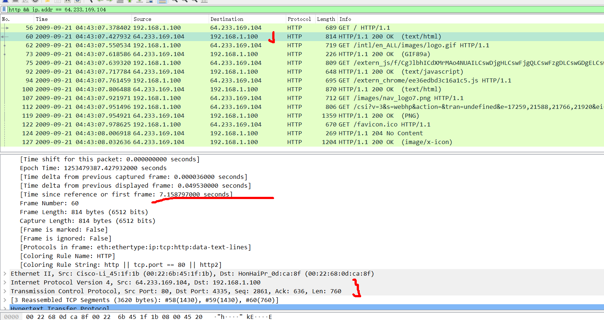

5. 回想一下，在将GET命令发送到HTTP服务器之前，TCP必须首先使用三向SYN / ACK握手建立连接。建立了在7.109267时发送的GET HTTP报文使用的连接所对应的从客户端到服务端的TCP SYN报文段是在什么时候发送的？TCP SYN段的源和目标IP地址以及源和目标端口是什么？为响应SYN而发送的ACK的源和目标IP地址以及源和目标端口是什么。在客户端收到此ACK的时间是什么时候？
（注意：要查找这些段，您需要清除上面在步骤2中输入的过滤器表达式。如果输入过滤器“tcp”，Wireshark将只显示TCP段）

答：在7.075657000秒发送。

  TCP SYN段的源和目标IP地址分别是192.168.1.100和64.233.169.104。

  源端口号和目的端口号分别是4335和80.
    
  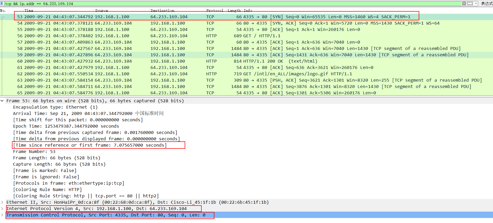

  ACK收到时间：7.108986000。

  源和目标IP地址分别是64.233.169.104和192.168.1.100。

  源端口号和目的端口号分别是80和4335.

  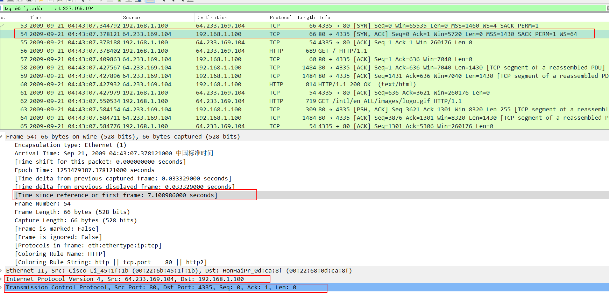

---

  在下文中，我们将重点关注两条HTTP消息（GET和200 OK）以及上面确定的TCP SYN和ACK段。我们的目标是在路由器和ISP之间的链路上捕获的跟踪文件（NAT_ISP_side）中找到这两个HTTP消息和两个TCP段。由于这些捕获的帧已经通过NAT路由器转发，因此一些IP地址和端口号将因NAT转换而被更改。

  打开NAT_ISP_side。请注意，此文件和NAT_home_side中的时间戳不同步，因为图1中所示的两个位置的数据包捕获不会同时启动。（实际上，您应该发现在ISP链路上捕获的数据包的时间戳实际上小于在客户端PC上捕获的数据包的时间戳）。

6. 在NAT_ISP_side跟踪文件中，找到在客户端7.109267发送的HTTP GET消息（其中t = 7.109267是在NAT_home_side跟踪文件中记录的时间）。该消息何时出现在NAT_ISP_side跟踪文件中？承载此HTTP GET的IP数据报的源和目标IP地址以及TCP源和目标端口是什么（在NAT_ISP_side跟踪文件中记录）？与您对上述问题3的回答相比，哪些字段相同，哪些字段不同？

答：Time:6.069168000秒
    源ip：71.192.34.104，端口：4335。
    目的ip：64.233.169.104 ，端口：80。
    只有源ip地址变了。
  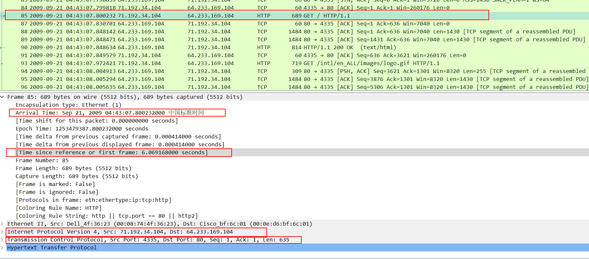
    
7. HTTP GET消息中的任何字段是否已更改？携带HTTP GET的IP数据报中的以下哪个字段发生了变化：版本，标题长度，标志，校验和。如果这些字段中的任何一个发生了变化，请给出一个原因（一句话）说明为什么需要更改此字段。

答：GET报文未改变。

  ip数据报版本不变，源ip地址从192.168.1.100变为71.192.34.104.

  源ip地址变了，校验和自然也需要变。

8. 在NAT_ISP_side跟踪文件中，从Google服务器收到的第一个200 OK HTTP消息是什么时候？携带此HTTP 200 OK消息的IP数据报上的源和目标IP地址以及TCP源和目标端口是什么？哪些字段相同，哪些字段与您对上述问题4的答案不同？

答：值：6.117570000秒。
  源ip：64.233.169.104，端口号：80
  目的ip：71.192.34.104，端口号：4335.

  只有目的ip变了。

  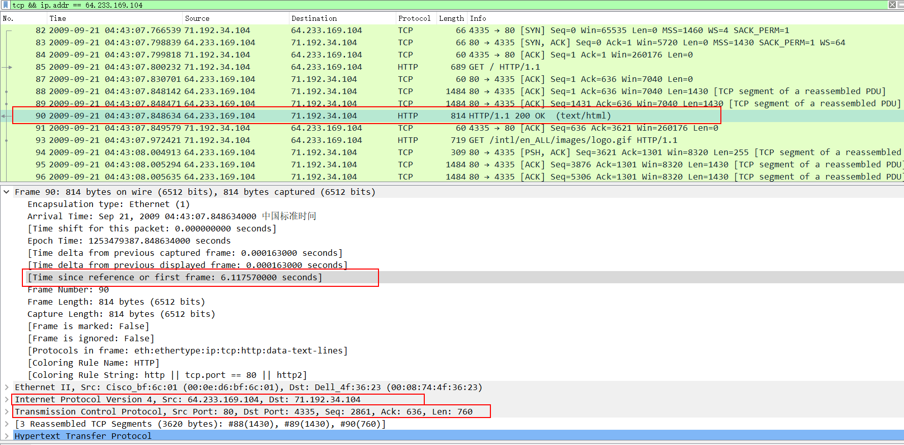

9. 在NAT_ISP_side跟踪文件中，客户端到服务器TCP SYN段和服务器到客户端TCP ACK段在什么时间对应于上面问题5中的报文段？这两个报文段的源和目标IP地址以及源和目标端口是什么？哪些字段相同，哪些字段与您对上述问题5的答案不同？

答： 

*SYN*:

time：6.035475000秒

源ip：71.192.34.104

目的ip：64.233.169.104

源端口：4335

目的端口：80

变化：源ip地址变了。

*ACK*

time：6.067775000秒

源ip：64.233.169.104

目的ip：71.192.34.104

源端口：80

目的端口：4335

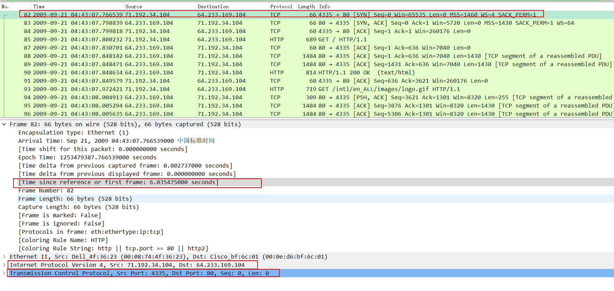
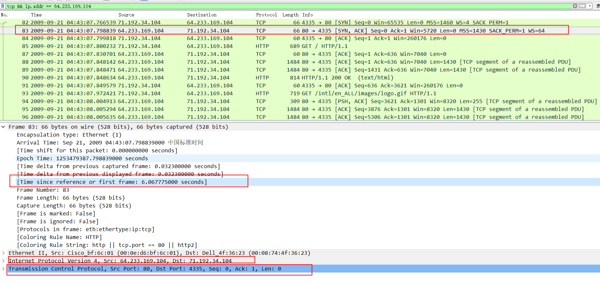

10. 使用上面1-8的答案，填写上面问题1-​​8中考虑的HTTP连接的NAT转换表条目

答：在WAN中，外部世界只能看到一个客户端IP地址，即NAT路由器的IP - 71.192.34.104。客户端的内部LAN IP地址为192.168.1.100。路由器将使用其IP之后的端口号71.192.34.104:4335将数据包转发到实际的客户端IP - 192.168.1.100:4335。

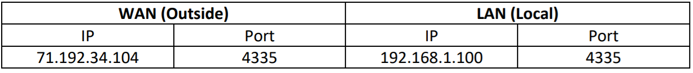

