# WireSharkLab-TCP

## 实验材料
[Wireshark_TCP_v6.0](Wireshark_TCP_v6.0.pdf)

## 概述
  通过实例来详细地研究TCP协议，具体是通从你的计算机过到一个远程主机传输一个150KB的文件
  （包含Lewis Carrol’s Alice’s Adventures in Wonderland的文本）来分析TCP报文段的发送和接收。
  包含以下内容：
  
1. 学习TCP利用序号(seq)和确认号(ack)来提供数据的可靠传输。
2. 学习TCP拥塞控制算法——慢启动和拥塞避免。
3. 学习TCP的接收器通知流控制机制。
4. 考虑TCP连接设置并研究计算机和服务器之间TCP连接的性能（吞吐量和往返时间）。

## 捕获从计算机到远程服务器的批量TCP传输

1. 从http://gaia.cs.umass.edu/wireshark-labs/alice.txt复制全文，在你的计算机上建立新的文本文件TCP.txt，
把复制的文本粘贴到TCP.txt,保存。
2. 打开http://gaia.cs.umass.edu/wireshark-labs/TCP-wireshark-file1.html，点击网页中的选择文件按钮，选择
TCP.txt文件。注意先别点击开始上传按钮。
3. 打开WireShark，启动开始捕获，回到浏览器点击“Upload alice.txt file”按钮，等上传完毕，浏览器会出现一条
congratulations信息。
4. 停止捕获。

### 结果如下：

## 首先看一下捕获的信息

  首先，在显示过滤器那里输入tcp，回车。现在，你看到的应该是你的计算机和gaia.cs.umass.edu之间的
  一系列TCP或者HTTP信息。
  
  **可以看到tcp建立连接的三次握手（包含一个SYN信息）：**

  
  **可以看到一条HTTP POST信息（可看到HTTP POST是在所有TCP报文段传输后才一次性传输过去的)**

  **取决于你的WireShark版本，可能看到一系列HTTP Continuation信息，本人的版本并没有显示，
  其实实际上没有HTTP Continuation这种信息，这只是WireShark来告知你有很多TCP报文段被用来传
  输同一个HTTP信息（因为文件太大了，需要分组）。**
  
  **更多的，最近的几个版本的WireShark，你可以在WireShark分组列表的信息（info)列看到
  “[TCP segmentof a reassembled PDU]”，表明这些TCP报文段属于一个更上层协议的信息
  （在这个例子中，便是HTTP信息）。**

  
  **同时，也能看到从gaia.cs.umass.edu传回你的计算机的确认号，表明某个分组确认收到了。**

  **在我的这一次TCP传输文件过程中，还发生过分组到目的主机超时，引起计算机重新发送分组，结果造成
  有两个一样的分组到达目的主机的情况（后一个分组目的主机会丢弃）**

### 问题解答

+ 从你的计算机传输文件到gaia.cs.umass.edu用的ip地址和TCP端口号是什么？

答：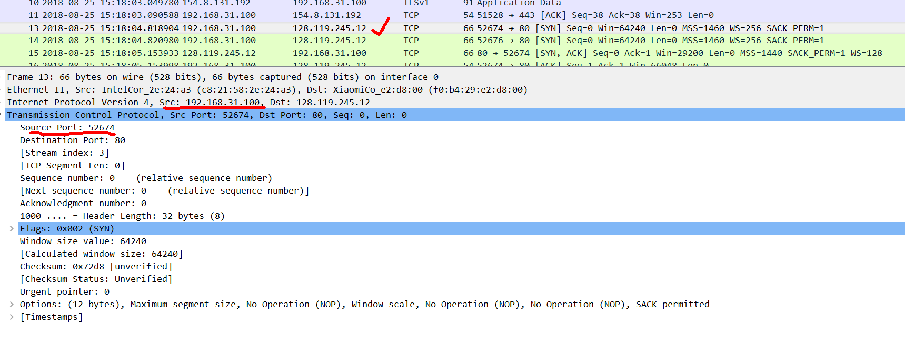

+ gaia.cs.umass.edu的ip地址、传输和接收TCP报文段的端口号是什么？

答：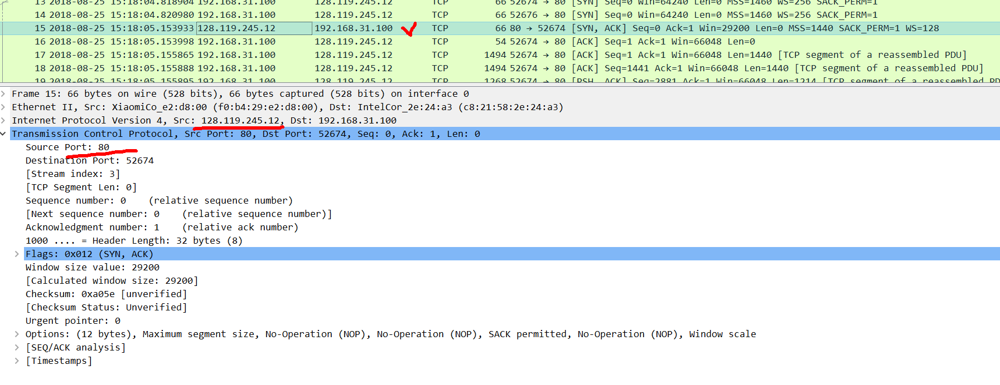

  **既然这次的实验是关于TCP而不是HTTP的，那么我们改变WireShark的分组列表的显示，
  让它显示TCP报文段（包含HTTP报文），不显示HTTP报文**
  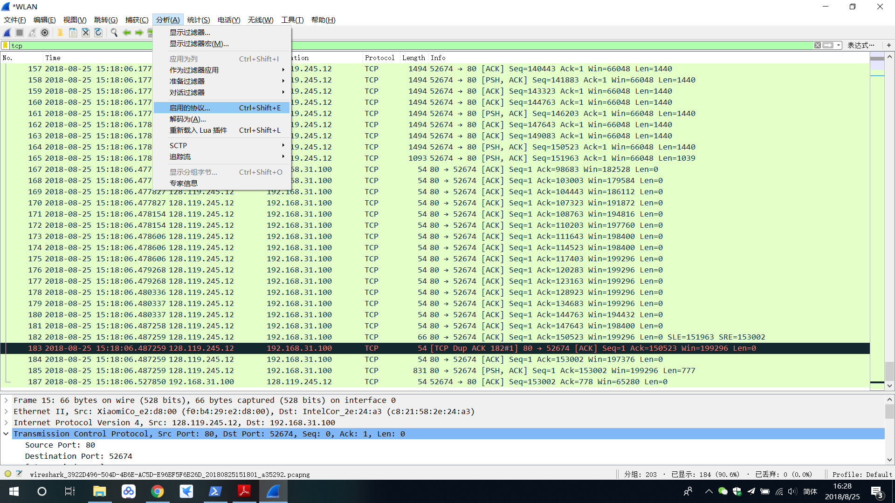
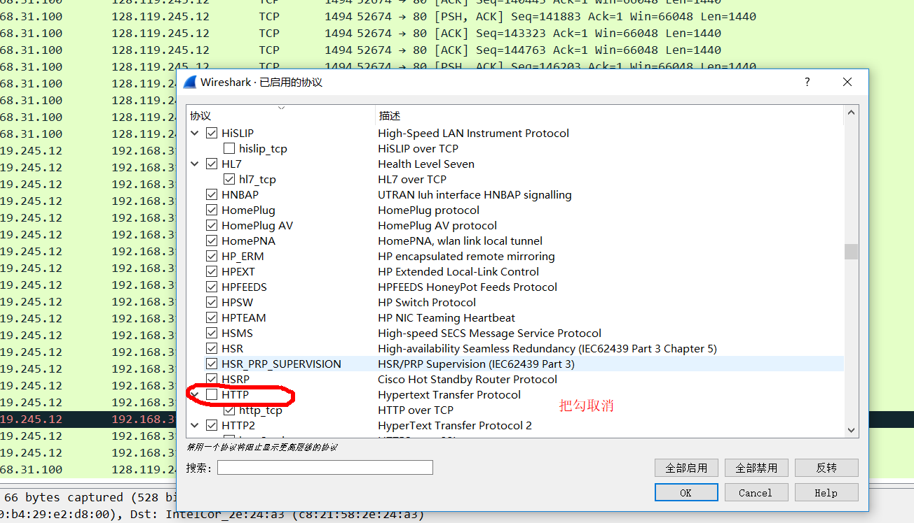

## TCP基础

### 问题解答

+ 在客户端计算机和gaia.cs.umass.edu之间开始建立TCP连接的TCP SYN报文段的序号是什么？什么标识了一个报文段是SYN报文段？

答：序号是0。SYN报文段不包含应用层数据，但在报文段首部中的一个标志位（即SYN比特）被置为1。主要，为了避免被攻击，
客户端会随机地选择一个初始序号（clinet_isn)。

+ gaia.cs.umass.edu回应客户端主机SYN报文段的SYNACK报文段的序号是多少？SYNACK报文段的ack字段是多少？
gaia.cs.umass.edu是如何决定这个值的？报文段中哪些信息标识了这个报文段是SYNACK报文段？

答： 序号是0。ack=1，ack的值是客户端发送过来的syn报文段的序号（0）+1得到的。报文段首部标志位SYN比特和ACK
比特都被置为1，表示这是一个SYNACK报文段。

+ 包含HTTP POST命令的TCP报文段的序号是多少？

答：序号为1.
  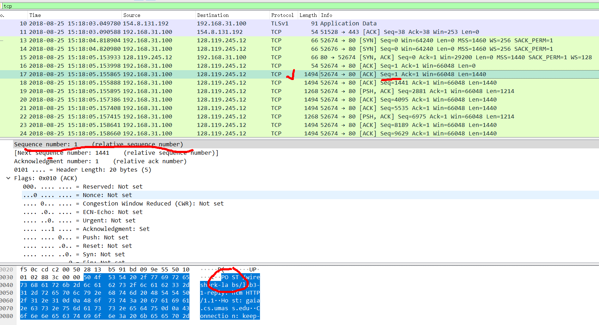

+ 把包含HTTP POST命令的TCP报文段作为第一个报文段。那么tcp连接的前六个报文段的序号是什么？
  什么时候每个报文段开始发送？每个报文段什么时候接收到一个ack报文段？六个报文段的往返时间是多少？
  在接收到每个ack后它们的估计往返时间是多少？
 
答：前六个报文段序号分别为：1,1441,2881,4095,5535,6975.

  发送时间分别为：
  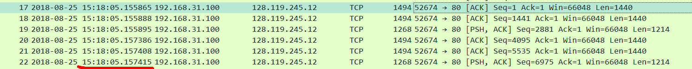
  
  收到ack报文段时间：
  
  先了解一下seq和ack的对应关系。
  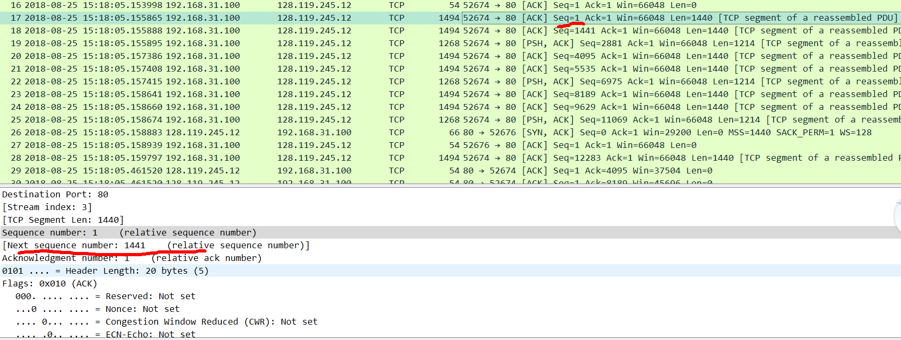
  每个报文段有自己的序号(seq号)，同时有一个next sequence number的信息，即下一条tcp报文段的序号。那么，服务端针对该报文段传回的ack报文段的
  ack便等于next sequence number。比如，序号为1的报文段的next sequence number为1441，那么它的ack报文段的ack=1441。
  
  根据这个原则，我们可以找到每个报文段对应的ack报文段。
  
  在我的实验中，不知道什么原因，只有序号为2881和6975的报文段有收到对应的ack报文段，其它的找不到（我查看了
  官网给的实验的记录，是每个报文段都有对应的ack报文段的）。不过，先不管原因，反正这个对应的原则是对的。
  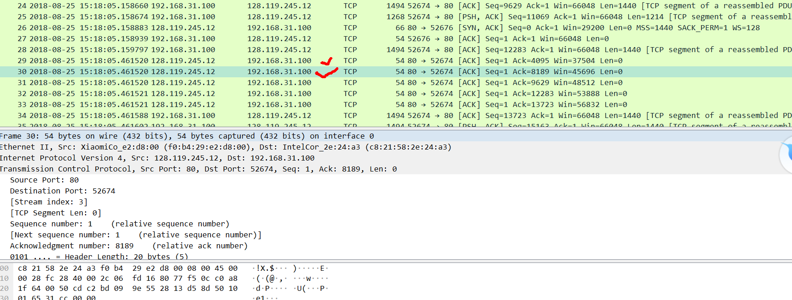
  
  RTT为：
  收到ack报文段的时间-报文段的发送时间便可得到，不详细计算。
  
  估计往返时间：
  
  计算公式：EstimatedRTT = 0.875 * EstimatedRTT + 0.125 * SampleRTT。其实就是计算指数平均值。
  
  因为我的实验报文段没有收到ack回应，无法计算。
  
  下面简单演示一下：
    EstimatedRTT after the receipt of the ACK of segment 1:
    EstimatedRTT = RTT for Segment 1 = 0.02746 second
    EstimatedRTT after the receipt of the ACK of segment 2:
    EstimatedRTT = 0.875 * 0.02746 + 0.125 * 0.035557 = 0.0285
    EstimatedRTT after the receipt of the ACK of segment 3:
    EstimatedRTT = 0.875 * 0.0285 + 0.125 * 0.070059 = 0.0337
    EstimatedRTT after the receipt of the ACK of segment 4:
    EstimatedRTT = 0.875 * 0.0337+ 0.125 * 0.11443 = 0.0438
    EstimatedRTT after the receipt of the ACK of segment 5:
    EstimatedRTT = 0.875 * 0.0438 + 0.125 * 0.13989 = 0.0558
    EstimatedRTT after the receipt of the ACK of segment 6:
    EstimatedRTT = 0.875 * 0.0558 + 0.125 * 0.18964 = 0.0725second

+ 前六个TCP报文段的长度是多少？

答：单位为字节。
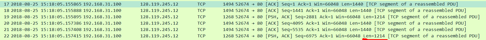

+ 对于整个跟踪，在接收时公布的最小可用缓冲区空间量是多少？缺少接收器缓冲区空间是否会限制发送方？

答：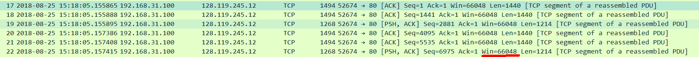

   单位为字节。不会。
   
 + 跟踪文件中是否有重新传输的段？为了回答这个问题，您检查了什么（在跟踪中）？
 
 答：跟踪文件中没有重新传输的段。我们可以通过检查跟踪文件中TCP段的序列号来验证这一点。在该跟踪的
 TimeSequence-Graph（Stevens）中，从源（192.168.1.102）到目的地（128.119.245.12）的所有序列
 号相对于时间单调递增。如果存在重传的分段，则该重传的分段的序列号应小于其相邻分段的序列号。
 
 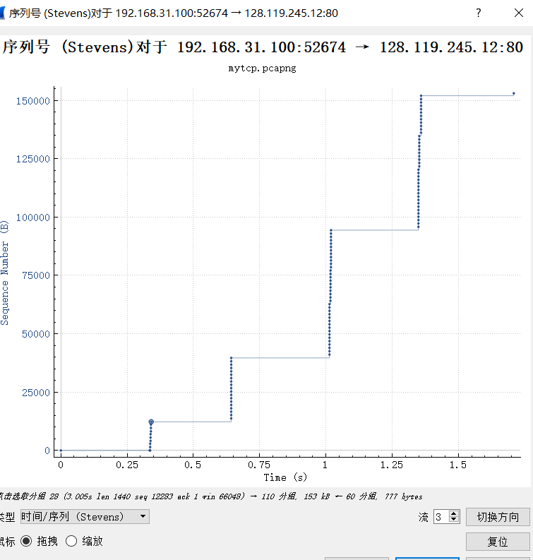
   
 + 接收器通常在ACK中确认多少数据？您能否确定接收方每隔一个接收到的段确认的情况？
 
 答：根据下面的屏幕截图，我们可以看到ACK数字按15163,16603,18043,20923,22363等的顺序增加，依此类推。
  ACK号每次增加1440，表示接收器每次确认1440字节。
 
 
 
   通过检查每个ACK的确认数据量，存在接收器每隔一个段确认一次的情况。例如，89号确认数据段，2880字节= 1440 * 2字节。
 + 
## TCP拥塞控制实践

