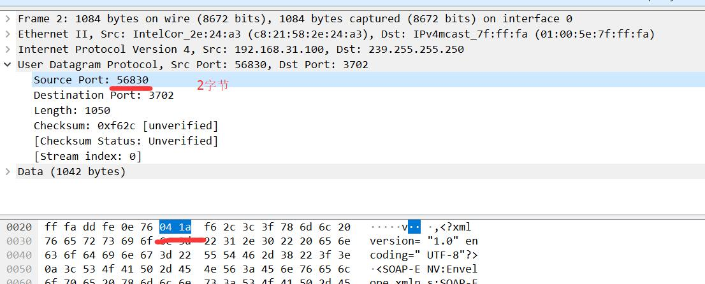
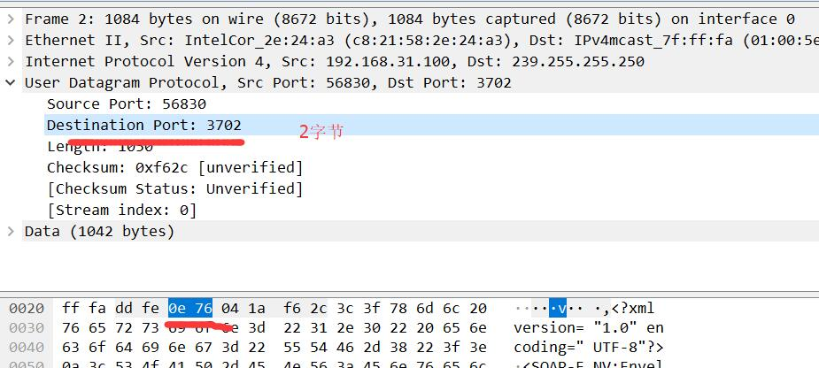
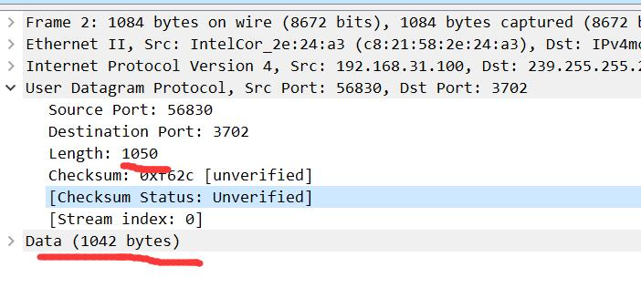
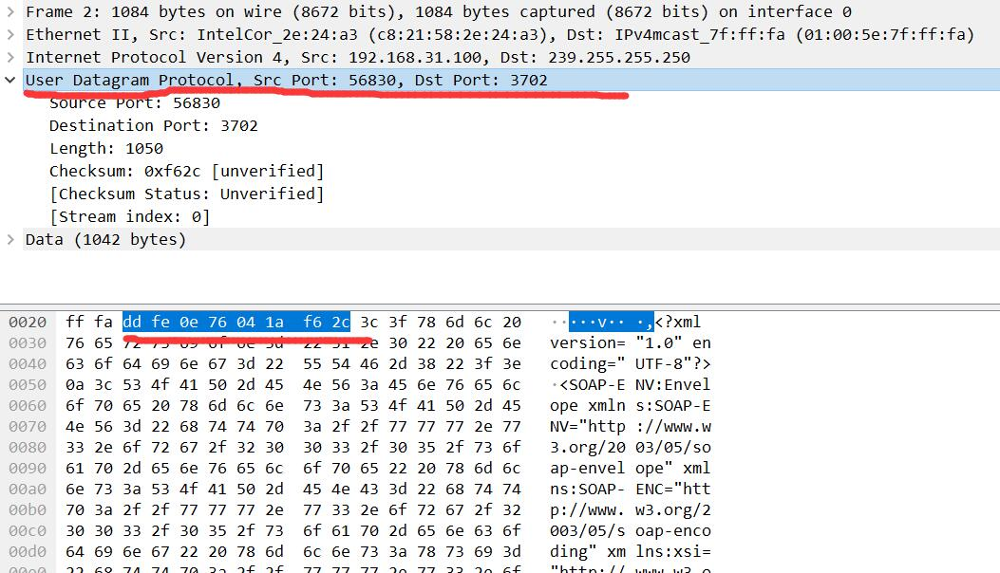
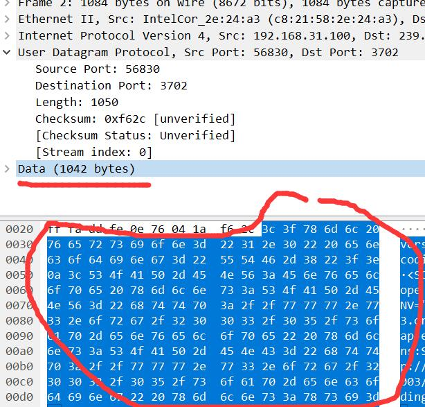
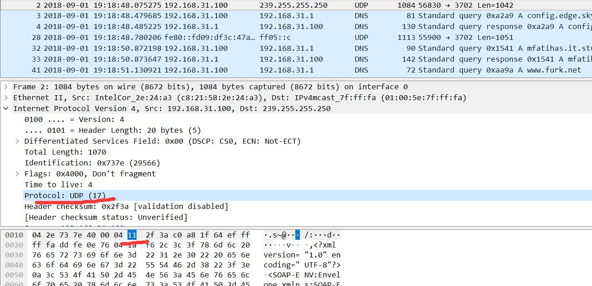
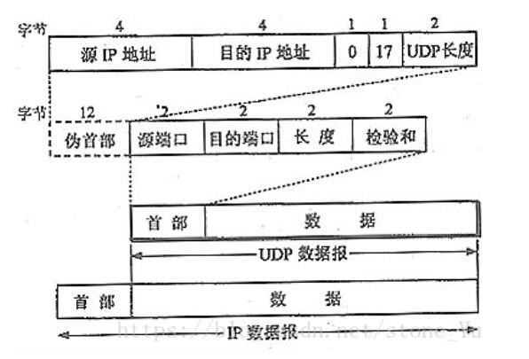
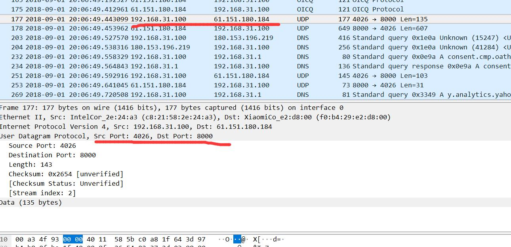
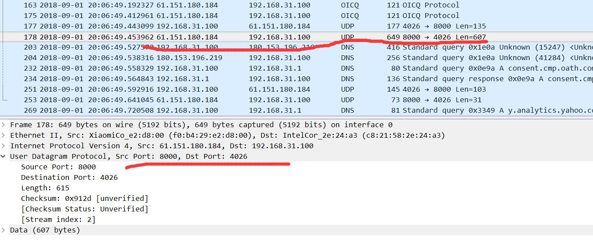

# WireSharkLab-UDP

## 实验材料
[Wireshark_UDP_v6.1](Wireshark_UDP_v6.1.pdf)

## 概述
  在本实验中，我们将快速了解UDP传输协议。正如我们在text1的第3章中看到的那样，UDP是一种简化的简洁协议。
  在进行本实验之前，您可能需要重新阅读课本中的第3,3节。
  由于UDP简单，我们将能够在本实验中快速了解它。
  
  开始在Wireshark中捕获数据包，然后执行一些会导致主机发送和接收多个UDP数据包的操作。
  它也可能只是通过什么都不做（除了通过Wireshark捕获数据包），其他人发送的一些UDP数据包将出现在你的跟踪中。
  特别是，简单网络管理协议（SNMP - 文本中的第9章）在UDP内部发送SNMP消息，因此您可能会在跟踪中找到一些SNMP消息（以及UDP数据包）。
  停止数据包捕获后，设置数据包筛选器，以便Wireshark仅显示在主机上发送和接收的UDP数据包。
  选择其中一个UDP数据包并在详细信息窗口中展开UDP字段。

## 问题解答

+ 从跟踪中选择一个UDP数据包。根据这个数据包中，确定UDP标头中有多少首部字段，这些首部字段是什么？

答：四个。源端口号，目的端口号，报文段长度，校验和。

+ 从分组内容字段中，确定每个UDP报头段首部字段的长度（以字节为单位）

答：每个首部字段为2个字节，共八字节。

+ 长度字段中的值是什么长度？使用捕获的UDP数据包验证您的声明。

答：八个字节的报文段首部字段+1042字节的应用层有效载荷。

+ UDP有效负载中可包含的最大字节数是多少。

答：首部字段中的长度字段是两字节，则其能表达的最大数为2^16-1，首部字段总共8字节，则有效载荷最大字节数是2^16-1-8=65527字节。

+ 最大可能的源端口号是多少？

答：2^16-1=65535

+ UDP的协议号是多少？以十六进制和十进制表示法给出答案。（要回答这个问题，您需要查看IP标头。）

答：协议号为0x11，以十进制表示为17。

+ 在Google中搜索“UDP”并确定计算UDP校验和的字段。

答：UDP计算校验和的方法和IP数据报首部校验和的方法相似。
   
   不同的是：IP数据报校验和只校验IP数据报的首部，但UDP的校验和是把首部和数据部分一起都检验。

   UDP的校验和需要计算UDP首部加数据荷载部分，但也需要加上UDP伪首部。这个伪首部指，源地址、目的地址、UDP数据长度、协议类型（0x11），协议类型就一个字节，但需要补一个字节的0x0，构成12个字节。伪首部+UDP首部+数据一起计算校验和。

   UDP检验和的计算方法是：

. 按每16位求和得出一个32位的数；
. 如果这个32位的数，高16位不为0，则高16位加低16位再得到一个32位的数；
. 重复第2步直到高16位为0，将低16位取反，得到校验和。

+ 检查主机发送第一个数据包的一对UDP数据包，第二个数据包是对第一个数据包的回复。描述两个数据包中端口号之间的关系。

答：端口号对调了。即请求报文的源端口号等于响应报文的目的端口号，请求报文的端口号等于响应报文的源端口号。

