# WiresharkLab-Ethernet_ARP

## 实验材料 
[Wireshark_Ethernet_ARP_v6.01](Wireshark_Ethernet_ARP_v6.01.pdf)

### 概述

在本实验中，我们将研究以太网协议和ARP协议。
在开始本实验之前，您可能希望查看课本中的5.4.1节（链路层寻址和ARP）和5.4.2（以太网）。
RFC 826（ftp://ftp.rfc-editor.org/innotes/std/std37.txt）包含ARP协议的详细信息，IP协议使用该协议来确定已知以太网地址的远程接口的IP地址。

## 1.捕获和分析以太网帧

### 步骤
1. 清除浏览器缓存，启动wireshark开始捕获。
2. 在浏览器中输入
http://gaia.cs.umass.edu/wireshark-labs/HTTP-ethereal-lab-file3.html，转到该地址。
3. 停止Wireshark数据包捕获。
首先，找到从您的计算机发送到gaia.cs.umass.edu的HTTP GET消息的数据包编号（Wireshark上部窗口中最左侧的列），以及：gaia.cs.umass.edu发送到您计算机的HTTP响应报文。

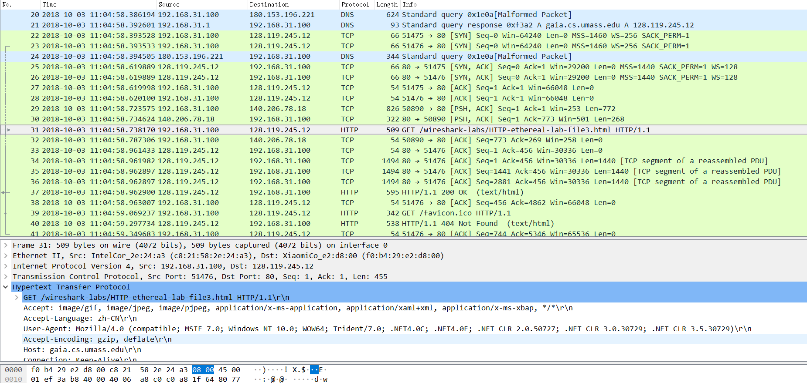

4. 由于本实验是关于以太网和ARP，我们对IP或更高层协议不感兴趣。
因此，让我们更改Wireshark的“捕获数据包列表”窗口，以便它仅显示有关IP以下协议的信息。
要让Wireshark执行此操作，请选择Analyze-> Enabled Protocols。
然后取消选中IP框并选择确定。
您现在应该看到一个Wireshark窗口，如下所示：
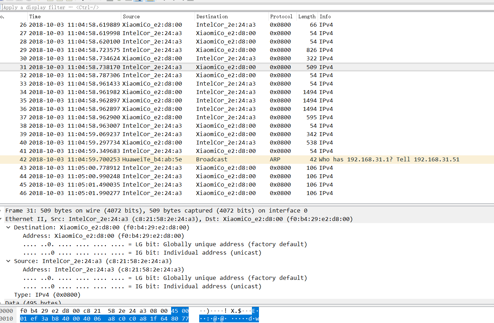

---
选择包含HTTP GET消息的以太网帧。
（回想一下，HTTP GET消息是在一个TCP段内携带的，它在一个IP数据报中携带，在一个以太网帧内携带;如果你发现这个封装有点令人困惑，请重读文本中的第1.5.2节）
。
在数据包详细信息窗口中展开以太网II信息。
请注意，以太网帧的内容（首部以及有效负载）显示在数据包内容窗口中。

根据包含HTTP GET消息的以太网帧的内容，回答以下问题。

1. 你的计算机的48位以太网地址是什么？

答：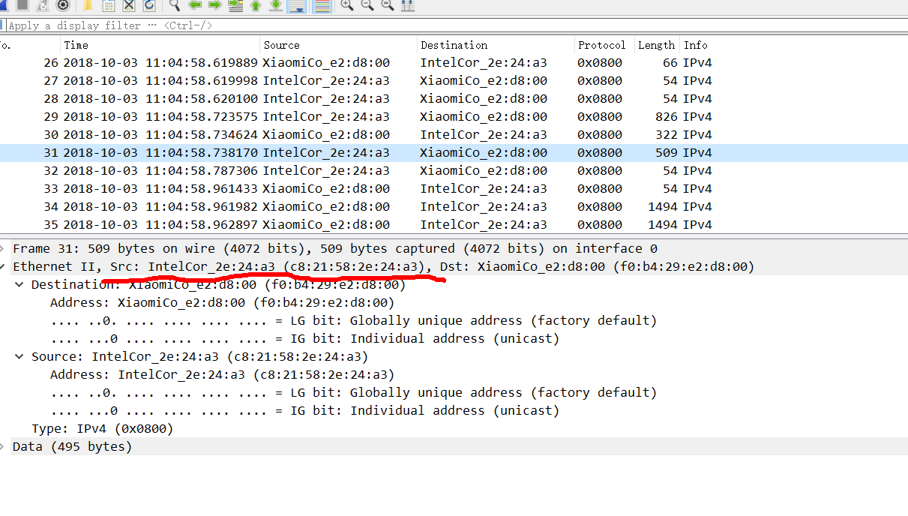

2. 以太网帧中的48位目标地址是什么？这是gaia.cs.umass.edu的以太网地址吗？
（提示：答案是否定的）。这个以太网地址有什么设备？[注意：这是一个重要的问题，也是学生有时会出错的问题。重新阅读课本的第468-469页，并确保您在此处理解答案。]

答：目的地址是f0:b4:29:e2:d8:00，这是我的小米路由器的mac地址。
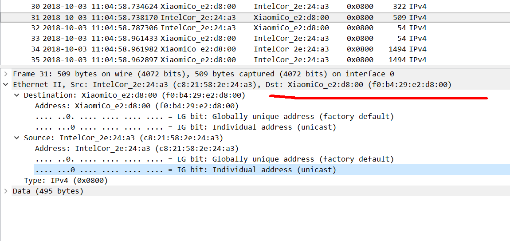

3. 给出双字节帧类型字段的十六进制值。这对应的上层协议是什么？
答：0x0800,对于IPv4。
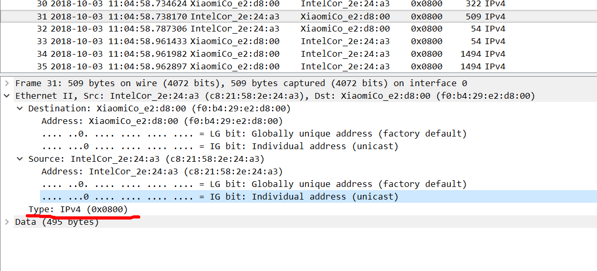

4. 太网帧中，Http报文段的Get中的"G“字符前面有多少个字节？

答：54个字节。

以太网帧首部（包含目的mac地址（6字节)，源mac地址(6字节)，帧类型（2字节）），

ip首部（20字节）

tcp首部（20字节）
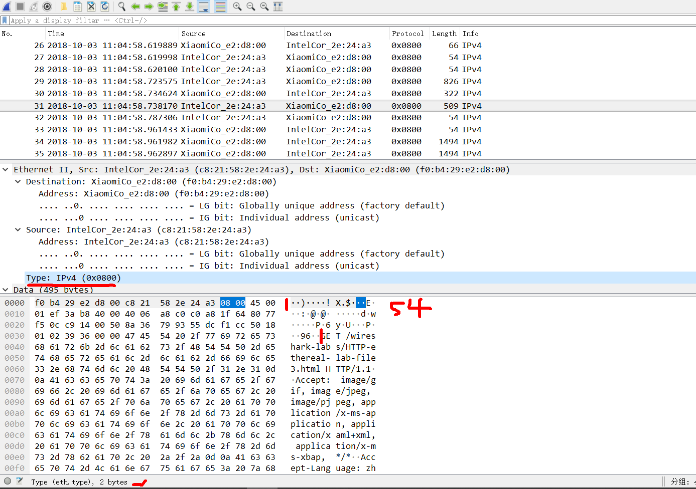

---

接下来，根据包含HTTP响应消息的第一个以太网帧的内容，回答以下问题。

5. 以太网源地址的价值是多少？
这是您的计算机的地址，或是gaia.cs.umass.edu的地址吗？（提示：答案是否定的）。
这个以太网地址有什么设备？

答： f0:b4:29:e2:d8:00。这是我的小米路由器的mac地址。

6. 以太网帧中的目标地址是什么？这是你的计算机的以太网地址吗？

答： c8:21:58:2e:24:a3，是我的计算机的mac地址。
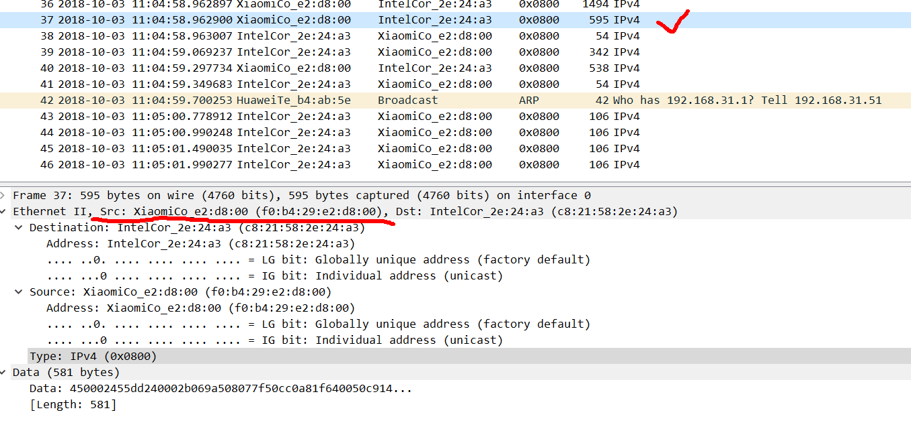

7. 给出双字节帧类型字段的十六进制值。
这对应的上层协议是什么？

答：0x0800，ipv4。

8. 以太网帧中，HTTP响应报文段中OK中的“O"字符前面有多少个字节？

答：前面有67个字节。

以太网帧首部（包含目的mac地址（6字节)，源mac地址(6字节)，帧类型（2字节）），

ip首部（20字节）

tcp首部（20字节）

还有13个http报文中O字符前面的字节。

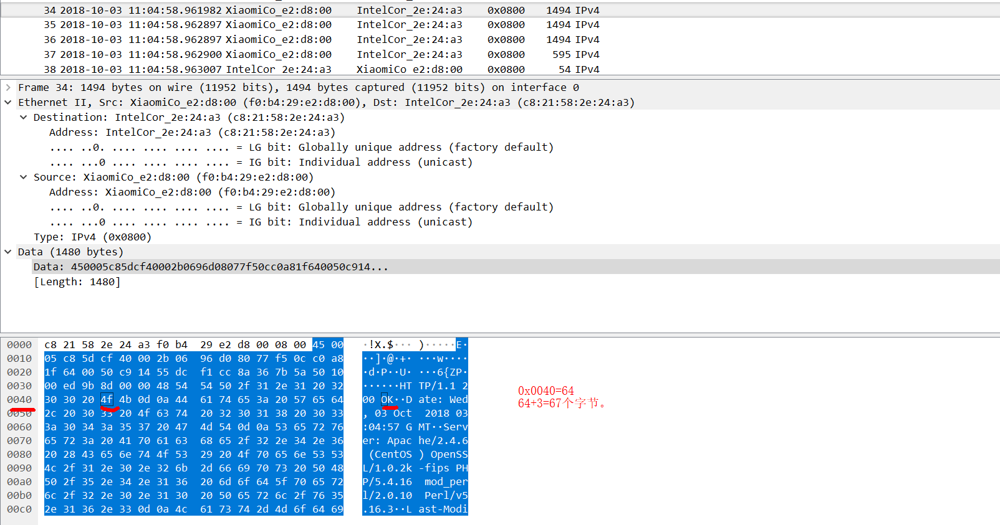

## 2.地址解析协议

*ARP缓存*

  回想一下，ARP协议通常在您的计算机上维护IP到以太网地址转换对的缓存.arp命令（在MSDOS和Linux / Unix中）用于查看和操作此缓存的内容。
由于arp命令和ARP协议具有相同的名称，因此很容易混淆它们。
但请记住，它们是不同的 - arp命令用于查看和操作ARP缓存内容，而ARP协议定义了发送和接收的消息的格式和含义，并定义了对消息传输和接收所采取的操作。

  让我们看一下计算机上arp缓存的内容：

* MS-DOS。arp命令位于c:\windows\system32中，因此在MS-DOS命令行中键入“arp”或“c:\windows\system32\arp”（不带引号）。
* linux / Unix / MacOS。arp命令的可执行文件可以位于不同的位置。一般位置是/ sbin/arp（对于linux）和/usr/etc/arp（对于某些Unix变体）。

不带参数的Windows arp命令将显示计算机上ARP缓存的内容。
运行arp命令。(我的电脑上式arp -a)

9. 记下计算机ARP缓存的内容。
每列值的含义是什么？
答：如下图。每列分别是ip地址，mac地址，以及ip地址类型（动态还是静态的）。
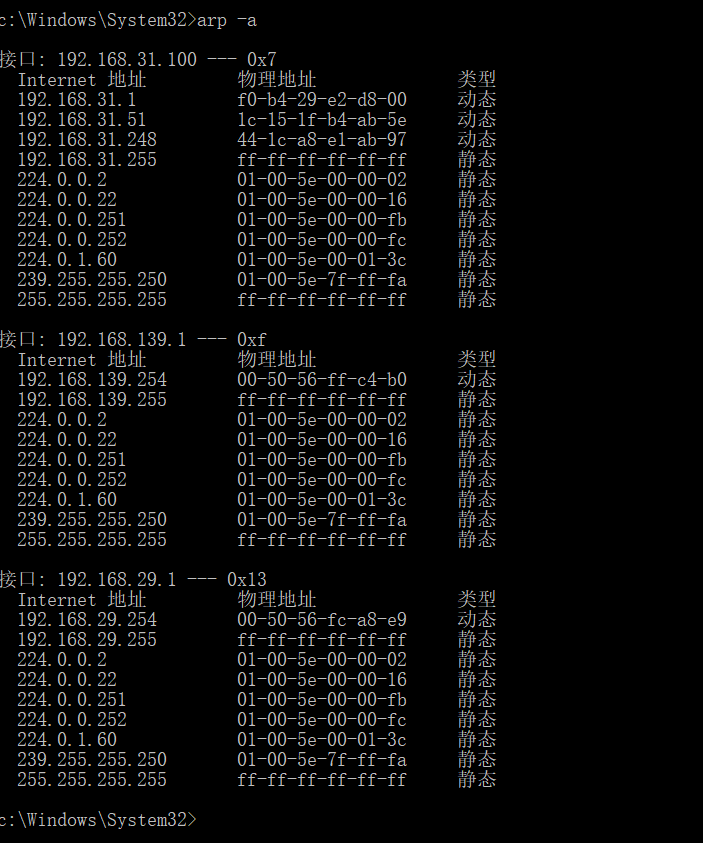

---

为了观察您的计算机发送和接收ARP报文，我们需要清除ARP缓存，否则您的计算机很可能在其缓存中找到所需的IP以太网地址转换对，因此无需发送ARP报文。

命令，输入 arp -d *。(删除arp缓存需要以管理员身份运行)

步骤：

1. 清除arp缓存。
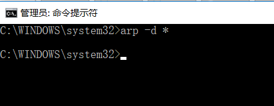

2. 清除浏览器缓存。
3. 打开wireshark开始捕获分组
4. 在浏览器中输入以下URL：http//gaia.cs.umass.edu/wireshark-labs/HTTP-wireshark-lab-file3.html您的浏览器应再次显示相当冗长的美国权利法。
5. 停止捕获，更改Wireshark的“捕获数据包列表”窗口，以便它仅显示有关IP以下协议的信息。要让Wireshark执行此操作，请选择Analyze-> Enabled Protocols。
然后取消选中IP框并选择确定。
您现在应该看到一个Wireshark窗口，如下所示。

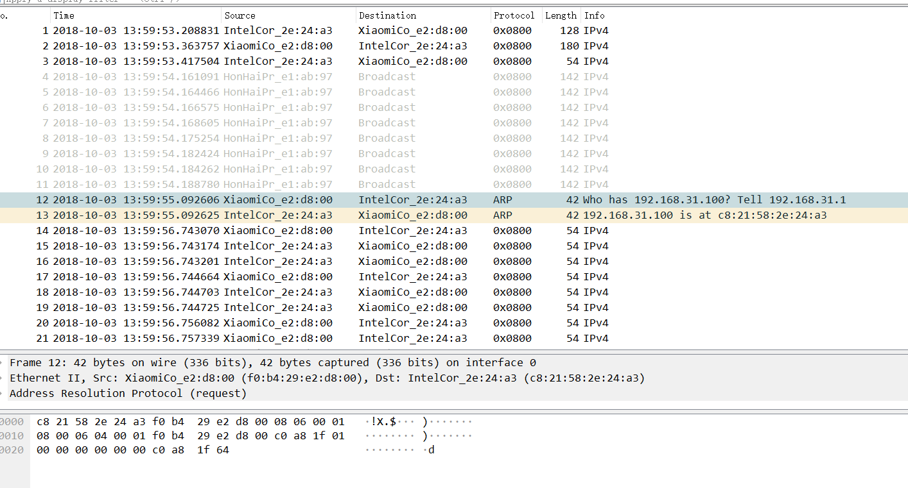

  *问题*

10. 包含ARP请求消息的以太网帧中的源地址和目标地址的十六进制值是多少？

答：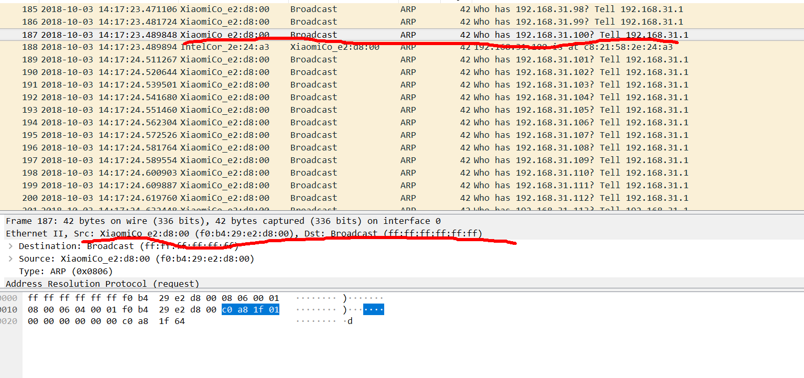

11. 双字节以太网帧类型字段的十六进制值是什么？
这对应的上层协议是什么？

答：0x0806，对应的上层协议是ARP协议。

12. 从ftp://ftp.rfc-editor.org/in-notes/std/std37.txt下载ARP规范。
有关ARP的可读详细讨论，请访问http://www.erg.abdn.ac.uk/users/gorry/course/inet-pages/arp.html。

- a) 以太网帧中，ARP操作码前面有多少个字节？

答：20个字节.
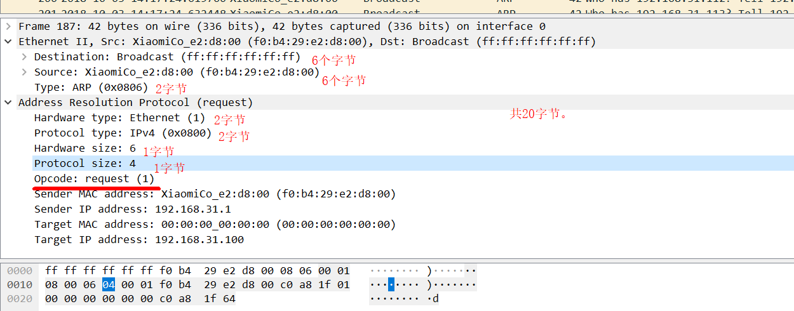

- b)在进行ARP请求的以太网帧的ARP负载部分中，操作码字段的值是多少？
答： 0x0001.

- c)ARP报文是否包含发件人的IP地址？

答：是的。
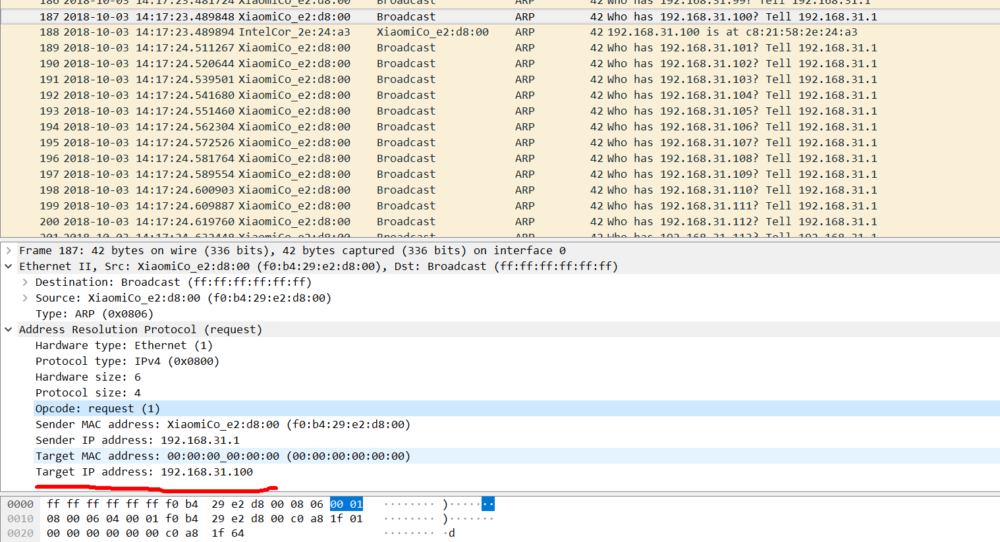

- d) Where in the ARP request does the “question” appear – the Ethernet
address of the machine whose corresponding IP address is being queried?

答： 查询的是目的mac地址。它被设置为0并广播目的ip地址以找到对应的目的ip地址。

13. 现在找到响应ARP请求而发送的ARP响应报文。
- a) 太网帧中，ARP操作码前面有多少个字节?
答： 20个字节。
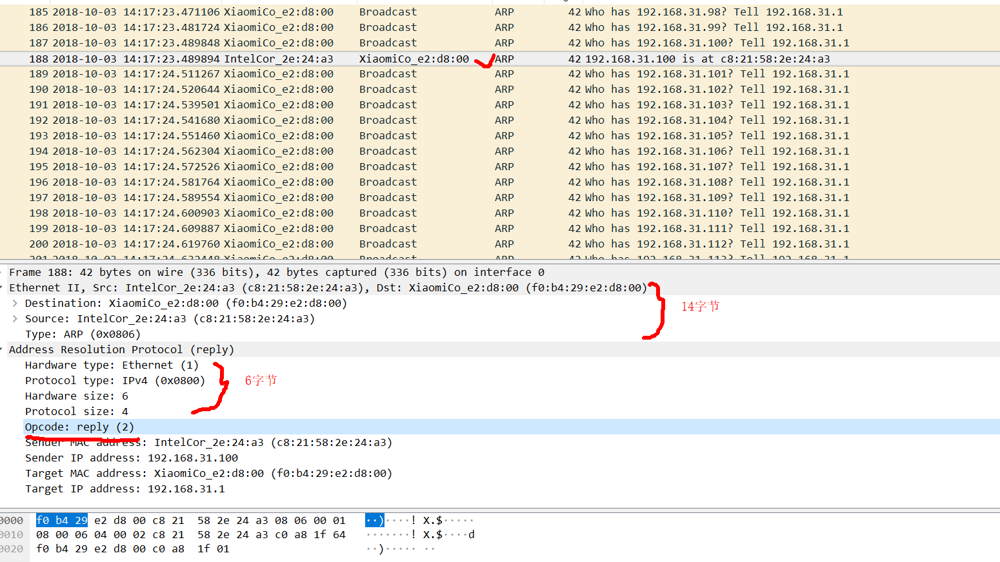

- b) 在进行ARP请求的以太网帧的ARP负载部分中，操作码字段的值是多少？
答： 0x0002.

- c) Where in the ARP message does the “answer” to the earlier ARP request appear – the IP address of the machine having the Ethernet address whose corresponding IP address is being queried?

答：目标MAC地址从00：00：00：00：00：00变为f0:b4:29:e2:d8:00。
此外，目标IP地址从192.168.31.100更改为192.168.31.1.
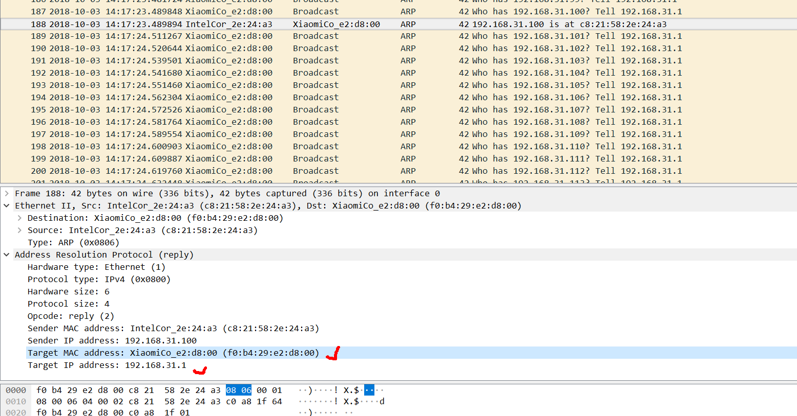

14. 包含ARP响应报文的以太网帧中的源地址和目标地址的十六进制值是多少？

答：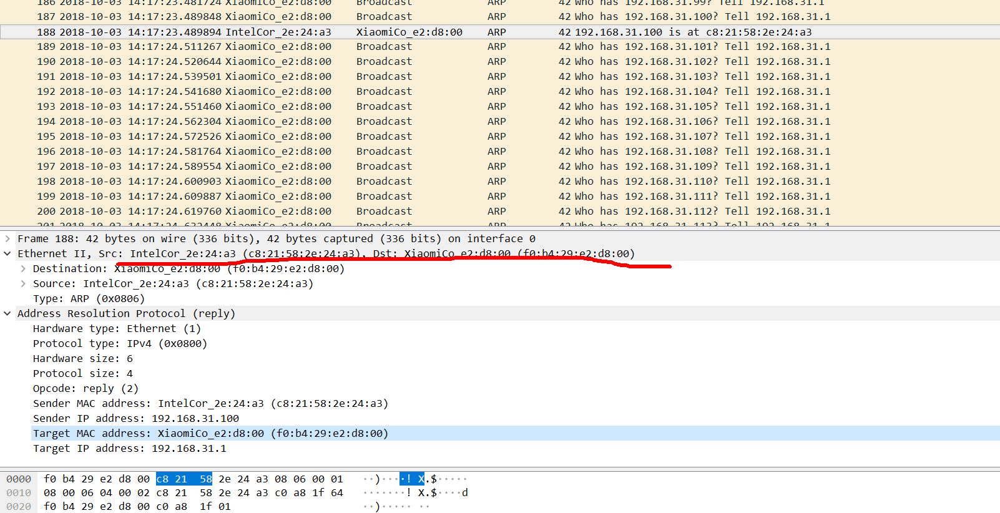