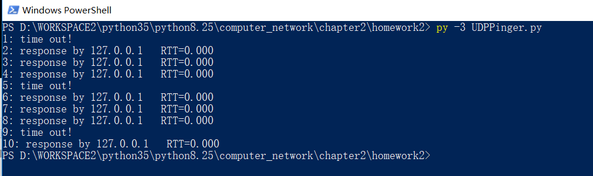

# 套接字编程作业2：UDPping程序

## 作业描述

>在这个编程作业中，你将用Python编写一个客户ping程序。该客户将发送一个简单的ping报文，接受一个从服务器返回的pong报文，并确定从该客户发送ping报文到接收到pong报文为止的时延。该时延称为往返时延（RTT）。由该客户和服务器提供的功能类似于在现代操作系统中可用的标准ping程序，然而，标准的ping使用互联网控制报文协议（ICMP）（我们将在第4章中学习ICMP）。此时我们将创建一个非标准（但简单）的基于UDP的ping程序。

你的ping程序经UDP向目标服务器发送10个ping报文，对于每个报文，当对应的pong报文返回时，你的客户要确定和打印RTT。因为UDP是一个不可靠协议，由客户发送的分组可能会丢失。为此，客户不能无限期地等待对ping报文的回答。客户等待服务器回答的时间至多为1秒；如果没有收到回答，客户假定该分组丢失并相应地打印一条报文。

在此作业中，我们给出服务器的完整代码（在配套网站中可以找到。你的任务是编写客户代码，该代码与服务器代码非常类似。建议你先仔细学习服务器的代码，然后编写你的客户代码，可以不受限制地从服务器代码中剪贴代码行。

##详细描述
[Socket_UDPpinger.pdf](Socket_UDPpinger.pdf)

## 解答代码

    from socket import *
    import time

    servername='127.0.0.1'
    serverport= 12000
    clientSocket=socket(AF_INET,SOCK_DGRAM)
    clientSocket.settimeout(1) #设置超时时间

    for i in range(1,11):
        t0=time.time()
        clientSocket.sendto(('Ping %d %s' % (i,t0)).encode(), (servername,serverport))
        try:
            modifiedMessage,serveraddress=clientSocket.recvfrom(1024)
            total_time=time.time()-t0
            print('%d: response by %s   RTT=%.3f'%(i,servername,total_time))

        except Exception as e:
            print('%d: time out!' %i)
    clientSocket.close()

## 演示

### 服务器端
  在一台主机上运行UDPPingerServer.py。

  

###客户端

  运行UDPPinger.py

  