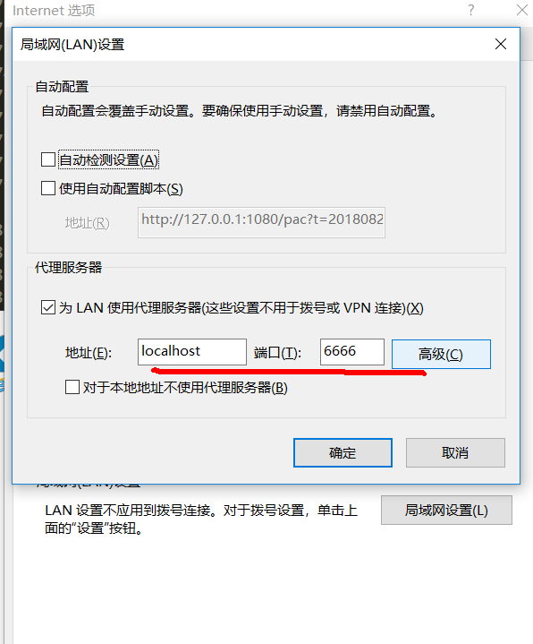
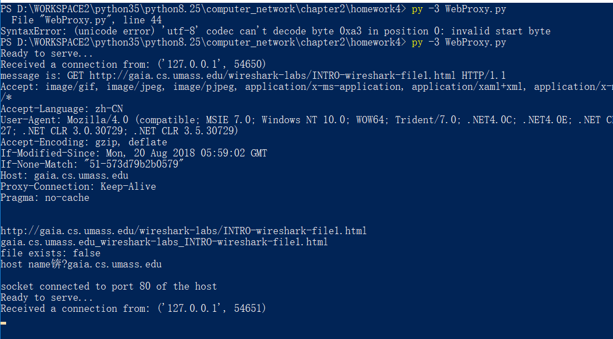
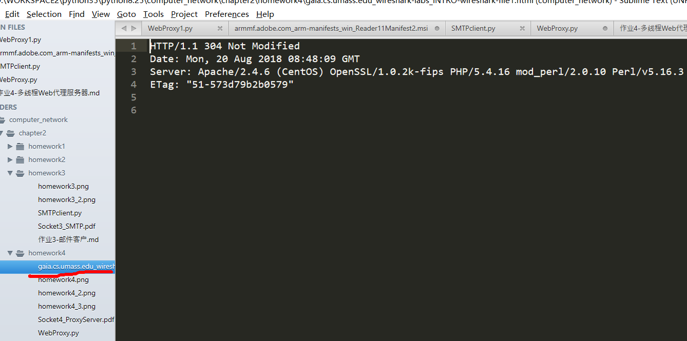

# 作业4-多线程Web代理服务器

## 详细描述
[Socket4_ProxyServer.pdf](Socket4_ProxyServer.pdf)

## 代码
#coding:utf-8
from socket import *

# Create a server socket, bind it to a port and start listening

    tcpSerSock = socket(AF_INET, SOCK_STREAM)
    tcpSerPort=6666
    tcpSerSock.bind(('',tcpSerPort))
    tcpSerSock.listen(5)

    while 1:
        # Strat receiving data from the client
        print('Ready to serve...')
        tcpCliSock, addr = tcpSerSock.accept()
        print('Received a connection from:', addr)
        message =tcpCliSock.recv(8192).decode() 
        print("message is:",message)
        # Extract the filename from the given message
        print(message.split()[1])
        filename = message.split()[1].partition("//")[2].replace('/','_')
        print(filename)
        fileExist = "false"
        try:
            # Check wether the file exist in the cache
            f = open(filename, "r")
            outputdata = f.readlines()
            fileExist = "true"

            # ProxyServer finds a cache hit and generates a response message
            tcpCliSock.send("HTTP/1.0 200 OK\r\n")
            tcpCliSock.send("Content-Type:text/html\r\n")
            # Fill in start.
            for i in range(len(outputdata)):
                tcpCliSock.send(outputdata[i].encode())
            # Fill in end.
            print('Read from cache')
        # Error handling for file not found in cache
        except IOError:
            print("file exists:",fileExist)
            if fileExist == "false":
                # Create a socket on the proxyserver
                c = socket(AF_INET,SOCK_STREAM)# Fill in start. # Fill in end.
                hostn = message.split()[1].partition("//")[2].partition("/")[0]
                print("host name：",hostn)
                try:
                    # Connect to the socket to port 80
                    # Fill in start.
                    c.connect((hostn,80))
                    print('socket connected to port 80 of the host')
                    c.sendall(message.encode())
                    buff=c.recv(8192)

                    tcpCliSock.sendall(buff)

                    tmpfile=open("./"+filename,"w")
                    tmpfile.writelines(buff.decode().replace('\r\n','\n'))
                    tmpfile.close()

                except:
                    print("Illegal request")
            else:
                # HTTP response message for file not found
                # Fill in start.
                print("File Not found")
                # Fill in end.
        # Close the client and the server sockets
        tcpCliSock.close()
    tcpSerSock.close()

## 运行

  我们使用链接 http://gaia.cs.umass.edu/wireshark-labs/INTRO-wireshark-file1.html 测试我们的代理程序，该链接是本书第一个wireshark实验使用的测试连接，正常打开后会出现一条欢迎语句：

  接着在本地运行代理服务器程序:

  打开IE浏览器，并设置代理，指向我们自己编写的代理程序：

  然后在IE浏览器中打开上文提到的链接，网页将正常显示.
  这时代理服务器程序显示缓存中不存在该文件，转发请求并接收响应的消息：

  同时在代理服务器程序的同目录下 会发现缓存的网页文件：

