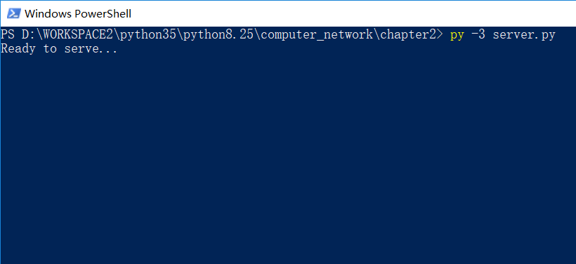
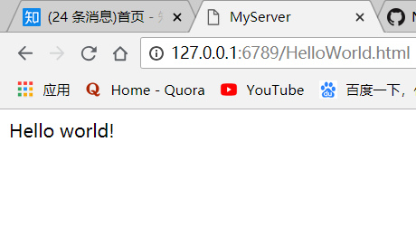
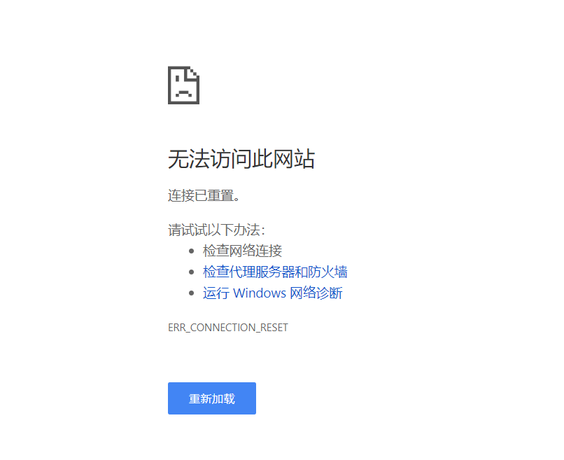

# 套接字编程作业1：Web服务器
## 作业描述

> 在这个编程作业中，你将用Python语言开发一个简单的Web服务器，它仅能处理一个请求。具体而言，你的Web服务器将：
>当一个客户（浏览器）联系时创建一个连接套接字；
>从这个连接套接字接收HTTP请求；
>解释该请求以确定所请求的特定文件；
>从服务器的文件系统获得请求的文件；
>创建一个由请求的文件组成的HTTP响应报文，报文前面有首部行；
>经TCP连接向请求浏览器发送响应。如果浏览器请求一个在该服务器种不存在的文件，服务器应当返回一个“404 Not Found”差错报文。
>在配套网站中，我们提供了用于该服务器的框架代码，我们提供了用于该服务器的框架代码。你的任务是完善该代码，运行服务器，通过在不同主机上运行的浏览器发送请求来测试该服务器。如果运行你服务器的主机上已经有一个Web服务器在运行，你应当为该服务器使用一个不同于80端口的其他端口。

## 详细描述

[官方文档：Socket1_WebServer.pdf](Socket1_WebServer.pdf)

## 解答

**webserver.py**

	#import socket module
	from socket import *
	serversocket=socket(AF_INET, SOCK_STREAM)#创建套接字，AF_INET表示IP地址用的32位地址，SOCK_STREAM表示用TCP连接

	#prepare a server socket

	serversocket.bind(('',6789))#将这个套接字与套接字地址(IP+端口号)绑定
	serversocket.listen(1)#最大连接数为1，表示最多同时只能响应一个客户端请求
	while True:
    	print('Ready to serve...')
    	connectionSocket,addr=serversocket.accept()#接到客户端请求后，建立一个连接套接字，该套接字负责与对应的客户端通信-->并发
    	try:
        	message=connectionSocket.recv(1024)
        	filename=message.split()[1]#回想一下请求行：方法字段、URL字段、HTTP版本，这个获取的便是URL字段，以便得到要请求的文件名
        	f=open(filename[1:])#去掉第一个字符'/'
        	outputdata=f.read()
        	header = 'HTTP/1.1 200 OK\nConnection: close\nContent-Type: text/html\nContent-Length: %d\n\n' % (len(outputdata))
        	connectionSocket.send(header.encode())
        	for i in range(len(outputdata)):
            	connectionSocket.send(outputdata[i].encode())
        	connectionSocket.close()
    	except IOError:
        	connectionSocket.send("HTTP/1.1 404 NOTFound".encode())
        	connectionSocket.close()
	serversocket.close()

**HelloWorld.html**

	<title>MyServer</title>
	<head>Hello world!</head>

## 运行示范
### 服务器端

  在同一个主机同一个目录下放置HelloWorld.html和webserver.py文件，运行webserver.py文件，作为服务器。
  
  
  
### 客户端

  在另一台主机打开浏览器，并输入"http://XXX.XXX.XXX.XXX:6789/HelloWorld.html" 
  （其中"XXX.XXX.XXX.XXX"是服务器IP地址），以获取服务器上的HelloWorld.html文件。

  由于我只有一台主机，便在和服务器同一台主机打开页面，输入http://127.0.0.1:6789/HelloWorld.html。成功的话，结果如下：
  
  
  
  输入新地址"http://XXX.XXX.XXX.XXX:6789/wozuishuai.html"，由于服务器不存在'shuai.html'。将出现以下页面（注意页面中的"HTTP ERROR 404"）：

  
