# 什么是操作系统 #
## 用户态和内核态 ##
- 内核态：操作系统运行在内核态的软件，拥有对所有硬件的完全访问权，可以执行机器能够运行的任何指令。
- 用户态：软件其他部分运行在用户态，只使用机器指令中的一个子集。那些会影响机器的控制或可进行I/O操作的指令，在用户态中的程序是禁止的
## 任务 ##
1. 自顶向下：为用户程序提供一个更好、更简单、更清晰的计算机模型，并管理处理器、磁盘、主存等设备。

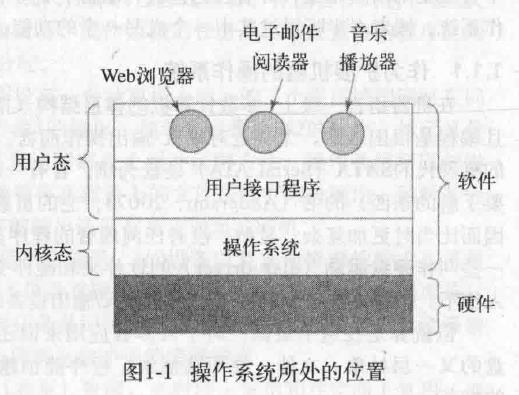

2.. 自底向上：在相互竞争的程序之间有序的控制对处理器、存储器以及其他I/O接口设备的分配。

## 资源管理 ##
实现多路复用（共享）资源：

1. 时间上的复用：；例如多个程序轮流获取CPU时间。对于资源是如何实现时间复用（谁应该是下一个以及运行多长时间），则是操作系统的任务。
2. 空间复用：在若干个运行程序之间分割内存，这样每一个程序都可同时注入内存（例如为了轮流使用CPU）。

# 操作系统历史 #
# 计算机硬件简介 #

简单个人计算机中一些部件：

## 处理器 ##
- 作用：从内存中取出指令并执行
- 每个CPU都有一套可执行的专门指令集。x86处理器不能执行ARM程序。
- 速度瓶颈：用来访问内存以得到指令或者数据的时间要比执行指令花费时间长的多--->CPU内部有用来保存关键变量和临时数据的寄存器
- 寄存器种类: 
	1. 用来保存变量和临时数据的通用寄存器
	2. 程序计数器：保存了将要取出的下一条指令的内存地址
	3. 堆栈指针：指向内存中当前栈的顶端
	4. 程序状态字寄存器：包含条件码位、CPU优先级、模式（用户态、内核态）控制位。
- 改善性能，放弃同时读取、解码、执行一条指令的简单模型
	1. 流水线机制
	2. 超标量CPU
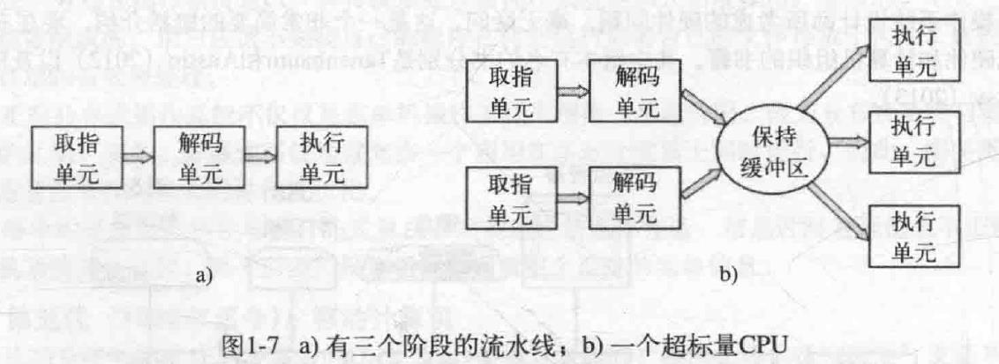
- 用户态中有关I/O和内存保护的所有指令是禁止的，将PSW（程序状态字）中的模式位设置成内核态也是禁止的。为了从操作系统获取服务，用户程序必须使用系统调用以陷入内核并调用操作系统，TRAP指令把用户态切换成内核态，并启用操作系统。
- 多线程和多核芯片 ：
  1. 摩尔定律 ---> 在CPU芯片中加入更大的缓存；不仅仅是有多个功能部件，某些控制逻辑也会出现多个 -->多线程。
  2. 多线程或超线程：(1) 多线程允许CPU保持两个不同的线程状态，然后再纳秒的时间尺度内来回切换
  （2） 多线程不提供真正的并行处理，在一个时刻内只有一个进程在运行，但是线程的切换时间则减少到纳秒数量级。
 
## 存储器 ##
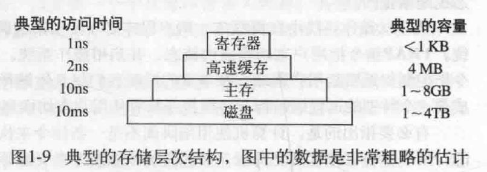

缓存系统需要考虑的问题

1. 何时把一个新的内容放入缓存（缓存不命中）
1. 把新内容放在缓存的哪一行上（哪个高速缓存行，缓存行哪个字节）
1. 在需要时，应该把哪个内容移走
1. 应该把新移走的内容放在某个较大存储器的何处

缓存可能设计为多级，L1，L2，L3缓存

主存：存储器系统的主力---->随机访问存储器(RAM)

## 磁盘 ##

- 同RAM相比，每个二进制位的成本低了两个数量级
- 随机访问数据时间比RAM慢了三个数量级  ->机械装置
- 概念：
	1. 磁道
	2. 柱面
	3. 扇区（512字节）

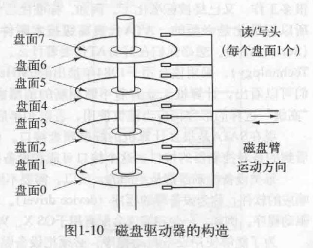

- 虚拟内存机制：使得期望运行大于物理内存的程序成为可能。这种机制需要快速的映射内存地址，以便把程序生成的地址转换为有关字节在RAM中的物理地址。由CPU中的存储器管理单元(MMU)完成。
- 上下文切换，两种昂贵操作：
	1. 缓存修改过的块写回磁盘
	2. 修改MMU中的映像寄存器
## IO设备 ##
- 包括控制器和设备本身
- 控制器的任务是为操作系统提供一个简单的接口（还是很复杂）。
- 每类设备的控制器都是不同的，需要不同的软件进行控制。
   1. 负责专门于控制器对话，发出命令并接受响应的软件，称为设备驱动程序。
   2. 为了能使用设备驱动程序，必须把设备驱动程序装入操作系统中，这样它可在核心态中运行。
- 实现输入和输出的方式：
   1. 忙等待
   2. 设备驱动程序启动设备并且让该设备在操作完成时发出一个中断
   3. 为IO使用一种特俗的直接存储器访问(DMA)芯片，无需CPU干预，在完成时发送CPU一个中断
   
   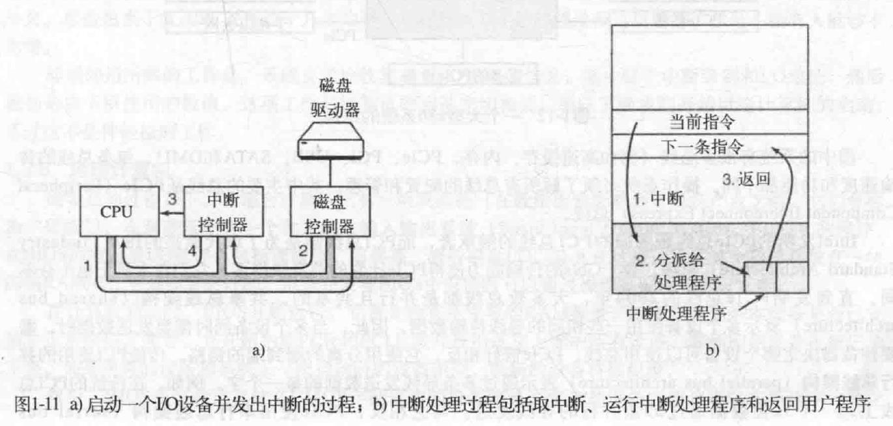

## 总线  ##

多总线结构

   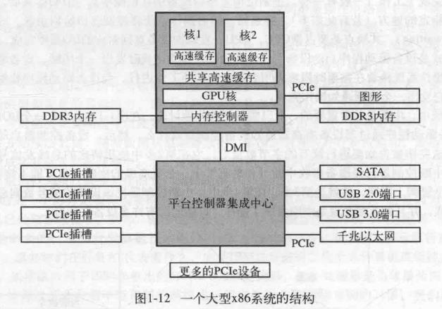
## 启动计算机过程 ##
1. BIOS运行，检查RAM数量、键盘及其他基本设备是否安装并已正常响应
2. 扫描PCIe和PCI总线并找出连在上面的设备，新的设备将被配置
3. BIOS通过尝试存储在CMOS存储器中的设备清单启动设备，用户可在系统刚启动后进入BIOS配置程序，修改清单。若存在CD-ROM(有时是USB),则试图从中启动，若失败，则从硬盘启动。
4. 启动设备上的第一个扇区被读入内存并执行。从该分区载入第二个启动装载模块。来自活动分区的这个装载模块被读入操作系统，并启动之。
5. 操作系统询问BIOS，以获得配置信息。对于每种设备，都需要设备驱动程序，若没有，则要求用户插入设备驱动程序的CD-ROM或从网上下载。
6. 操作系统将设备驱动程序调入内核，然后初始化有关表格，创建需要的任何后台进程，并在每个终端上启动登陆程序或GUI。

# 操作系统大观园 #
### 大型机操作系统 ###
### 服务器操作系统 ###
### 多处理器操作系统 ###
### 个人计算机操作系统 ###
### 掌上计算机操作系统 ###
### 传感器节点操作系统 ###
### 实时操作系统 ###
### 智能卡操作系统 ###

# 操作系统概念 #
## 进程 ##
- 进程本质上是正在执行的一个程序
- 与进程有关的是地址空间，这是从某个最小值的存储位置（通常是零）到某个最大值存储位置的列表，在这个地址空间中，进程可进行读写。该地址空间保存有可执行程序、程序的数据以及程序的堆栈。
- 与进程相关的还有资源集，通常包括寄存器、打开文件的清单、有关进程清单，以及运行该程序所需要的其他信息
- 在许多操作系统中，与一个进程有关的所有信息，除了该进程自身地址空间的内容以外，均存放在操作系统的一张表中，称为进程表。
- 一个（挂起的）的进程包括：进程的地址空间以及对应的进程表项。
- 其他概念：子进程，进程间通信，UID,GID
## 地址空间 ##
- 复杂的操作系统允许在内存中同时运行多道程序，为避免互相干扰（包括操作系统），需要某种保护机制
- 管理进程地址空间  ---> 虚拟内存
   - 操作系统可把部分地址空间装入主存，部分留着磁盘上，并且在需要时来回交换它们
   - 本质上，操作系统创建了一个地址空间的抽象，作为进程可以引用的地址集合，然后映射到主存或磁盘
## 文件系统 ##
- 根文件系统
- 块特殊文件、字符特殊文件
- 管道
## 输入输出 ##
## 保护 ##
- 如：unix操作系统通过对每个文件赋予一个9位二进制保护代码（如：rwxr-x--x)
## shell ##
- 操作系统是进行系统调用的代码。编辑器、编译器、汇编程序、命令行解释器等不是操作系统的组成部分
- shell是终端用户与操作系统之间的接口

# 系统调用 #
- 操作系统两种功能：
   1. 为用户程序提供抽象
   2. 管理计算机资源
- 用户程序与操作系统的交互处理主要是前者，例如创建、写入、读出和删除文件。对用户而言，资源管理部分主要是透明和自动完成的。

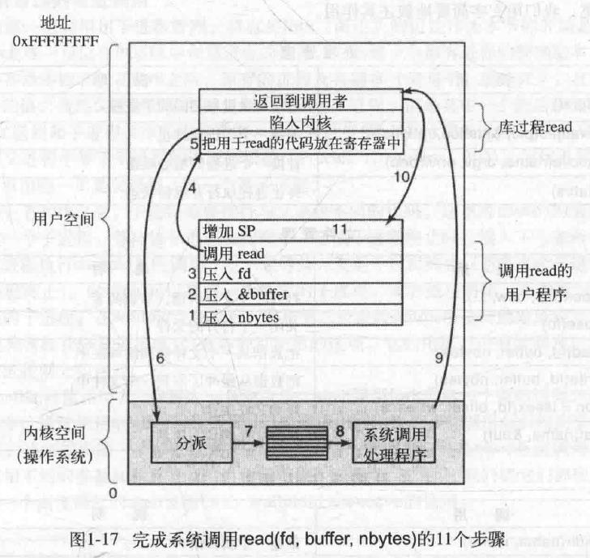

- 库过程read一般是汇编语言编写的，使用库过程而不是直接系统调用相当于加了一层缓冲，使用库函数就可以大大减少调用系统调用的次数。这一结果又缘于缓冲区技术。在用户空间和内核空间，对文件操作都使用了缓冲区，例如用fwrite写文件，都是先将内容写到用户空间缓冲区，当用户空间缓冲区满或者写操作结束时，才将用户缓冲区的内容写到内核缓冲区，同样的道理，当内核缓冲区满或写结束时才将内核缓冲区内容写到文件对应的硬件媒介。
- 系统调用和系统调用所使用的库过程几乎是一对一的关系
- 常见POSIX系统调用

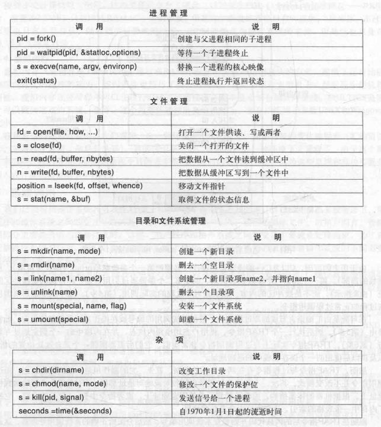

## 用于进程管理的系统调用 ###
- 在unix中，fork是唯一可以在POSIX中创建进程的途径。fork调用返回一个值，在子进程中该值为0，在父进程中该值为子进程的进程标识符。
- execve系统调用可以实现子进程执行用户的命令。execve(name,argv,environp)，三个参数：将要执行的文件名称(如cp），一个指向变量数组的指针，以及一个指向环境数组的指针

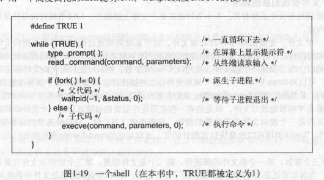

- 考虑执行 cp file1 file2
- shell创建进程后，该子进程定位和执行文件cp，并将源文件名和目标文件名传递给它。
- cp主程序（以及多数其他C程序的主程序）都有声明
	main(argc,argv,envp)
   - argc:命令行内有关参数数目的计数器，该例中argc=3
   - argv：指向数组的指针，该数组元素i是指向该命令行第i个字符串的指针。argv[0]指向字符串"cp",argv[1]指向字符串file1，argv[2]指向“file2”
   - envp：指向环境的指针。该例为0

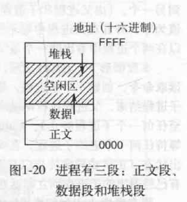

## 用于文件管理的系统调用 ##

- position=lseek(fd,offset,whence),移动文件指针
- s=stat(name,&buf) ，取的文件的状态信息

## 用于目录管理的系统调用 ##

- 在unix中，每个文件都有唯一的编号，即i-编号，用以标识文件。该i编号是对i-节点表格的一个引用，它们一一对应，说明该文件的拥有者，磁盘的位置等。目录就是一个包含了(i-编号，ASCII名称）对集合的文件。
- link("/usr/jim/memo","/usr/ast/note")
  1. 相当于是一个文件在两个位置以不同名称出现，与复制一个文件不一样，典型应用是同一个开发团队共享一个文件。
  2. 只有一个文件存在，修改立即被其他成员可见
  3. 如果使用unlink系统调用将其中一个文件移走，可以保留另一个。如果两个都移走了，unix看到尚且存在的文件没有目录项(i-节点中的一个字段记录着指向该文件的目录项），就会把该文件从磁盘移去。

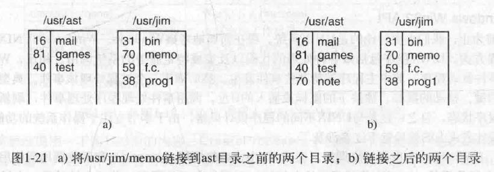

- mount("/dev/sdb0","/mnt",0)
  mount系统调用允许将两个文件系统合并为一个。

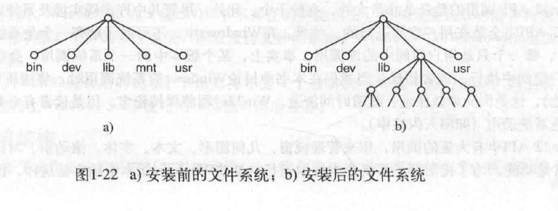

## 各种系统调用 ##

- chmode(name,mode)
- s=kill(pid,signal)

## Win32 API ##

- windows和unix主要区别在于编程方式
   - UNIX程序包括做各种处理的代码以及完成特定服务的系统调用
   - windows程序通常是事件驱动程序：主程序等待某些事件发生，然后调用一个过程处理该事件。
- windows库调用和实际的系统调用几乎是不对应的。微软定义了一套过程，称为win32应用编程接口
- windows没有类似unix中进程层次，所以不存在父进程和子进程。进程创建后，创建者和被创建者是平等的

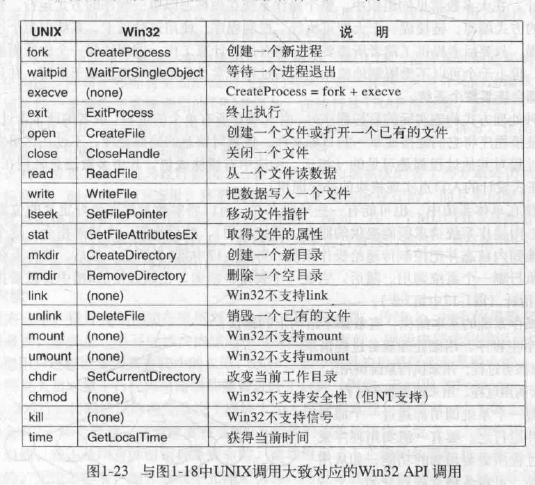

# 操作系统结构 #
## 单体系统 ##

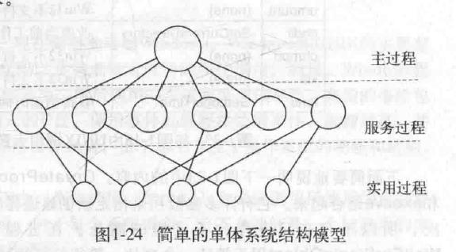

- unix：共享库
- windows：动态链接库

## 层次式系统 ##

- 有点类似网络的分层结构

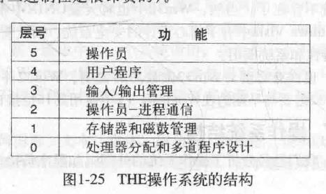

## 微内核 ##

- 尽可能减少内核态中功能的做法更好，因为内核中的错误会快速拖累系统
- 微内核设计思想：为了实现高可靠性，将操作系统划分成小的、良好定义的模块，只有其中一个模块——微内核——运行在内核态其余的模块作为普通用户进程进行。这样，模块中的错误只会让模块崩溃而不会使系统崩溃

## 客户端——服务器模式 ##
- 微内核思想的变体：将进程划分为两类：
   - 服务器：每个服务器提供某种服务
   - 客户端：使用这些服务

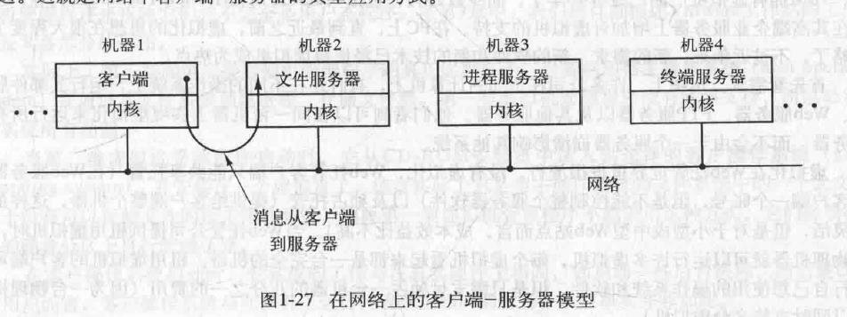

## 虚拟机 ##

- 好处：
   - 一台物理机可运行多台虚拟机，每个虚拟机看起来都是一台完全的机器。
   - 为希望同时运行两个或多个操作系统的最终用户服务
