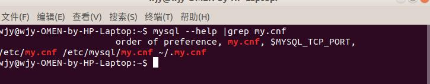
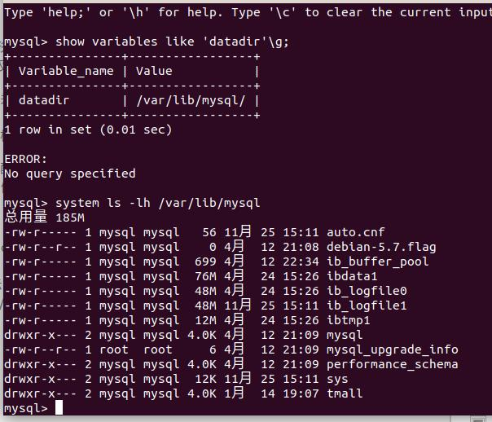
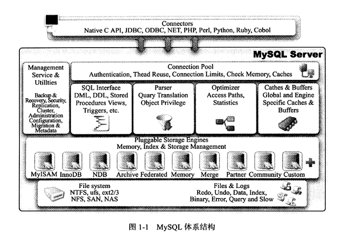
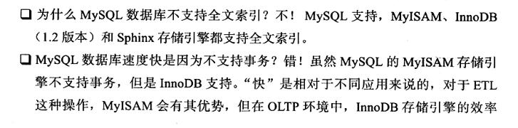
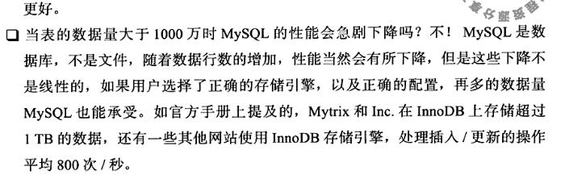
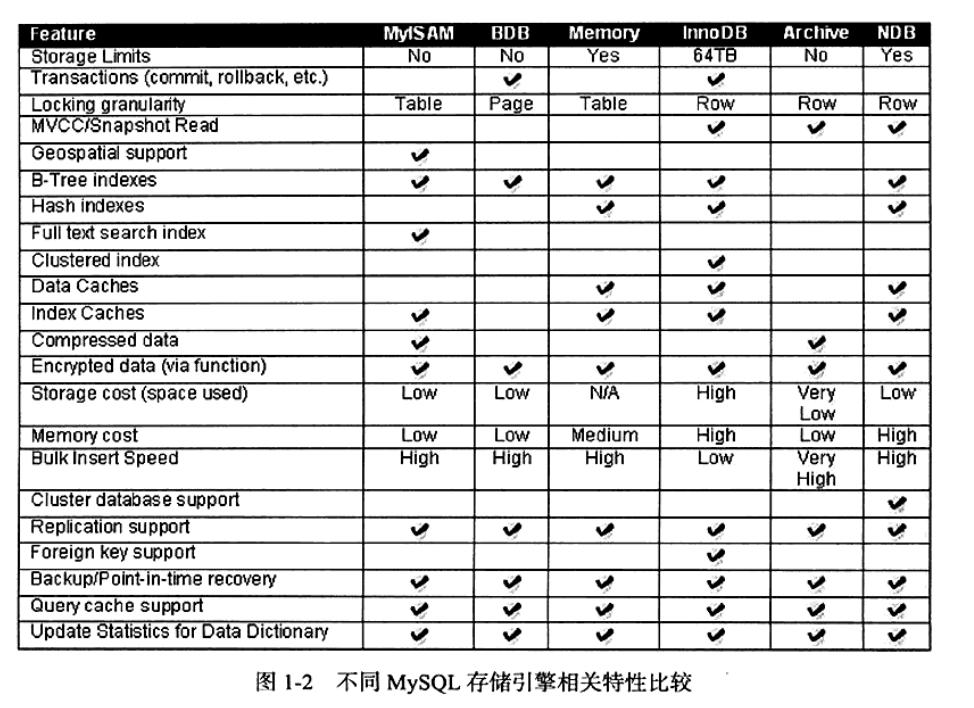
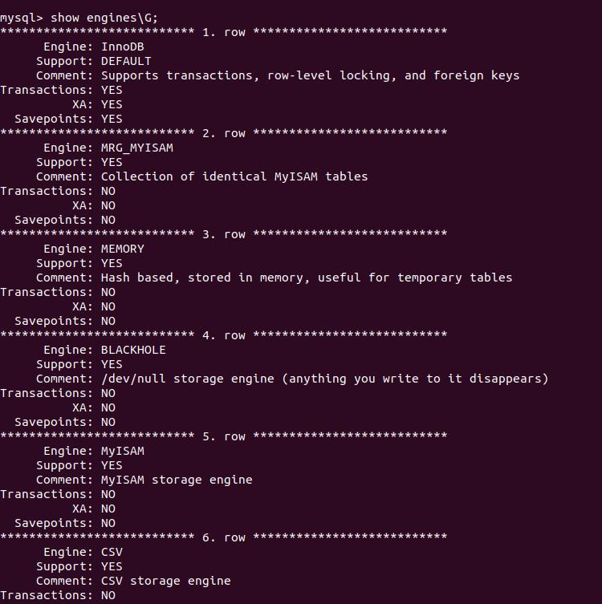
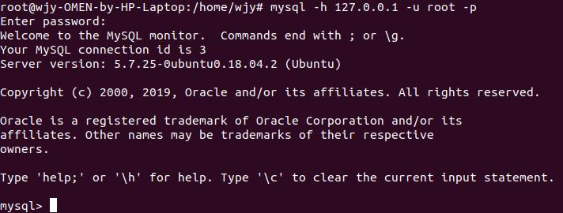
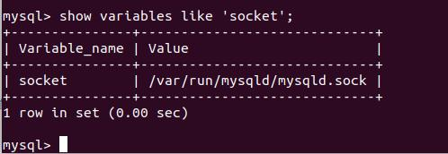

# 第一章 MySQL体系结构和存储引擎 #

MySQL是一个可移植的数据库，尽管各平台(Linux、Solaris、Mac、Windows)在底层（如线程）实现方面有所不同，但MySQL基本上都能保存在个平台上的物理体系结构的一致性。

## 1.1 定义数据库和实例 ##
- 定义
    - 数据库：物理操作系统文件或其他形式文件类型的集合。是一个文件。
    - 实例：MySQL数据库由后台线程以及一个共享内存区组成。数据库实例才是真正用于操作数据库文件的。

- 在MySQL数据库中，实例和数据库的关系通常是一一对应的，但在集群情况下可能存在一个数据库被多个数据库实例使用的情况。
- MySQL被设计成一个单进程多线程架构的数据库，也就是说，MySQL数据库实例在系统上的表现就是一个进程。

- 启动实例时，MySQL数据库会去读取配置文件，根据配置文件的参数来启动数据库实例。这与oracle的参数文件相似，不同嘚瑟oracle若无参数文件，启动实例时会失败。而MySQL会按照编译时的默认参数设置启动实例。

 

-  可看到MySQL数据库是按照/etc/my.cnf  -> /etc/mysql/my.cnf  -> ~/.my.cnf的顺序读取配置文件。若有相同参数，则以最后一个配置文件中的参数为准
- 配置文件中有一个参数datadir，指示了数据库所在路径。Linux下默认datadir为/usr/local/mysql/data，我的版本时5.7，试验了一下目录是/var/lib/mysql/，用户可以修改该参数。

 
## 1.2 MySQL体系结构
- 连接池组件
- 管理服务和工具组件
- SQL接口组件
- 查询分析器组件
- 优化器组件
- 缓冲组件
- 插件式存储引擎（存储引擎是底层物理结构的实现，是基于表的，而不是数据库）
- 物理文件 

 

## 1.3 Mysql存储引擎
### 1.3.1 InnoDB存储引擎
- InnoDB存储引擎支持事务，其设计目标主要是面向在线事务处理（OLTP）的应用。
- 特点：行锁设计、支持外键，并支持类似oracle的非锁定读，即默认读操作不会产生锁。是MySQL的默认存储引擎，新版本已支持全文索引。
- InnoDB通过多版本并发控制（MVCC）来获得高并发性，并且实现sql标准的四种隔离级别，默认位REPEATABLE级别。
- InnoDB使用一种next-key locking的策略来避免幻读
- InnoDB还提供了插入缓冲(insert buffer)、二次写(double write)、自适应哈希索引(adaptive hash index)、预读(read ahead)等高性能和高可用功能。
- 对于表中数据的存储，InnoDB存储引擎采用聚集（cluster）的方式，因此每张表的存储都是按照主键的顺序存放。如果没有指定主键，InnoDB会为每一条记录生产一个六字节的ROWID，并以此为主键
### 1.3.2 MyISAM存储引擎
- MyISAM存储引擎不支持事务、表锁设计、支持全文索引，主要面向一些OLAP（在线分析处理）数据库应用。
- MyISAM存储引擎缓冲池只缓冲索引文件，而不缓冲数据文件，对于MyISAM存储引擎表，MySQL数据库只缓存其索引文件，数据文件的缓存由操作系统本身完成。
- MyISAM存储引擎表有MYD（存放数据文件）、MYI（存放索引文件）
### 1.3.3 NDB存储引擎
- 数据全放在内存中（从MySQL5.1开始，非索引数据可以放在磁盘上），因此主键查找speed极快。
### 1.3.4 Memory存储引擎
- 数据存放在内存中，数据库重启或崩溃，表中数据将消失，适合与存储临时数据
- 默认使用哈希索引，而不是b+ tree索引
- 只支持表锁，并发性差
- 不支持TEXT和BLOB列类型

### 1.3.5 其他存储引擎：Archive、Federated、Maria存储引擎
### 1.3.6 问答
 
 
## 1.4 存储引擎比较
 

- show engines语句查看当前使用数据库支持的存储引擎，也可通过information_schema架构下的engines表查看

 
## 1.5 链接MySQL
- 连接MySQL操作是一个连接进程和MySQL数据库实例进行通信，本质上是进程通信。
- 常用的进程通信方式：管道、命名管道、TCP/IP套接字、UNIX域套接字
### 1.5.1 TCP/IP
- TCP/IP套接字方式是MySQL数据库在任何平台下都提供的连接方式，也是网络中使用最多的一种方式。

 

- 再通过TCP/IP连接到MySQL实例时，MySQL数据库会先检验一张权限视图，用来判断发起请求的客户端ip是否允许连接到数据库实例。该视图在mysql架构(数据库）下，表名位user。
### 1.5.2 命名管道和共享内存
- 如果两个需要进程通信的进程在同一台服务器上，那么可以使用命名管道
### UNIX套接字
- UNIX套接字不是一个网络协议，所以只能在MySQL客户端和数据库实例在一台服务器上的情况下使用。用户可以在配置文件中指定套接字文件的路径，如--socket=/tmp/mysql.sock。当数据库实例启动后，用户可以用下列命令来进行unix域套接字文件的查找。

 

在知道unix域套接字文件的路径后，就可以使用该方式连接了。

 