#  第二章 InnoDB存储引擎
## 2.1 概述
- 第一个完整支持ACID事务的MySQL存储引擎
- 行锁设计、支持外键，并支持类似oracle的非锁定读，即默认读操作不会产生锁。是MySQL的默认存储引擎，新版本已支持全文索引。
- InnoDB通过多版本并发控制（MVCC）来获得高并发性，并且实现sql标准的四种隔离级别，默认位REPEATABLE级别。
- InnoDB使用一种next-key locking的策略来避免幻读
- 一个OLTP项目最好使用MySQLInnoDB存储引擎
- 是一个高性能、高可用、高可扩展的存储引擎
## 2.2 历史版本
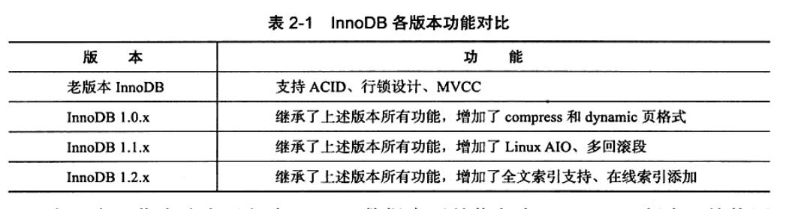
## 2.3 InnoDB体系结构
- InnoDB有多个内存块，这些内存块组成一个大的内存池，负责以下工作:
    -  维护所有进程、线程需要访问的多个内部数据结构
    - 缓存磁盘上的数据，方便快速读取，同时在对磁盘文件的数据修改之前在这里缓存
    - 重做日志（redo log）缓冲。
    
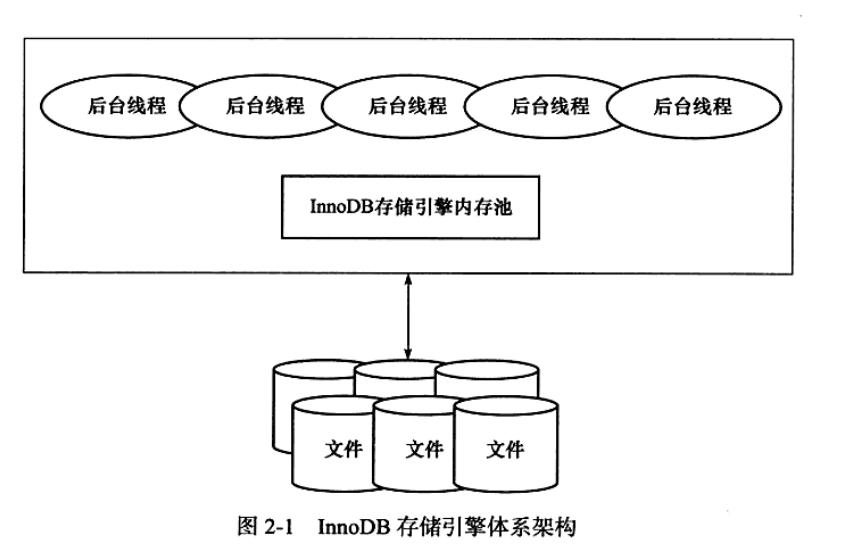

- 后台线程作用：
    - 刷新内存池中数据
    - 将已修改的数据文件刷新到磁盘
    - 保证数据库发生异常的情况下InnoDB能恢复到正常运行状态
###  2.3.1 后台线程

1. Master Thread
    - 主要负责将缓冲池中的数据异步刷新到磁盘
2. IO Thread
    - 主要负责这些IO请求的回调处理
    - 4个IO thread：write、read。insert buffer、log
    - read、write thread各有四个
    
   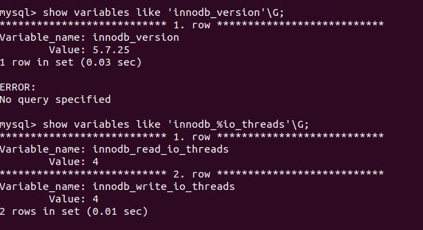

   通过show engine innodb status\G;观察InnoDB中的IO Thread
    
   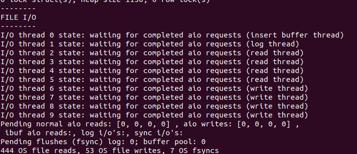

3.Purge Thread

  -  事务提交后，其所使用的undolog可能不再需要，因此需要PurgeThread来回收已经使用并分配的undo页。
  - 单独的线程，减轻master Thread工作量
  - purge thread 在我的版本中默认是四个
    
   
    
4.Page Cleaner Thread

   - 将之前版本中脏页的刷新操作放入单独的线程来完成，减轻原master Thread 的工作，以及对于用户查询线程的阻塞程度
###  2.3.2 内存

1. 缓冲池
   - InnoDB存储引擎是基于磁盘存储的
    - 对于页的修改操作，首先修改缓冲池中的页，再以一定频率刷新到磁盘上（checkpoint机制）
    
   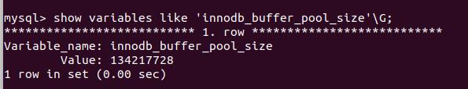
      
  - 缓冲池中的数据页类型：索引页、数据页、undo页、插入缓冲页、自适应哈希索引页、锁信息、数据字典信息。
     
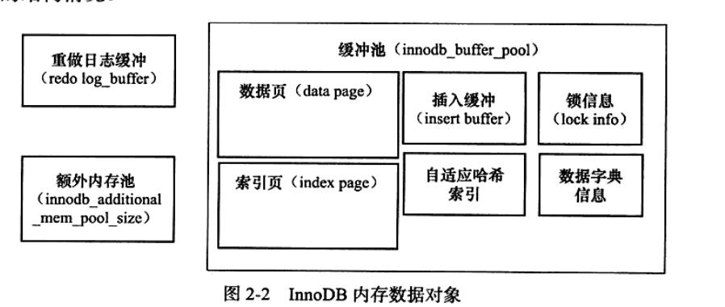
      
 - 现在InnoDB允许有多个缓冲池实例。每个页根据哈希值平均分配到不同缓冲池实例中，以减少数据库内部资源竞争，提高并发性，通过innodb\_buffer\_pool\_instances设置，默认值为1。
      
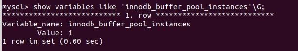
     
 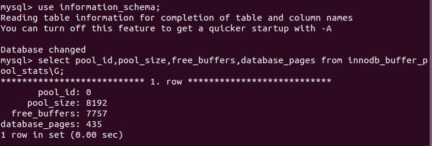

2.LRU List，Free List ,Flush List

 - 不是用传统的LRU算法，而是用midpoint insertion strategy。默认新的页插入到LRU列表长度的5/8处，midpoint可由innodb_old_blocks_pct控制。
    
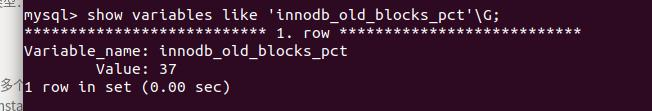
   
- 原因：
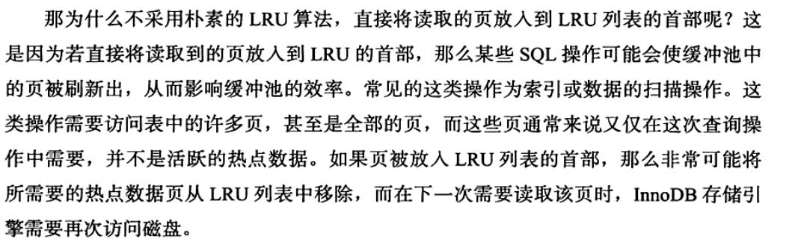
    
 - innodb\_old\_blocks\_time 表示页读取到mid位置后需要等待多久才会被加入到LRU列表的热端。（我的版本中没有这个参数了）
 - page made young、page not made young
  - show engine innodb status\g查看LRU列表及free列表使用情况
     
 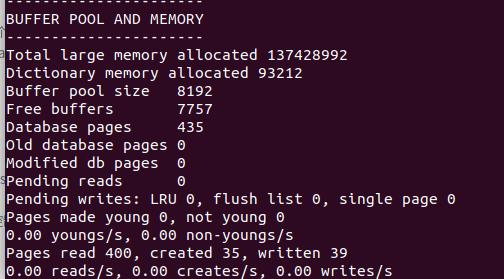
  
-  free buffers当前free列表页的数量，database pages表示LRU列表页的数量，两者相加并不等于buffer pool size，因为还有自适应哈希索引、lock信息、insert buffer等页
     
- buffer pool hit rate缓冲池的命中概率，不应小于95%。
- InnoDB支持压缩页的功能，即原本16kb额页压缩为1KB、2KB、4KB、8KB。对于非16KB的页，通过unzip LRU列表管理。how engine innodb status\g查看：
     
   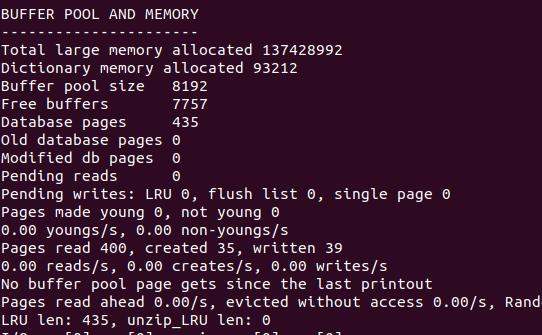

  可看到LRU列表一共与435个页，而unzip表有0页。LRU列表包含了unzip_LRU列表中的页
 - unzip_LRU从缓冲池中分配内存：
   
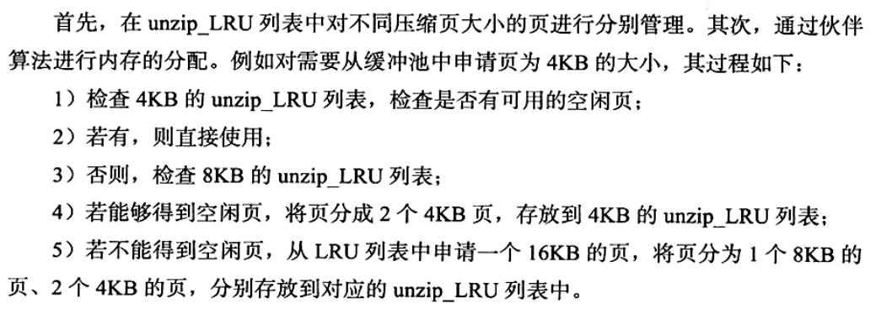
    
 - 在LRU列表中的页被修改后，成为脏页。Flush列表中的页即为脏页列表。脏页存在与LRU列表中，也存在Flushl列表中。LRU列表用来管理缓冲池中页的可用性，Flush列表用来管理将页刷新到磁盘，两者互不干扰。（即LRU中的某一页成为脏页时，会被记录到Flush列表中，而LRU列表是不会记录哪一页是脏页哪一页不是）。
      
 3. 重做日志缓冲
 - 不需设置得很大，一般情况下每一秒会将重做日志缓存刷新到日志文件
     
 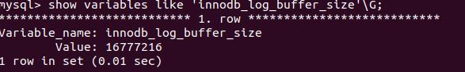
      
- 8MB的重做日志缓冲足以满足大部分需求，因为它在下列情况会刷新到重做日志文件：1. master Thread每一秒将重做日志缓冲刷新到日志文件 。 2. 每个事务提交时 。  3. 重做日志缓冲池空间小于1/2时
      
 4.额外的内存池
  
## 2.4 Checkpoint技术

- 目的：
	1. 缩短数据库的恢复时间
	2. 缓冲池不够用时，将脏页刷新到磁盘
	3. 重做日志不可用时，刷新脏页
- 对InnoDB存储引擎而言，其是通过LSN(Log Sequence Number)来标记版本的。
- 两种checkpoint方式
### sharp checkpoint
- 发生在数据库关闭时将所有脏页刷新回磁盘，默认的工作方式
### Fuzzy checkpoint
- master thread checkpoint 每秒或每十秒的 speed从缓冲池的脏页列表中刷新**一定比例**的页回磁盘 
- FLUSH\_LRU\_LIST Checkpoint LRU列表空闲页不够用时
- Async/Sync Flush Checkpoint 重做日志不可用时
- Dirty Page too much Checkpoint ,脏页太多时，变量innodb\_max\_dirty\_pages\_pct
## 2.5 Master Thread工作方式
### 2.5.1 InnoDB 1.0.x版本之前的Master Thread
   
  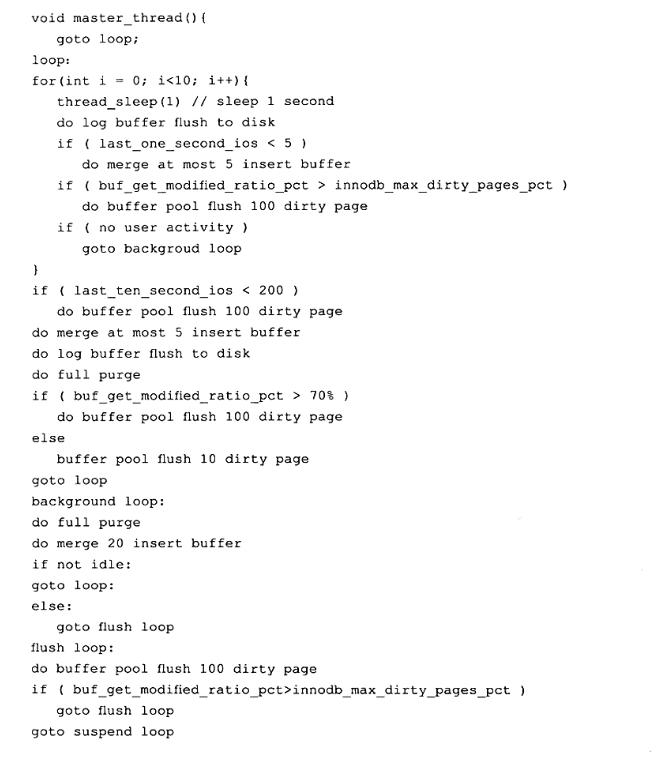  

### 2.5.2 InnoDB 1.2.x版本之前的Master Thread ###

- 之前innodb\_max\_dirty\_pages_pct默认值是90,不是一个最优值，现在为75
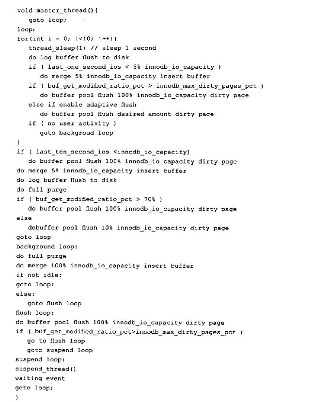

- 注意，并不能认为1秒总和sleep（每一秒进行的操作）相等，当压力大时并不总等待1秒，可能1秒多。比如有时主循环运行了2188次，但循环中每秒挂起的操作只运行了1537次。
### 2.5.3 InnoDB 1.2.x版本的Master Thread  ###

-伪代码如下：

	if Innodb is idle
		srv_master_do_idle_tasks();
	else
		srv_master_do_active_tasks();

- 其中srv_master_do_idle_tasks()就是之前版本中每十秒的操作，srv_master_do_active_tasks()每一秒的操作。同时对于刷新脏页的操作，从master thread线程分离一个单独的page cleaner thread，从而减轻master thread的工作，提高了并发性
## 2.6 InnoDB关键特性 ##
### 2.6.1 插入缓冲 ###
#### (1) Insert Buffer ####
首先了解一下Innodb的聚集索引和非聚集索引

- 其实两者都是一个B+ tree索引，只不过主键索引下面直接存储有数据，数据表中记录是按照主键的大小顺序排列的，我们查询读取记录的时候便可以顺序读取，速度很快。而次索引下，存储的是主键的id，通过主键查找数据的时候，就会很快查找到数据，但是通过次索引查找数据的时候，需要先查找到对应的主键id，然后才能查找到对应的数据。
- 下面两张图比较清晰地说明这一点：

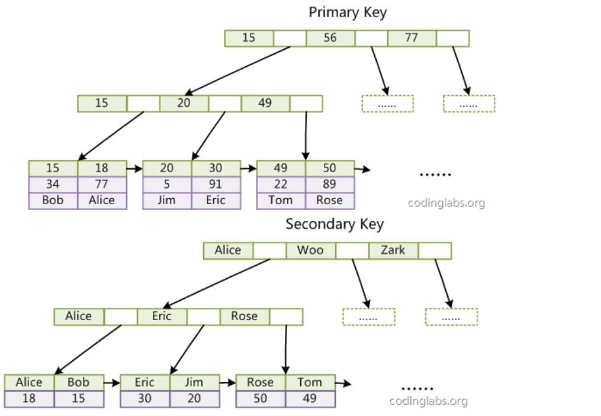

比如我们要读取(18,77,Alice)这条记录，第一列为主键。

- 通过主键查找，先读取第一级索引块，18大于15小于56，进入第二级索引(15,20,49)，18大于15小于20，进入第三级索引(15,18)，找到18，也就读取到记录了
- 通过非聚集索引，也就是姓名查找。Alice大于等于Alice小于Woo，进入第二级索引，Alice大于等于Alice小于Eric，进入第三极索引(Alice,Bob)，找到Alice，同时找到Alice主键18，再通过主键18进行聚集查找。

通过上面的过程我们也看到索引的好处，大大减少了需要扫描的磁盘扇区的数量，加快了查询的速度。假设有1000条记录，每个磁盘扇区能存储两条记录，那么不用索引我们需要读取500个扇区才能找到记录。假设一级索引占了一个扇区，二级索引占了6个扇区，分成三块，每块两个扇区，三级索引占了27个扇区，分为9块，每块三个扇区，那么我们这个例子只需要读取(1+2+3)=6个扇区，大大加快了读取速度，而我们只需要再付出34个扇区来建立索引，以空间换时间。 

同时，我们也可以看到对于非聚集索引而言，记录不是顺序的。
比如(15,34,Bob),(18,77Alice),Bob比Alice大却记录在前面。

- Insert Buffer的作用，就是在插入的时候尽量让非聚集索引更有序地插入。对于非聚集索引的插入或更新操作，不是每一次直接插入到索引页中，而是先判断插入的非聚集索引页是否在缓冲池中，若在，则直接插入；若不在，则先放到一个insert buffer对象中，先不插入。然后再以一定频率和情况进行insert buffer和辅助索引子节点的merge操作，这是通常能将多个插入合并到一个操作中(因为在一个索引页中），这就大大提高了对非聚集索引的性能。
- 比如，我们插入(33,44，King),(34,42,Like),(35,39,Cake),(36,Bean),(38,33,Amy)（主键自增）。对于聚集索引的插入，这五条记录的主键都是递增的，大概率是同一索引页，我们只需要把该索引放在缓冲池中后直接插入就行，因为它们是顺序的，而不需要insert buffer。而对于非聚集索引（姓名），我们先把它们放在insert buffer，最后发现King和Like是相邻的，大概率是一个索引页的，然后取出该索引页放进缓冲池后一起插入，而Cake、Bean、Amy是相邻的，取出它们的索引页后也合并插入，这样大大提高了插入非聚集索引的性能。
- 注：insert buffer的使用需要满足两个条件：
   1. 索引是辅助索引（聚集索引也不需要）
   2. 索引不是唯一的（唯一的话插入的时候要判断插入的记录是不是唯一的，需要去查找，而一查找就又会有离散的读取，从而导致insert buffer失去了意义
#### (2) change buffer ####
- insert buffer的升级，Innodb存储引擎可以对DML操作——insert、delete、update都进行缓冲，分别是insert buffer、delete buffer、purge buffer
- change buffer适用对象仍然是非唯一的辅助索引。
- 对一条记录update操作包含两个过程：
   - 标记删除
   - 真正删除
- 因此delete buffer对应update操作第一个过程，purge buffer对应update操作的第二个过程。

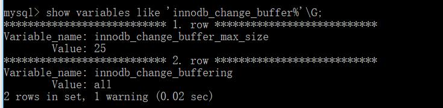

#### (3)insert buffer内部实现 ####
- insert buffer是一棵B+树，存放在共享表空间ibdata1中，因此通过独立表空间ibd文件恢数据往往会导致check table失败，因为表的辅助索引中的数据可能在insert buffer中，也就是共享表空间中，故还需要进行repair table操作来重建表上所有的辅助索引。
- insert buffer b+ 树，非叶子节点：

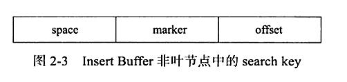

search key一共九个字节，space表示待插入的表空间id，offset表示页的偏移量，marker兼容老版本的insert buffer
- 叶子节点：

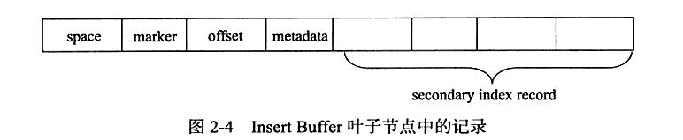

metadata字段存储内容：

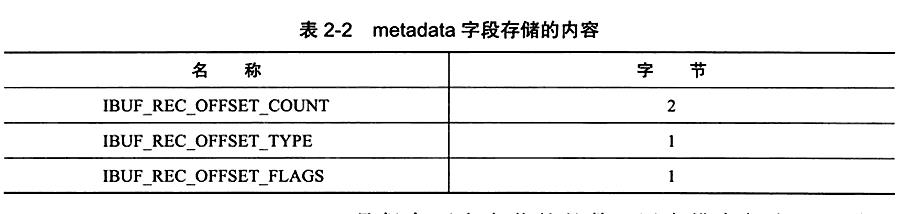

IBUF\_REC\_OFFSET\_COUNT用来排序每个记录进入insert buffer的顺序

- InsertBuffer Bitmap页用来标记每个辅助索引页(space,page_no)的可用空间，一个页追踪16384个辅助索引页，每个辅助索引页在insert buffer bitmap页中占4个bit

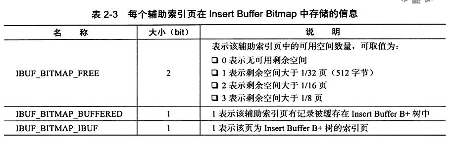
 
#### （4） Merge Insert Buffer ####

- merge insert buffer发生在以下几种情况：
   1. 辅助索引页读取到缓冲池
   2. insert buffer bitmap页追踪到该辅助索引页已无可用空间
   3. master thread
   
### 2.6.2 两次写 ###

- insert buffer带给Innodb存储引擎性能上的提升，那么double write带给innodb存储引擎的是数据页的可靠性。
- 在应用重做日志前，用户需要一个页的副本，当写入失效发生时，先通过页的副本还原该页，再进行重组，这就是double write

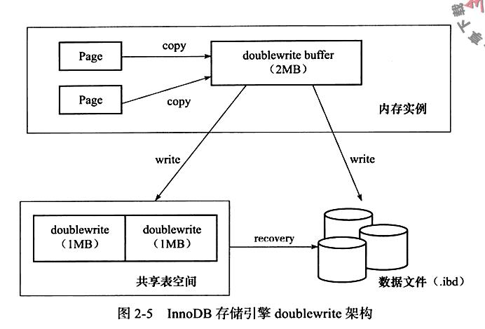
### 2.6.3 自适应哈希索引 ###

- InnoDB存储引擎会监控对表上个索引页的查询。如果观察到建立哈希索引可以带来速度提升，则建立哈希索引，称为自适应哈希索引AHI，AHI通过缓冲池的B+树页构造而来，因此建立很快，而且不需对整张表构建哈希索引。Innodb存储引擎会自动根据范围的频率和模式来自动地为某些热点页建立哈希索引。
- AHI有一个要求，即对这个页的连续访问模式必须是一样的
- AHI只能用来搜索等值的查询，不能范围查找
- 建立AHI后，读取和写入速度可提升两倍，辅助索引的连接操作性能可提高5倍。

### 2.6.4 AIO ###

- AIO比Sync IO性能高
- AIO可以进行IO merge操作
- windows和linux都支持native aio，而mac osx系统则未提供，可通过innodb\_use\_native\_aio查看
- 开启native aio速度可提高75%。
### 2.6.5 刷新邻接页 ###
- 当刷新脏页时，检测该页所在区(extent)的所有页，若是脏页，则一起刷新。通过aio可以将多个io写入合并为一个io操作
## 2.7 启动、关闭、恢复 ##

- innodb\_fast\_shutdown,参数取值为0,1,2，默认值1
   - 0 在数据库关闭时，innodb需要完成所有的full purge和merge insert buffer，并且将所有的脏页刷新到磁盘
   - 1 默认值，表示不需完成full purge和merge insert buffer，但在缓冲池的脏页还会刷新到磁盘
   - 2 不需完成full purge和merge insert buffer，也不需将缓冲池的脏页刷新到磁盘，而是将日志写入日志文件。这样不会有事务的丢失，但下次mysql数据库启动时会进行恢复操作。
- innodb\_force\_recovery,m默认值为0，代表党发生需要恢复时，进行所有的恢复操作，当不能进行有效恢复时，数据库可能宕机，并把错误写入错误日志中去。
- innodb\_force\_recovery还可设置6个非零值，1~6：
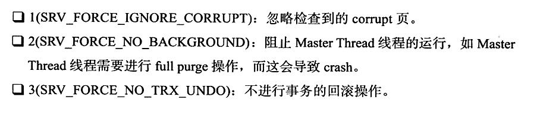
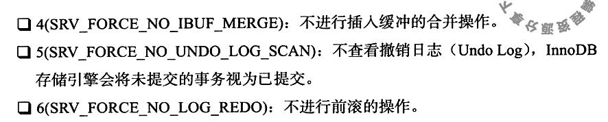